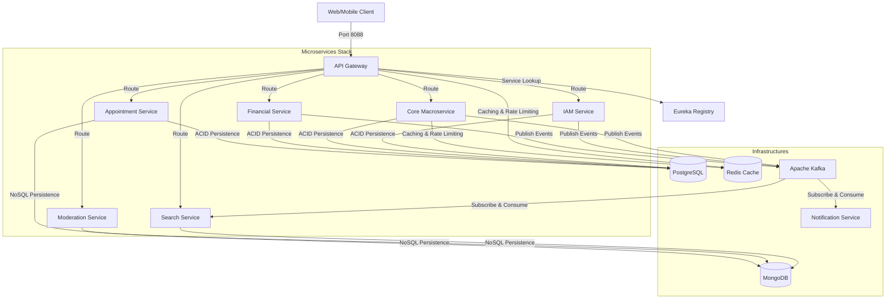

# BatDongSan Platform Backend

The BatDongSan Platform Backend is a distributed, high-performance real estate transaction and listing ecosystem built using Spring Boot, Spring Cloud, and Apache Kafka. It provides a highly modular, event-driven solution to handle property catalog management, user identity, scheduling, billing orchestration, and listing moderation.

[](#)


---

## Features

*   **Polyglot Persistence Layer:** Utilizes PostgreSQL for transaction-heavy, ACID-compliant domains (Properties, Contracts, Payments) and MongoDB for search indexing, report generation, and system activity logs.
*   **Asynchronous Messaging Engine:** Employs Apache Kafka to propagate state transitions (e.g., property changes, contract agreements, payment status updates) decoupled from blocking request-response cycles.
*   **Gateway Rate Limiting & Auth:** Integrates a reactive API Gateway using Redis-backed Token Bucket rate limiting and a centralized JSON Web Token (JWT) cryptographic signature validator.
*   **Downstream Authentication Propagation:** Distributes authenticated security contexts to internal microservices via custom HTTP headers (`X-User-Id` and `X-User-Roles`) translated by a security starter module.
*   **Distributed Billing & Escrow:** Integrates with Stripe for card processing, tracking commission splits, deposit deadlines, and executing multi-party escrow fund payouts.
*   **Automated Modularity Validation:** Utilizes Spring Modulith inside the core macroservice to verify domain boundary encapsulation and prevent unwanted cyclic package dependencies.
*   **Resiliency & Fault Tolerance:** Configures Resilience4j circuit breakers, retries, and bulkheads to isolate downstream service degradation (e.g., PDF compilation limits or authentication outages).

---

## Architecture

The system follows a decentralized microservices topology. External traffic is processed by an API Gateway, which handles security token decryption and rate limiting before routing requests to individual microservices or the core macroservice.



### Request Authentication Data Flow
1.  The client transmits an HTTP request containing a `Bearer JWT` token.
2.  The Gateway validates the token using the public JWKS keyset fetched from the IAM service.
3.  The Gateway injects user details into the downstream request headers (`X-User-Id` and `X-User-Roles`).
4.  The receiving service deserializes the headers into its local security context to authorize method invocations.

---

## Tech Stack

| CATEGORY | TECH |
| :--- | :--- |
| **1. Backend & Core Platform** | |
| Platform | Java Spring Boot (v3.4.0) |
| Protocol | REST (JSON over HTTP) & Kafka Protocol (Event-Driven) |
| API Document | Swagger UI, Springdoc OpenAPI (v2.8.6) |
| Call API | Spring Cloud OpenFeign, WebClient |
| Config | System Environment Variables, `.env` files, Spring Profiles |
| **2. Database & Storage** | |
| SQL | PostgreSQL (v15) |
| NoSQL | MongoDB (v6), Redis (v7) |
| Caching | Redis (Spring Boot Cache with custom TTL) |
| **3. Infrastructure, DevOps & Architecture** | |
| Load balancing | Client-side Load Balancing (Spring Cloud LoadBalancer / Feign) |
| Proxy | Spring Cloud Gateway (`bds-api-gateway`) |
| Service Discovery | Netflix Eureka Server (`bds-eureka-server`) |
| Queue | Apache Kafka |
| **4. Observability & Code Quality** | |
| Logging | Grafana Loki, Logback (SLF4J) |
| Monitor, Performance | OpenTelemetry Javaagent, OTel Collector, Prometheus, Jaeger, Grafana, k6, JMH |
| Unit Test | JUnit 5, Mockito |
| Testing Framework | REST Assured, Testcontainers, k6 (load test), Chaos Engineering (`iptables` / `tc` script) |
| **5. Security** | |
| Security - Authentication | Stateless JWT (via JJWT 0.13.0) with Gateway Header Propagation (`X-User-Id`, `X-User-Roles`) and downstream filter (`HeaderAuthenticationFilter`) |
| Security - CORS Policy | Gateway Global CORS Configuration (`spring.cloud.gateway.globalcors`) |
| Security - Allowlist | Gateway Public Paths Configuration (`app.public-paths`) |
| Security - Error Handling | Spring Controller Advice (`GlobalExceptionHandler`) |
| Security - Paging | Spring Data Pageable (via custom `PagedData` DTO) |
| Security - Scope (open/internal) | API Gateway (Open public proxy), Feign client / Internal network routing (`/api/internal/**`) |

---

## Getting Started (Local Development)

### Prerequisites
*   **Docker & Docker Compose** installed.
*   **Java 21 JDK** (e.g., Eclipse Temurin distribution) configured.
*   **Maven 3.9+** (optional, wrapper script is provided).

### Installation
1.  Clone the repository:
    ```bash
    git clone https://github.com/Janus-Aurelius/BatDongScam-Backend-Microservice.git
    cd BatDongScam-Backend-Microservice
    ```

2.  Set up environment configurations:
    ```bash
    cp .env.example .env
    ```
    *Modify `.env` to supply Cloudinary, Stripe, or Firebase credentials. The default values work out-of-the-box for offline testing.*

3.  Build the Maven projects and compile artifacts:
    ```bash
    ./mvnw clean package -DskipTests
    ```

### Running the App
1.  Launch the infrastructure services and microservice containers:
    ```bash
    docker compose up -d
    ```

2.  Seed the database with default users, locations, and properties:
    ```bash
    ./scripts/seed-data.sh
    ```

3.  Verify container health and port access:
    *   **API Gateway:** `http://localhost:8088`
    *   **Eureka Discovery Panel:** `http://localhost:8761`
    *   **Swagger API Console:** `http://localhost:8088/swagger-ui.html`

4.  *(Optional)* Start the monitoring and observability stack:
    ```bash
    docker compose -f observability/docker-compose.yml up -d
    ```
    *Grafana is accessible at `http://localhost:3001` (Anonymous Admin role enabled).*

---

## Project Structure

A high-level map of the codebase modules and utility folders:

```text
├── .github/workflows/          # CI pipeline configurations
├── bds-api-gateway/            # Reactive Gateway with JWT filter and rate limiting
├── bds-appointment-service/    # Manages property tours and agent assignments
├── bds-common/                 # Shared domain DTOs, custom exception structures, and events
├── bds-core-macroservice/      # Main service handling properties and contracts
├── bds-eureka-server/          # Netflix Eureka Service Discovery registry
├── bds-financial-service/      # Financial ledgers, stripe configuration, and webhooks
├── bds-iam-service/            # Identity, Access Management, and JWKS credentials provider
├── bds-moderation-service/      # Handles compliance reporting and violations
├── bds-notification-service/    # Broadcasts alerts via Firebase and local registers
├── bds-search-service/         # Handles MongoDB property query indexing
├── bds-spring-security-starter/# Auto-configuration security filter for header parsing
├── init-db/                    # Initial database SQL creation scripts
├── observability/              # OTel Collector, Prometheus, Jaeger, and Loki templates
└── scripts/                    # Contains database seeds, k6 load files, and chaos actions
```

---

## Testing

The testing suite contains unit, integration, modularity, and load tests. 

### Run Unit and Integration Tests
Execute the JUnit test suite utilizing Testcontainers:
```bash
./mvnw test
```

### Run Modularity Tests
Verify package dependency boundaries using Spring Modulith:
```bash
./mvnw test -pl bds-core-macroservice -Dtest=ModularityTest
```

### Execute Load Performance Checks
Run endpoint performance stress validation using k6:
```bash
k6 run scripts/e2e-load-tests.js
```

### Distributed Systems Chaos Scenarios

The codebase incorporates chaos testing profiles to validate six key theories of distributed systems (3 targeting the Core Macroservice, 3 system-wide):

#### Core Macroservice Scenarios
1.  **Universal Scalability Law (USL) - Contention limits:** Tests database contention under high virtual user counts. It evaluates connection pool starvation (HikariCP) and thread throttling on PostgreSQL active backends under restricted CPU resource limits (`usl-noisy-neighbor.sh` and `usl-contention.js`).
2.  **CALM Theorem - Coordination-free monotonicity:** Validates that version-controlled mutations (like approving the same contract concurrently) reject duplicate requests gracefully with a `409 Conflict` (Optimistic Locking collision) instead of throwing `500 Server Errors` (`calm-retry-storm.js`).
3.  **Fallacies of Distributed Computing (Latency is Zero) - Database delay:** Injects 200ms of simulated network delay directly onto PostgreSQL traffic (port 5432) using traffic control (`tc`) filters, testing application resilience and HikariCP connection timeout recovery (`chaos-inject.sh latency`).

#### System-Wide Scenarios
4.  **PACELC Theorem - Availability/Consistency tradeoff:** Evaluates read-consistency during cache network degradation. Using Toxiproxy, it injects 15% packet loss and 1.5s jitter on the Redis cache network, asserting that the system continues serving cached reads (favoring availability and low latency over strict consistency, `pacelc-consistency.js`).
5.  **FLP Impossibility Principle - Leader agreement:** Simulates the "Zombie Node" scenario. It freezes the active ShedLock leader container using a `SIGSTOP` signal during lock execution. After the 55s lease expires, a peer node inherits leadership. Once the original leader is resurrected with `SIGCONT`, lock lease safety prevents concurrent scheduling collisions (`flp-zombie.sh`).
6.  **CAP Theorem - Partition isolation:** Simulates network partitioning by dropping outgoing TCP packets from the Core Macroservice to the Financial Service and Kafka via `iptables` egress blocks. This verifies that core property catalog endpoints remain available (AP) while downstream transaction paths fail safely with active circuit breaker fallbacks (CP) (`chaos-inject.sh partition`).

#### Trigger Chaos Resilience Executions
To run services under simulated network delay or packet dropouts, spin up the chaos compose configuration and execute the injection script:
```bash
docker compose -f docker-compose.yml -f docker-compose-chaos.yml up -d
./scripts/chaos-inject.sh
```

---

## Deployment / CI-CD

### CI Pipeline
All pull requests and commits merged to `main`, `master`, or `develop` trigger the automated build loop defined in [.github/workflows/ci.yml](file:///home/annguyen/master_projects/sem2_year3_projects/BatDongSan/BatDongScam-Backend-Microservice/.github/workflows/ci.yml).
*   **Database Mocking:** GitHub Actions launches PostgreSQL 15 and MongoDB 6 containers.
*   **Database Preparation:** Initializes isolated database schemas for the microservices.
*   **Build Loop:** Pulls JDK 21 dependencies and executes compilation and validation:
    ```bash
    mvn -B clean compile test-compile
    mvn -B test
    ```

---

## Author / Contact

| Name | Email | Role |
| :--- | :--- | :--- |
| Nguyen Thien An | 23520020@gm.uit.edu.vn (or annguyenthien.work@gmail.com) | Lead & Principal Backend Engineer |
| Huynh Anh Quoc | 23521302@gm.uit.edu.vn | Memeber & Backend Engineer |
| Ha Nhat Minh | 23520922@gm.uit.edu.vn | Memeber & Backend Engineer |
| Nguyen Ba Tuan Anh | 23520054@gm.uit.edu.vn | Memeber & Backend Engineer |

