# Conceptual Domain Model

This document provides a high-level conceptual data model of the BatDongScam system, mapping core business entities, actors, and their relationships.

## Domain Model Diagram

```plantuml
@startuml
!theme plain
skinparam rectangle {
    BackgroundColor White
    BorderColor Black
    ArrowColor Black
}

' ==========================================
' ACTORS
' ==========================================
actor "Guest" as guest
actor "Registered User" as user
actor "Customer" as customer
actor "Property Owner" as owner
actor "Sale Agent" as agent
actor "System Administrator" as admin

' ==========================================
' USER & IDENTITY CONTEXT
' ==========================================
package "User & Identity Management" {
    rectangle "User Account" as account
    rectangle "Profile" as profile
    rectangle "Referral Program" as referral
}

' ==========================================
' PROPERTY CONTEXT
' ==========================================
package "Property Management" {
    rectangle "Property Listing" as property
    rectangle "Property Type" as propType
    rectangle "Media Gallery" as media
    rectangle "Location Data" as location
    rectangle "AI Valuation" as valuation
    rectangle "Promotion Package" as promotion
}

' ==========================================
' TRANSACTION & CONTRACT CONTEXT
' ==========================================
package "Transaction & Contracts" {
    rectangle "Appointment" as appointment
    rectangle "Contract" as contract
    rectangle "Rental/Deposit/Purchase" as contractType
    rectangle "Payment" as payment
    rectangle "Escrow Wallet" as escrow
    rectangle "Subscription Plan" as subscription
}

' ==========================================
' INTERACTION & SUPPORT CONTEXT
' ==========================================
package "Interaction & Support" {
    rectangle "Wishlist" as wishlist
    rectangle "Review & Rating" as review
    rectangle "Real-time Chat" as chat
    rectangle "Violation Report" as violation
    rectangle "Notification" as notification
}

' ==========================================
' SYSTEM OPERATIONS CONTEXT
' ==========================================
package "System Operations" {
    rectangle "Audit Log" as audit
    rectangle "Security Matrix" as security
}

' ==========================================
' RELATIONSHIPS & DATA FLOW
' ==========================================

' Actor to User Management
guest --> account : registers
user --> profile : updates
user --> referral : participates in
admin --> account : manages
admin --> security : configures

' User to Support
user --> notification : receives
customer --> wishlist : manages
customer --> review : rates Agent
customer --> chat : communicates with Agent
user --> violation : reports

' Property Relationships
owner --> property : creates / manages
owner --> valuation : requests
owner --> promotion : purchases for visibility
agent --> property : is assigned to
property --> propType : categorized by
property --> media : contains
property --> location : situated in
admin --> property : reviews / archives

' Transactional Relationships
customer --> property : views / searches
customer --> appointment : books viewing
agent --> appointment : manages / confirms
appointment --> property : refers to
appointment --> contract : facilitates
contract --> property : covers
contract --> customer : involves
contract --> payment : generates
payment --> escrow : held in (for high value)
agent --> subscription : pays for listing capacity

' System Operations
admin --> violation : resolves
admin --> audit : monitors
admin --> payment : approves escrow release

@enduml
```

## Architectural Breakdown

### 1. Bounded Contexts
*   **User & Identity Management**: Centralizes user lifecycle, from Guest registration to Profile management and Referral incentives.
*   **Property Management**: Handles the core asset of the platform, including AI-driven valuations and promotion mechanisms.
*   **Transaction & Contracts**: Orchestrates the legal and financial flow, starting from an Appointment viewing to Contract execution and Escrow-protected Payments.
*   **Interaction & Support**: Manages the social and safety layer, including real-time communication, reviews, and violation reporting.
*   **System Operations**: Provides the administrative backbone for security auditing and global configuration.

### 2. Core Entities
*   **User Account**: The polymorphic base for Customers, Owners, and Agents.
*   **Property Listing**: The central entity linked to location data, media, and transactional history.
*   **Contract**: An abstract entity specialized into Rental, Deposit, or Purchase agreements.
*   **Payment**: Linked to external gateways and potentially held in Escrow for security.

### 3. Primary Actors
*   **Customer**: Primarily consumes data and initiates transactions (appointments, payments).
*   **Property Owner**: Supplies listings and manages their visibility.
*   **Sale Agent**: Facilitates the bridge between owners and customers, often operating under a subscription model.
*   **System Administrator**: Overlays the entire system for moderation, safety, and financial oversight.
