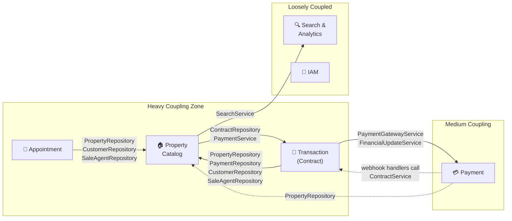

# Step 1: The Boundary Debate — Core Macroservice Candidates

## Dependency Matrix (from actual codebase analysis)

I traced every `Repository` and `Service` injection across all domain service implementations. Here's the raw coupling map:

### Raw Dependency Table

| Service Impl                                 | Directly Injects From…                                                                                                                                                                                                                            |
|----------------------------------------------|---------------------------------------------------------------------------------------------------------------------------------------------------------------------------------------------------------------------------------------------------|
| **PurchaseContractServiceImpl**              | `PropertyRepository`, `PaymentRepository`, `CustomerRepository`, `SaleAgentRepository`, `DepositContractRepository`, `PaymentGatewayService`, `NotificationService`, `FinancialUpdateService`                                                     |
| **RentalContractServiceImpl**                | `PropertyRepository`, `PaymentRepository`, `CustomerRepository`, `SaleAgentRepository`, `DepositContractRepository`, `PaymentGatewayService`, `NotificationService`, `FinancialUpdateService`                                                     |
| **DepositContractServiceImpl**               | `PropertyRepository`, `PaymentRepository`, `CustomerRepository`, `SaleAgentRepository`, `PaymentGatewayService`, `NotificationService`                                                                                                            |
| **AppointmentServiceImpl**                   | `PropertyRepository`, `CustomerRepository`, `SaleAgentRepository`, `RankingService`, `NotificationService`                                                                                                                                        |
| **PropertyServiceImpl**                      | `WardRepository`, `DocumentTypeRepository`, `PropertyOwnerRepository`, `PropertyTypeRepository`, `ContractRepository`, `PaymentService`, `SearchService`, `RankingService`, `CloudinaryService`, `CustomerFavoriteService`, `NotificationService` |
| **PaymentServiceImpl**                       | `PaymentRepository`, `PaymentGatewayService` (lean)                                                                                                                                                                                               |
| Webhook: `ServiceFeePaymentSucceededHandler` | `PropertyRepository`, `FinancialUpdateService`                                                                                                                                                                                                    |
| Webhook: `PurchasePaymentSucceededHandler`   | `PurchaseContractService`                                                                                                                                                                                                                         |
| Webhook: `DepositPaymentSucceededHandler`    | `DepositContractService`                                                                                                                                                                                                                          |
| Webhook: `RentalSecurityDepositHandler`      | `RentalContractService`                                                                                                                                                                                                                           |

---

## My Recommendation: **Property Catalog + Transaction/Workflow** as the Core Macroservice

### Why These Two?

#### 1. Bidirectional Data Coupling is Extreme

This isn't a one-way dependency — it's a **mutual gravity well**:
- **Contract → Property**: All three contract service impls (`Purchase`, `Rental`, `Deposit`) directly inject `PropertyRepository` to validate property status, check availability, and read pricing data (commission rates, service fees).  
- **Property → Contract**: `PropertyServiceImpl` injects `ContractRepository` and `PaymentService` — it needs to know about active contracts (e.g., can't delist a property with an `ACTIVE` rental contract) and synchronize service fee collection.

Splitting these into separate microservices would require **6+ synchronous API calls** per contract creation flow alone. That's a latency and reliability nightmare.

#### 2. Shared Transactional Invariants (ACID Boundaries)

The most critical business invariants span *both* domains simultaneously:

| Invariant                                                       | Property Tables                           | Contract Tables                 |
|-----------------------------------------------------------------|-------------------------------------------|---------------------------------|
| "A property can only have one active sale contract"             | `properties.status` → `SOLD`              | `contract.status` → `ACTIVE`    |
| "Creating a rental contract must mark property as RENTED"       | `properties.status` update                | `rental_contract` insert        |
| "Cancelling the last active contract must re-list the property" | `properties.status` → `APPROVED`          | `contract.status` → `CANCELLED` |
| "Service fee synchronization on property approval"              | `properties.service_fee_collected_amount` | `payments` linked to property   |

> [!IMPORTANT]
> If these were separate services with separate databases, every one of these invariants becomes a **distributed saga**. For a 4-person team, that's an enormous operational burden — saga orchestrators, compensating transactions, idempotency keys, dead letter queues. Keeping them in one JVM gives you `@Transactional` for free.

#### 3. The Appointment Question — Include It or Not?

`AppointmentServiceImpl` injects `PropertyRepository`, `CustomerRepository`, and `SaleAgentRepository`. It looks coupled, but consider:

- Appointments are a **pre-sales workflow** — they don't mutate property state or contract state.
- The coupling is **read-only**: appointments need to *validate* that a property exists and is viewable, not update it.
- Appointment data is **low-value for transactions**: no ACID constraint binds an appointment to a contract.

**My recommendation: Keep Appointment OUT of the macroservice.** It can live as its own lightweight microservice that reads property data via a cached Feign client or gRPC call. Its read-only dependency doesn't justify adding a third module to the macroservice.

---

## Alternative Candidates Considered (and Rejected)

### Alt A: Property + Payment

❌ **Rejected.** While Property does inject `PaymentService`, the coupling is narrow — only for service fee synchronization. Payment's core complexity (gateway integration, PayOS/PayPal, webhooks) is **infrastructure-oriented**, not domain-coupled. It scales differently (bursty payment webhook traffic vs. steady property CRUD). Merging them violates the "same rate of change" heuristic.

### Alt B: Contract + Payment

❌ **Rejected.** The payment webhook handlers *do* call back into `ContractService`, but this is a textbook **event-driven relationship** — a payment succeeds → contract status transitions. This maps perfectly to a Kafka event (`PaymentSucceededEvent`), making them *ideal* for decoupling, not merging.

### Alt C: Property + Search/Analytics

❌ **Rejected.** The migration plan already identifies Search as the best extraction candidate (MongoDB-backed, distinct data tier). Property calling `SearchService` is a **publish** action (property created/updated → search index updated), which is the poster child for async events.

---

## Pros & Cons Summary

### ✅ Pros of Property + Transaction Macroservice
| Advantage                                           | Impact                                                                                 |
|-----------------------------------------------------|----------------------------------------------------------------------------------------|
| **ACID transactions across domains**                | No distributed sagas for the most critical business flows                              |
| **Zero network overhead** for the tightest coupling | Contract creation validates property in-memory, not via HTTP                           |
| **Single deployment unit** for the core domain      | Simplifies CI/CD for the most complex, highest-risk code                               |
| **JPA relationship preservation**                   | `@ManyToOne` between Contract → Property stays as a local join, not a UUID + API fetch |
| **Team cognitive load**                             | 4 devs can reason about property-contract lifecycle in one codebase                    |

### ⚠️ Cons / Risks
| Risk                             | Mitigation                                                                                                                                                                               |
|----------------------------------|------------------------------------------------------------------------------------------------------------------------------------------------------------------------------------------|
| **Scaling granularity lost**     | If Property reads >> Contract writes, you can't scale them independently. Mitigation: This is a B2B real-estate platform, not a consumer marketplace — traffic is moderate and balanced. |
| **Blast radius**                 | A bug in Contract code can take down Property APIs. Mitigation: Strict module boundaries (Step 2), separate thread pools, circuit breakers on the internal API.                          |
| **Internal discipline required** | Developers might shortcut the modular boundary. Mitigation: ArchUnit tests, Spring Modulith, CI enforcement (Step 2).                                                                    |
| **Database still shared**        | The two modules share a PostgreSQL instance (but NOT tables). Mitigation: Separate schemas (`property_schema`, `transaction_schema`), enforce via Spring Modulith DB rules.              |

---

## Questions for You

1. **Appointment placement**: I recommended keeping Appointment as a separate microservice. Do you agree, or do you see the pre-sales → contract pipeline as tight enough to warrant inclusion in the macroservice?

2. **Location data (City/District/Ward)**: The migration plan flags the "Hierarchical Location Trap." These are essentially reference/lookup data. Should they live inside the Property module of the macroservice, or be extracted as a shared "Reference Data Service" that everyone reads from?

3. **Notification + Violation**: Both are consumed by Property and Contract services today (`NotificationService` is injected everywhere). Are you planning to extract these as independent microservices, or treat them as infrastructure (like a shared notification gateway)?
