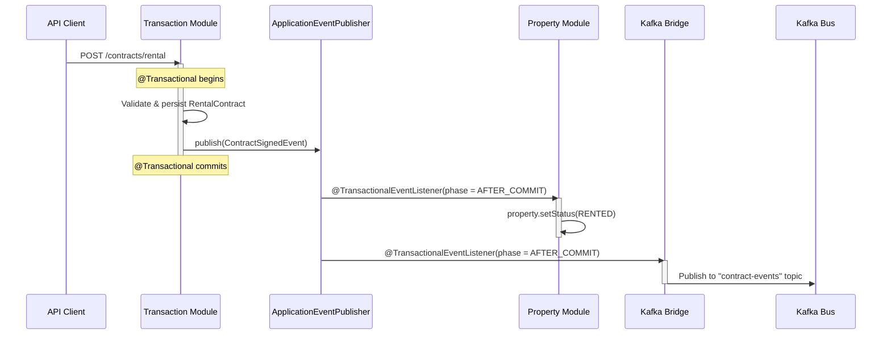

# Step 2: Internal Architecture of the Core Macroservice

## The Problem We're Solving

Your codebase today has **zero enforcement** between Property and Contract domains. From the code analysis:

```
PurchaseContractServiceImpl directly injects → PropertyRepository
PropertyServiceImpl directly injects → ContractRepository
```

Both entities even have bidirectional JPA relationships:
- `Property.java` line 132: `List<Contract> contracts` (`@OneToMany`)
- `Contract.java` line 33: `Property property` (`@ManyToOne`)

This means any developer can freely `property.getContracts().stream()...` or `contract.getProperty().getStatus()` — creating invisible coupling that makes future extraction impossible. We need to **keep the JVM colocation benefit while building a firewall between the modules**.

---

## 1. Target Package Structure

### Current (flat, no boundaries)
```
com.se100.bds/
├── models/entities/property/    ← anyone can import
├── models/entities/contract/    ← anyone can import
├── repositories/domains/property/
├── repositories/domains/contract/
├── services/domains/property/impl/
└── services/domains/contract/impl/
```

### Target (Spring Modulith-aware)
```
com.se100.core/                          ← Application root
├── CoreMacroserviceApplication.java
├── shared/                              ← Shared Kernel (Step 2.2)
│   ├── events/                          ← Inter-module event contracts
│   │   ├── PropertyStatusChangedEvent.java
│   │   ├── ContractSignedEvent.java
│   │   └── ContractCancelledEvent.java
│   ├── ids/                             ← Typed ID value objects
│   │   ├── PropertyId.java
│   │   └── ContractId.java
│   └── enums/                           ← Shared enums
│       ├── PropertyStatusEnum.java
│       └── ContractStatusEnum.java
│
├── property/                            ← MODULE A ──────────────────
│   ├── package-info.java                ← @ApplicationModule annotation
│   ├── api/                             ← PUBLIC: Named interface
│   │   ├── PropertyInternalApi.java     ← Interface exposed to Transaction module
│   │   └── PropertyExternalApi.java     ← REST controllers (external)
│   ├── internal/                        ← PRIVATE: package-private classes
│   │   ├── model/
│   │   │   ├── Property.java            ← @Entity, NOT exported
│   │   │   ├── Media.java
│   │   │   ├── PropertyType.java
│   │   │   └── Location.java            ← City/District/Ward (owned here)
│   │   ├── repository/
│   │   │   ├── PropertyRepository.java  ← package-private
│   │   │   └── WardRepository.java
│   │   └── service/
│   │       └── PropertyServiceImpl.java ← implements PropertyInternalApi
│
├── transaction/                         ← MODULE B ──────────────────
│   ├── package-info.java                ← @ApplicationModule annotation
│   ├── api/
│   │   ├── ContractInternalApi.java     ← Interface exposed to Property module
│   │   └── ContractExternalApi.java     ← REST controllers
│   ├── internal/
│   │   ├── model/
│   │   │   ├── Contract.java            ← @Entity, NOT exported
│   │   │   ├── DepositContract.java
│   │   │   ├── PurchaseContract.java
│   │   │   ├── RentalContract.java
│   │   │   └── Payment.java            ← Stays here, NOT in Financial Service
│   │   ├── repository/
│   │   │   ├── ContractRepository.java
│   │   │   └── PaymentRepository.java
│   │   └── service/
│   │       ├── DepositContractServiceImpl.java
│   │       ├── PurchaseContractServiceImpl.java
│   │       └── RentalContractServiceImpl.java
│
└── config/                              ← Shared infrastructure
    ├── SecurityConfig.java
    ├── DataSourceConfig.java            ← Multi-schema routing
    └── KafkaConfig.java                 ← Outbound event publishing
```

> [!IMPORTANT]
> **Why `Payment` entity stays in the Transaction module, NOT in the Financial microservice:**
> The `Payment` entity today has a `contract_id` FK and is created *within the same `@Transactional` boundary* as contract operations (e.g., `PurchaseContractServiceImpl` creates the initial payment record when signing a contract). The *external* Financial Service will handle gateway integrations and webhook processing, but the *internal* payment ledger record belongs to the transaction that creates it.

---

## 2. The Shared Kernel — Anti-Corruption Layer

The `shared/` package is the **only** package that both modules may import from. It contains:

### 2.1 Typed IDs (Value Objects)
```java
// com.se100.core.shared.ids.PropertyId
public record PropertyId(UUID value) {
    public static PropertyId of(UUID id) { return new PropertyId(id); }
}
```
**Why?** Prevents accidentally passing a `contractId` UUID where a `propertyId` is expected. Compile-time safety.

### 2.2 Internal API Interfaces

These are the **only legal doorways** between modules:

```java
// com.se100.core.property.api.PropertyInternalApi
public interface PropertyInternalApi {

    /** Read-only DTO — Transaction module can NEVER get a Property @Entity */
    PropertySnapshot getPropertySnapshot(PropertyId propertyId);

    /** Validates that a property can accept a new contract */
    void validatePropertyAvailableForContract(PropertyId propertyId, ContractType type);

    /** Called by Transaction module after a contract changes property state */
    void updatePropertyStatus(PropertyId propertyId, PropertyStatusEnum newStatus);
}
```

```java
// com.se100.core.transaction.api.ContractInternalApi
public interface ContractInternalApi {

    /** Property module checks if a property has active contracts before delisting */
    boolean hasActiveContracts(PropertyId propertyId);

    /** Returns count of active contracts for a property (for service fee calculation) */
    int getActiveContractCount(PropertyId propertyId);
}
```

> [!TIP]
> **The "Snapshot" pattern:** The `PropertySnapshot` is a **read-only DTO** (Java `record`), not a JPA entity. The Transaction module can read property data (title, price, commission rate) but cannot lazy-load relationships or call `property.setStatus()`. This is the anti-corruption layer in action.

```java
// com.se100.core.shared.dto.PropertySnapshot
public record PropertySnapshot(
    PropertyId id,
    String title,
    BigDecimal priceAmount,
    BigDecimal commissionRate,
    BigDecimal serviceFeeAmount,
    PropertyStatusEnum status,
    UUID ownerId,
    UUID assignedAgentId
) {}
```

### 2.3 Inter-Module Events

```java
// com.se100.core.shared.events.ContractSignedEvent
public record ContractSignedEvent(
    ContractId contractId,
    PropertyId propertyId,
    ContractType contractType,
    LocalDateTime signedAt
) {}
```

These events serve **dual purpose**:
1. **Internal:** Property module listens to `ContractSignedEvent` to update property status (same JVM, via Spring's `ApplicationEventPublisher`)
2. **External:** A Kafka bridge component republishes them to the event bus for downstream services (Financial, Notification, Search)

---

## 3. Internal Event Publishing Pattern

### The Flow



### Code Implementation

**Publisher (Transaction module):**
```java
// Inside PurchaseContractServiceImpl
@Transactional
public ContractResponse signPurchaseContract(SignContractRequest request) {
    // ... validate, persist contract ...
    PurchaseContract contract = purchaseContractRepository.save(newContract);

    // Publish internal event — NOT a direct call to PropertyService
    applicationEventPublisher.publishEvent(new ContractSignedEvent(
        ContractId.of(contract.getId()),
        PropertyId.of(request.getPropertyId()),
        ContractType.PURCHASE,
        LocalDateTime.now()
    ));

    return mapToResponse(contract);
}
```

**Listener (Property module):**
```java
// Inside Property module's event handler
@Component
class ContractEventHandler {

    private final PropertyRepository propertyRepository;

    @TransactionalEventListener(phase = TransactionPhase.AFTER_COMMIT)
    @Transactional(propagation = Propagation.REQUIRES_NEW)
    void onContractSigned(ContractSignedEvent event) {
        Property property = propertyRepository.findById(event.propertyId().value())
            .orElseThrow();
        property.setStatus(mapToPropertyStatus(event.contractType()));
        propertyRepository.save(property);
    }
}

> [!WARNING]
> **Why `AFTER_COMMIT` with `REQUIRES_NEW`?**
> 1. **Isolation:** If the property status update fails, you do NOT want to roll back the contract signing. The contract is the source of truth. Using `AFTER_COMMIT` ensures the contract commit is never endangered.
> 2. **Transactionality:** Since the publishing transaction is already committed, the listener runs *without* an active transaction. We MUST use `@Transactional(propagation = Propagation.REQUIRES_NEW)` so the listener's own DB writes are atomic and can be rolled back if they fail.


**Kafka Bridge (infrastructure):**
```java
@Component
class KafkaEventBridge {

    private final KafkaTemplate<String, Object> kafkaTemplate;

    @TransactionalEventListener(phase = TransactionPhase.AFTER_COMMIT)
    void republishToKafka(ContractSignedEvent event) {
        kafkaTemplate.send("contract-events", event.contractId().value().toString(), event);
    }

    @TransactionalEventListener(phase = TransactionPhase.AFTER_COMMIT)
    void republishToKafka(PropertyStatusChangedEvent event) {
        kafkaTemplate.send("property-events", event.propertyId().value().toString(), event);
    }
}
```

---

## 4. Database Schema Separation

Both modules share one PostgreSQL **instance** but use **separate schemas**:

```sql
-- Schema A: Property Catalog
CREATE SCHEMA property_catalog;

-- Tables owned by Property module
SET search_path TO property_catalog;
CREATE TABLE properties (...);
CREATE TABLE property_types (...);
CREATE TABLE media (...);
CREATE TABLE cities (...);
CREATE TABLE districts (...);
CREATE TABLE wards (...);
CREATE TABLE document_types (...);
CREATE TABLE identification_documents (...);

-- Schema B: Transaction & Workflow
CREATE SCHEMA transaction_workflow;

-- Tables owned by Transaction module
SET search_path TO transaction_workflow;
CREATE TABLE contract (...);
CREATE TABLE deposit_contract (...);
CREATE TABLE purchase_contract (...);
CREATE TABLE rental_contract (...);
CREATE TABLE payments (...);
```

### JPA Configuration

```java
// DataSourceConfig.java
@Configuration
public class DataSourceConfig {

    @Bean
    public LocalContainerEntityManagerFactoryBean entityManagerFactory(
            DataSource dataSource, JpaVendorAdapter vendorAdapter) {
        
        LocalContainerEntityManagerFactoryBean em = new LocalContainerEntityManagerFactoryBean();
        em.setDataSource(dataSource);
        em.setPackagesToScan(
            "com.se100.core.property.internal.model",
            "com.se100.core.transaction.internal.model"
        );
        
        Properties jpaProperties = new Properties();
        // Default schema for unqualified queries
        jpaProperties.put("hibernate.default_schema", "property_catalog");
        em.setJpaProperties(jpaProperties);
        
        return em;
    }
}
```

Each entity specifies its schema explicitly:
```java
// Property module
@Entity
@Table(name = "properties", schema = "property_catalog")
public class Property { ... }

// Transaction module  
@Entity
@Table(name = "contract", schema = "transaction_workflow")
public class Contract {
    // The FK to property uses a UUID column, NOT a @ManyToOne to the Property entity
    @Column(name = "property_id", nullable = false)
    private UUID propertyId;  // ← UUID, not Property reference
    
    // ... rest of contract fields
}
```

> [!IMPORTANT]
> **Breaking the JPA `@ManyToOne` between Contract → Property is the single most critical refactoring.** Today, `Contract.java` line 33 has `private Property property` with a `@ManyToOne`. This must become a raw `UUID propertyId`. The Transaction module gets property data via `PropertyInternalApi.getPropertySnapshot()`, not via Hibernate lazy loading. This is what makes future extraction to a separate service possible.

---

## 5. Build-Time Enforcement with ArchUnit

Add ArchUnit tests that **fail the build** if a developer violates module boundaries:

### Maven Dependency
```xml
<dependency>
    <groupId>com.tngtech.archunit</groupId>
    <artifactId>archunit-junit5</artifactId>
    <version>1.3.0</version>
    <scope>test</scope>
</dependency>
```

### Enforcement Rules

```java
@AnalyzeClasses(packages = "com.se100.core")
class ModuleBoundaryTests {

    // Rule 1: Transaction module CANNOT import Property internals
    @ArchTest
    static final ArchRule transaction_cannot_access_property_internals =
        noClasses()
            .that().resideInAPackage("..transaction..")
            .should().dependOnClassesThat()
            .resideInAPackage("..property.internal..");

    // Rule 2: Property module CANNOT import Transaction internals
    @ArchTest
    static final ArchRule property_cannot_access_transaction_internals =
        noClasses()
            .that().resideInAPackage("..property..")
            .should().dependOnClassesThat()
            .resideInAPackage("..transaction.internal..");

    // Rule 3: Both modules CAN import from shared/
    @ArchTest
    static final ArchRule modules_can_only_share_via_shared_kernel =
        classes()
            .that().resideInAPackage("..property.internal..")
            .or().resideInAPackage("..transaction.internal..")
            .should().onlyDependOnClassesThat()
            .resideInAnyPackage(
                "..property..",          // own module
                "..transaction..",       // own module
                "..shared..",            // shared kernel
                "..config..",            // shared infra
                "java..",                // JDK
                "jakarta..",             // Jakarta EE
                "org.springframework..", // Spring
                "lombok..",              // Lombok
                "org.slf4j.."            // Logging
            );

    // Rule 4: No @Entity in shared kernel
    @ArchTest
    static final ArchRule no_entities_in_shared =
        noClasses()
            .that().resideInAPackage("..shared..")
            .should().beAnnotatedWith(Entity.class);

    // Rule 5: Repository classes must be package-private
    @ArchTest
    static final ArchRule repositories_are_not_public =
        classes()
            .that().haveSimpleNameEndingWith("Repository")
            .and().resideInAPackage("..internal.repository..")
            .should().notBePublic();
}
```

> [!TIP]
> **CI Integration:** Add these tests to your CI pipeline's `mvn test` phase. Any PR that violates a boundary will **fail the build** — no code review needed to catch structural violations.

---

## 6. Spring Modulith Integration (Optional but Recommended)

If you want framework-level support beyond ArchUnit:

### Maven Dependency
```xml
<dependency>
    <groupId>org.springframework.modulith</groupId>
    <artifactId>spring-modulith-starter-core</artifactId>
</dependency>
<dependency>
    <groupId>org.springframework.modulith</groupId>
    <artifactId>spring-modulith-starter-test</artifactId>
    <scope>test</scope>
</dependency>
```

### Module Declaration
```java
// com/se100/core/property/package-info.java
@org.springframework.modulith.ApplicationModule(
    allowedDependencies = {"shared", "transaction::api"}
)
package com.se100.core.property;
```

```java
// com/se100/core/transaction/package-info.java
@org.springframework.modulith.ApplicationModule(
    allowedDependencies = {"shared", "property::api"}
)
package com.se100.core.transaction;
```

### Modulith Verification Test
```java
@Test
void verifyModularStructure() {
    ApplicationModules modules = ApplicationModules.of(CoreMacroserviceApplication.class);
    modules.verify();  // Fails if any module accesses another's internals
}
```

### Documentation Generation
```java
@Test
void generateModuleDocs() {
    ApplicationModules modules = ApplicationModules.of(CoreMacroserviceApplication.class);
    new Documenter(modules)
        .writeModulesAsPlantUml()
        .writeIndividualModulesAsPlantUml();
}
```
This auto-generates architecture diagrams from your actual code structure — great for onboarding.

---

## 7. Concrete Before/After Refactoring Example

### BEFORE (current code): `PurchaseContractServiceImpl`
```java
// ❌ Direct repository injection — crosses module boundary
private final PropertyRepository propertyRepository;

@Transactional
public ContractResponse createPurchaseContract(CreateContractRequest request) {
    // ❌ Directly fetching a Property entity from another module
    Property property = propertyRepository.findById(request.getPropertyId())
        .orElseThrow(() -> new NotFoundException("Property not found"));

    // ❌ Directly reading entity fields from another module
    if (property.getStatus() != PropertyStatusEnum.APPROVED) {
        throw new BadRequestException("Property is not available");
    }

    PurchaseContract contract = new PurchaseContract();
    contract.setProperty(property);  // ❌ JPA entity reference across modules
    contract.setPropertyValue(property.getPriceAmount());
    contract.setCommissionAmount(
        property.getPriceAmount().multiply(property.getCommissionRate())
    );

    purchaseContractRepository.save(contract);

    // ❌ Directly mutating another module's entity
    property.setStatus(PropertyStatusEnum.SOLD);
    propertyRepository.save(property);

    return mapToResponse(contract);
}
```

### AFTER (refactored): `PurchaseContractServiceImpl`
```java
// ✅ Depends on the public API interface, NOT the repository
private final PropertyInternalApi propertyApi;
private final ApplicationEventPublisher eventPublisher;

@Transactional
public ContractResponse createPurchaseContract(CreateContractRequest request) {
    PropertyId propertyId = PropertyId.of(request.getPropertyId());

    // ✅ Validates via public API — throws if property unavailable
    propertyApi.validatePropertyAvailableForContract(propertyId, ContractType.PURCHASE);

    // ✅ Gets a read-only snapshot, NOT a JPA entity
    PropertySnapshot snapshot = propertyApi.getPropertySnapshot(propertyId);

    PurchaseContract contract = new PurchaseContract();
    contract.setPropertyId(propertyId.value());  // ✅ UUID reference, not entity
    contract.setPropertyValue(snapshot.priceAmount());
    contract.setCommissionAmount(
        snapshot.priceAmount().multiply(snapshot.commissionRate())
    );

    purchaseContractRepository.save(contract);

    // ✅ Event-driven — Property module decides how to update its own state
    eventPublisher.publishEvent(new ContractSignedEvent(
        ContractId.of(contract.getId()),
        propertyId,
        ContractType.PURCHASE,
        LocalDateTime.now()
    ));

    return mapToResponse(contract);
}
```

### Key Differences

| Aspect | Before | After |
|--------|--------|-------|
| Property access | `PropertyRepository` (direct) | `PropertyInternalApi` (interface) |
| Data type received | `Property` JPA entity | `PropertySnapshot` DTO record |
| Property status mutation | `property.setStatus()` directly | `ContractSignedEvent` → listener |
| JPA relationship | `contract.setProperty(entity)` | `contract.setPropertyId(UUID)` |
| Testability | Needs full JPA context | Mock `PropertyInternalApi` easily |
| Future extractability | Impossible without refactoring | Swap `PropertyInternalApi` impl to Feign client |

---

## 8. Migration Playbook (for your 4-person team)

| Phase | Task | Owner | Duration |
|-------|------|-------|----------|
| **0** | Add Spring Modulith + ArchUnit dependencies | Any dev | 1 day |
| **1** | Create `shared/` package: events, IDs, DTOs, enums | Lead | 2 days |
| **2** | Define `PropertyInternalApi` + `ContractInternalApi` interfaces | Lead + 1 dev | 2 days |
| **3** | Implement `PropertyInternalApi` (wraps existing `PropertyServiceImpl`) | Dev A | 3 days |
| **4** | Refactor `PurchaseContractServiceImpl` → use `PropertyInternalApi` | Dev B | 3 days |
| **5** | Refactor `RentalContractServiceImpl` → same pattern | Dev B | 2 days |
| **6** | Refactor `DepositContractServiceImpl` → same pattern | Dev C | 2 days |
| **7** | Refactor `PropertyServiceImpl` → use `ContractInternalApi` (replace `ContractRepository`) | Dev A | 2 days |
| **8** | Replace `@ManyToOne Property property` in `Contract.java` with `UUID propertyId` | Lead | 1 day (but test everything) |
| **9** | Add `@TransactionalEventListener` handlers + Kafka bridge | Dev D | 3 days |
| **10** | Schema separation (Flyway migration scripts) | Lead + DBA | 2 days |
| **11** | Write ArchUnit tests + enable in CI | Any dev | 1 day |
| **12** | Spring Modulith `verify()` test + documentation generation | Lead | 1 day |

**Total estimate: ~3 sprints (6 weeks)** for a team of 4, assuming 2-week sprints.

---

## Open Questions for You

1. **Spring Modulith vs. ArchUnit-only?** Modulith gives you event publication tracking and auto-documentation, but adds a framework dependency. ArchUnit is pure testing. Do you want both, or just ArchUnit?

2. **The `Payment` entity split**: I kept `Payment` inside the Transaction module because it's created in the same `@Transactional` boundary as contracts. Your Financial microservice will handle *gateway interactions* (PayOS, webhooks). Does this split make sense to you, or do you want Payment to move entirely to the Financial service?

3. **Redis cache for Location data**: You mentioned Redis for distributing location access. Should the Property module publish `LocationDataChangedEvent` to Kafka, and each downstream service maintains its own Redis cache? Or do you want a single shared Redis cluster that the Property module writes to?
