# Step 3: System Architecture — The Complete Picture

## 1. Sync vs Async Decision Matrix

> [!IMPORTANT]
> **The rule of thumb:** If the caller **needs an answer right now** to continue its operation, it's synchronous. If the caller **doesn't care when the side-effect happens**, it's an event.

### Synchronous Operations (REST/gRPC via Feign Clients)

| Caller | Target | Operation | Why Sync? |
|--------|--------|-----------|-----------|
| **Any Service** | **IAM** | Validate JWT / Get user roles | Auth is a gateway-level prereq — can't proceed without it |
| **Appointment** | **Core (Property)** | `GET /internal/properties/{id}/snapshot` | Must verify property exists & is viewable before booking |
| **Appointment** | **IAM** | `GET /internal/users/{id}/profile` | Need agent name + contact to display in appointment |
| **Financial** | **Core (Transaction)** | `GET /internal/contracts/{id}/payment-schedule` | Must read contract terms to generate correct payment amounts |
| **Core (Transaction)** | **Financial** | `POST /internal/payment-sessions` | Contract signing triggers immediate payment link generation — user is waiting |
| **Search** | **Redis** | `GET location:{ward_id}` | Location lookup for filtering — must be instant |
| **Moderation** | **Core (Property)** | `GET /internal/properties/{id}/snapshot` | Admin needs property details to review a violation report |
| **Moderation** | **IAM** | `GET /internal/users/{id}/profile` | Admin needs reporter/offender details |

### Synchronous Operations (Internal API — same JVM, Core Macroservice only)

| Caller Module | Target Module | Operation | Why Sync? |
|---------------|---------------|-----------|-----------|
| **Transaction** | **Property** | `PropertyInternalApi.validatePropertyAvailableForContract()` | Must validate before persisting contract |
| **Transaction** | **Property** | `PropertyInternalApi.getPropertySnapshot()` | Need price/commission to compute contract amounts |
| **Property** | **Transaction** | `ContractInternalApi.hasActiveContracts()` | Must check before allowing property delist/delete |
| **Property** | **Transaction** | `ContractInternalApi.getActiveContractCount()` | Service fee sync requires contract count |

### Asynchronous Operations (Kafka Events)

| Event | Publisher | Consumer(s) | Why Async? |
|-------|-----------|-------------|------------|
| `PropertyCreatedEvent` | Core (Property) | Search | Index update is background work |
| `PropertyApprovedEvent` | Core (Property) | Search, Notification | Search index + notify owner — no urgency |
| `PropertyStatusChangedEvent` | Core (Property) | Search | Search index sync |
| `PropertyMediaUpdatedEvent` | Core (Property) | Search | Update search thumbnails |
| `ContractSignedEvent` | Core (Transaction) | Financial, Notification | Financial creates payment schedule; Notification alerts parties |
| `ContractCancelledEvent` | Core (Transaction) | Financial, Notification | Financial cancels pending payments; Notification alerts |
| `PaymentSucceededEvent` | Financial | Core (Transaction), Notification | Contract status transition + receipt notification |
| `PaymentOverdueEvent` | Financial | Notification | Reminder — purely informational |
| `AppointmentBookedEvent` | Appointment | Notification | Notify agent — fire-and-forget |
| `AppointmentCancelledEvent` | Appointment | Notification | Notify affected party |
| `UserPenaltyAppliedEvent` | Moderation | IAM, Core (Property) | IAM restricts login; Core delists offender's properties |
| `LocationDataUpdatedEvent` | Core (Property) | Redis (direct write) | Property module writes to shared Redis — no Kafka needed |

### Operations That Are **NOT** Events (Avoiding Over-Engineering)

| Operation | Why NOT an event? |
|-----------|-------------------|
| Location data → Redis | Direct write from Property module. Adding Kafka here is overhead for reference data that changes rarely. |
| Property view count increment | In-process counter. Emitting an event per page view would flood Kafka. Batch-sync to Search via scheduled job instead. |
| User login/logout tracking | `last_login_at` is an IAM-internal field. No other service cares in real-time. |
| Contract draft saves | Drafts are uncommitted work. Only `ContractSignedEvent` matters to downstream. |
| Payment retry attempts | Internal to Financial service. Only `PaymentSucceededEvent` / `PaymentFailedEvent` are published. |
| Admin CRUD on document types / property types | Reference data, rarely changes. No event needed — services cache on startup. |

---

## 2. Full System Architecture Diagram

```mermaid
graph TB
    %% ── External ──
    Client["🌐 Client Apps<br/>(Web / Mobile)"]

    %% ── Gateway Layer ──
    Gateway["🚪 API Gateway<br/>(Spring Cloud Gateway)<br/>JWT validation, Rate limiting,<br/>Request routing"]

    %% ── Service Registry & Config ──
    Eureka["📋 Service Registry<br/>(Eureka)"]
    ConfigSvr["⚙️ Config Server<br/>(Spring Cloud Config)"]

    %% ── Independent Microservices ──
    IAM["🔐 IAM Service<br/>─────────────<br/>Auth, JWT issuance,<br/>RBAC, User profiles,<br/>Firebase identity sync"]

    Appointment["📅 Appointment Service<br/>─────────────<br/>Booking lifecycle,<br/>Agent assignment,<br/>Viewing scheduling"]

    Financial["💳 Financial Service<br/>─────────────<br/>PayOS/PayPal gateway,<br/>Payment sessions,<br/>Webhook processing,<br/>Commission payouts"]

    Search["🔍 Search & Analytics<br/>─────────────<br/>Full-text search,<br/>Search logs, Reports,<br/>Property rankings,<br/>Admin dashboard stats"]

    Moderation["🛡️ Moderation Service<br/>(Trust & Safety)<br/>─────────────<br/>Violation reports,<br/>Fraud detection,<br/>Admin audit logs,<br/>Penalty decisions"]

    Notification["🔔 Notification Service<br/>(Stateful Inbox)<br/>─────────────<br/>In-app inbox state,<br/>FCM push delivery,<br/>Template resolution,<br/>Read/unread tracking"]

    %% ── Core Macroservice ──
    subgraph CoreMacro["🏗️ CORE MACROSERVICE (Single JVM / Single Deploy)"]
        direction TB

        subgraph PropertyMod["📦 Property Catalog Module"]
            direction TB
            PropAPI["PropertyInternalApi<br/>PropertyExternalApi"]
            PropSvc["PropertyServiceImpl<br/>LocationService<br/>DocumentService"]
            PropRepo["PropertyRepository<br/>WardRepository<br/>MediaRepository"]
            PropAPI --> PropSvc --> PropRepo
        end

        subgraph SharedKernel["🔗 Shared Kernel"]
            direction TB
            Events["Events:<br/>ContractSignedEvent<br/>PropertyStatusChangedEvent<br/>ContractCancelledEvent"]
            IDs["Typed IDs:<br/>PropertyId, ContractId"]
            DTOs["DTOs:<br/>PropertySnapshot<br/>ContractSummary"]
        end

        subgraph TransactionMod["📦 Transaction Module"]
            direction TB
            TxAPI["ContractInternalApi<br/>ContractExternalApi"]
            TxSvc["PurchaseContractServiceImpl<br/>RentalContractServiceImpl<br/>DepositContractServiceImpl"]
            TxRepo["ContractRepository<br/>PaymentRepository"]
            TxAPI --> TxSvc --> TxRepo
        end

        KafkaBridge["🌉 Kafka Event Bridge<br/>Republishes internal events<br/>to external Kafka topics"]

        PropertyMod <-->|"Internal API calls<br/>(in-process)"| SharedKernel
        TransactionMod <-->|"Internal API calls<br/>(in-process)"| SharedKernel
        SharedKernel --> KafkaBridge
    end

    %% ── Data Stores ──
    CoreDB[("🐘 Core PostgreSQL<br/>──────────<br/>property_catalog schema<br/>transaction_workflow schema")]
    IAMDB[("🐘 IAM PostgreSQL<br/>──────────<br/>users, customers,<br/>sale_agents, owners")]
    FinDB[("🐘 Financial PostgreSQL<br/>──────────<br/>payment_sessions,<br/>gateway_logs, payouts")]
    SearchDB[("🍃 Search MongoDB<br/>──────────<br/>search_logs, reports,<br/>rankings, dashboards")]
    AppointDB[("🐘 Appointment PostgreSQL<br/>──────────<br/>appointments")]
    ModDB[("🐘 Moderation PostgreSQL<br/>──────────<br/>violation_reports,<br/>audit_logs, evidence")]
    NotifDB[("🍃 Notification MongoDB<br/>──────────<br/>notifications,<br/>inbox_state, templates")]

    %% ── Shared Infrastructure ──
    Kafka["📨 Apache Kafka<br/>(Event Bus)"]
    Redis["⚡ Shared Redis<br/>(Location Cache)<br/>──────────<br/>cities, districts, wards<br/>Written by Property module"]
    FCM["🔥 Firebase FCM<br/>(Push Gateway)"]
    Cloudinary["☁️ Cloudinary<br/>(Media Storage)"]
    PayGateway["💰 PayOS / PayPal<br/>(Payment Gateway)"]

    %% ── Client → Gateway ──
    Client -->|"HTTPS"| Gateway

    %% ── Gateway → Services (REST) ──
    Gateway -->|"/api/auth/**"| IAM
    Gateway -->|"/api/properties/**<br/>/api/contracts/**"| CoreMacro
    Gateway -->|"/api/appointments/**"| Appointment
    Gateway -->|"/api/payments/**"| Financial
    Gateway -->|"/api/search/**<br/>/api/reports/**"| Search
    Gateway -->|"/api/violations/**"| Moderation
    Gateway -->|"/api/notifications/**"| Notification

    %% ── Synchronous Inter-Service (Feign/gRPC) ──
    Appointment -->|"gRPC: Property snapshot"| CoreMacro
    Appointment -->|"gRPC: User profile"| IAM
    Financial <-->|"gRPC: Payment sessions ↔<br/>Contract payment schedule"| CoreMacro
    Moderation -->|"gRPC: Property/User details"| CoreMacro
    Moderation -->|"gRPC: User profile"| IAM

    %% ── Async Event Flows (Kafka) ──
    KafkaBridge -->|"property-events<br/>contract-events"| Kafka
    Financial -->|"payment-events"| Kafka
    Appointment -->|"appointment-events"| Kafka
    Moderation -->|"moderation-events"| Kafka

    Kafka -->|"PropertyCreated/Approved<br/>PropertyStatusChanged"| Search
    Kafka -->|"ContractSignedEvent"| Financial
    Kafka -->|"ContractSignedEvent<br/>ContractCancelledEvent"| Notification
    Kafka -->|"PaymentSucceededEvent"| CoreMacro
    Kafka -->|"PaymentOverdueEvent"| Notification
    Kafka -->|"AppointmentBookedEvent"| Notification
    Kafka -->|"UserPenaltyAppliedEvent"| IAM
    Kafka -->|"UserPenaltyAppliedEvent"| CoreMacro
    Kafka -->|"All domain events"| Notification

    %% ── Data Store Connections ──
    CoreMacro --- CoreDB
    IAM --- IAMDB
    Financial --- FinDB
    Search --- SearchDB
    Appointment --- AppointDB
    Moderation --- ModDB
    Notification --- NotifDB

    %% ── Redis ──
    CoreMacro -->|"WRITE location data"| Redis
    Search -->|"READ location data"| Redis
    Appointment -->|"READ location data"| Redis

    %% ── External Services ──
    Notification -->|"Push notifications"| FCM
    CoreMacro -->|"Media upload/delete"| Cloudinary
    Financial -->|"Payment processing"| PayGateway

    %% ── Service Discovery ──
    IAM -.->|"register"| Eureka
    CoreMacro -.->|"register"| Eureka
    Appointment -.->|"register"| Eureka
    Financial -.->|"register"| Eureka
    Search -.->|"register"| Eureka
    Moderation -.->|"register"| Eureka
    Notification -.->|"register"| Eureka
    Gateway -.->|"discover"| Eureka

    ConfigSvr -.->|"config push"| IAM
    ConfigSvr -.->|"config push"| CoreMacro
    ConfigSvr -.->|"config push"| Financial

    %% ── Styling ──
    classDef gateway fill:#4A90D9,stroke:#2C5F8A,color:#fff
    classDef core fill:#E8A838,stroke:#B07D28,color:#fff
    classDef service fill:#6B8E6B,stroke:#4A6B4A,color:#fff
    classDef db fill:#8B6BB5,stroke:#6B4A8B,color:#fff
    classDef infra fill:#D94A4A,stroke:#A83232,color:#fff
    classDef external fill:#888,stroke:#666,color:#fff

    class Gateway gateway
    class CoreMacro core
    class IAM,Appointment,Financial,Search,Moderation,Notification service
    class CoreDB,IAMDB,FinDB,SearchDB,AppointDB,ModDB,NotifDB db
    class Kafka,Redis,Eureka,ConfigSvr infra
    class FCM,Cloudinary,PayGateway,Client external
```



---

## 3. Kafka Topic Design

| Topic Name | Key | Publisher | Consumer(s) | Partitions |
|------------|-----|-----------|-------------|------------|
| `property-events` | `propertyId` | Core (Property) | Search, Notification | 6 |
| `contract-events` | `contractId` | Core (Transaction) | Financial, Notification | 6 |
| `payment-events` | `paymentId` | Financial | Core (Transaction), Notification | 6 |
| `appointment-events` | `appointmentId` | Appointment | Notification | 3 |
| `moderation-events` | `violationId` | Moderation | IAM, Core, Notification | 3 |
| `user-events` | `userId` | IAM | Notification | 3 |

> [!TIP]
> **Partition key strategy:** Using entity IDs as Kafka keys ensures all events for the same entity land on the same partition → guaranteed ordering per entity. 6 partitions for high-traffic topics (property, contract, payment) allows up to 6 consumer instances per consumer group.

---

## 4. Service Ownership Matrix

| Service | Team Member | Database | External Deps | Key Entities |
|---------|-------------|----------|---------------|--------------|
| **API Gateway** | Lead | None | Eureka | Routes, Filters |
| **IAM** | Dev A | PostgreSQL | Firebase Auth | users, customers, sale_agents, property_owners |
| **Core Macroservice** | Lead + Dev B | PostgreSQL (2 schemas) | Cloudinary, Redis | properties, contracts, payments, locations, media, documents |
| **Financial** | Dev C | PostgreSQL | PayOS, PayPal | payment_sessions, gateway_logs, payout_records |
| **Search & Analytics** | Dev A | MongoDB | Redis (read) | search_logs, reports, rankings |
| **Appointment** | Dev D | PostgreSQL | Redis (read) | appointments |
| **Moderation** | Dev D | PostgreSQL | Cloudinary (evidence) | violation_reports, audit_logs |
| **Notification** | Dev C | MongoDB | Firebase FCM | notifications, inbox_state |

---

## 5. Maven Multi-Module Build Structure

```
batdongscam-platform/                    ← Root POM (parent)
├── pom.xml                              ← dependencyManagement, plugin versions
├── bds-common/                          ← Shared library JAR
│   └── pom.xml                          ← Event contracts, DTOs, error types
├── bds-gateway/
│   └── pom.xml                          ← Spring Cloud Gateway
├── bds-iam-service/
│   └── pom.xml                          ← depends on bds-common
├── bds-core-macroservice/               ← THE MACROSERVICE
│   ├── pom.xml                          ← depends on bds-common
│   └── src/main/java/com/se100/core/
│       ├── property/                    ← Module A
│       ├── transaction/                 ← Module B
│       └── shared/                      ← Internal shared kernel
├── bds-financial-service/
│   └── pom.xml                          ← depends on bds-common
├── bds-search-service/
│   └── pom.xml                          ← depends on bds-common
├── bds-appointment-service/
│   └── pom.xml                          ← depends on bds-common
├── bds-moderation-service/
│   └── pom.xml                          ← depends on bds-common
└── bds-notification-service/
    └── pom.xml                          ← depends on bds-common
```

> [!IMPORTANT]
> **`bds-common`** is a thin shared library containing ONLY: event envelope schemas, canonical DTOs for inter-service Feign clients, shared exceptions, and the typed ID value objects. It must NEVER contain business logic or JPA entities.
