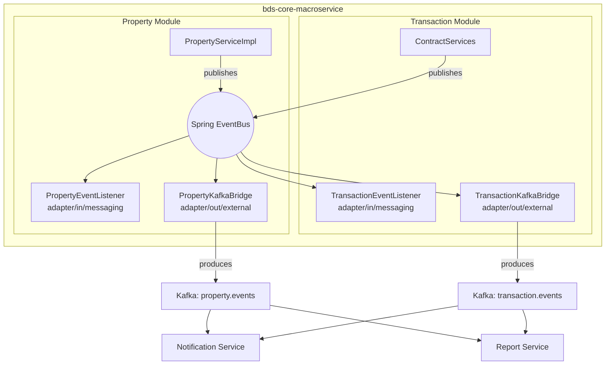

# Phase 2: Kafka Event Bridge & Exposed APIs

> [!NOTE]
> Implement this AFTER Phase 1 (in-memory event bus) is working. This phase externalizes events for other microservices and adds REST APIs so the system doesn't solely rely on the event bus.

> [!IMPORTANT]
> **Transactional Safety in Listeners:**
> Since `@TransactionalEventListener(phase = AFTER_COMMIT)` runs after the main transaction has committed, the listener execution is **not** transactional by default. 
> - For **Kafka bridges** that only send messages, this is usually fine.
> - For **listeners that mutate the database**, you MUST ensure a new transaction is started, either by:
>     1. Adding `@Transactional(propagation = Propagation.REQUIRES_NEW)` to the listener method.
>     2. Or calling a `@Service` method that is itself `@Transactional`.

| Mechanism | Use Case | Failure Mode |
|---|---|---|
| **In-memory events** | Intra-macroservice fan-out (Property ↔ Transaction) | Process crash = event lost |
| **Kafka bridge** | Inter-microservice communication (Core → Notification, Report, etc.) | Kafka down = events buffered/retried |
| **REST APIs (facades)** | Synchronous queries, compensating actions, manual retrigger | Standard HTTP errors |

The system should **not** depend on any single mechanism. Kafka handles async fan-out to external services; REST APIs provide synchronous fallbacks and direct queries.

---

## 2. Architecture



### Hexagonal Placement

| Component | Package | Why |
|---|---|---|
| `PropertyKafkaBridge` | `property/internal/adapter/out/external/` | Outbound driven adapter — sends data OUT to Kafka |
| `TransactionKafkaBridge` | `transaction/internal/adapter/out/external/` | Same |
| Kafka config | `property/internal/infrastructure/` or app-level `config/` | Cross-cutting infrastructure |

---

## 3. Maven Dependencies to Add

**In `bds-core-macroservice/pom.xml`:**

```xml
<!-- Kafka -->
<dependency>
    <groupId>org.springframework.kafka</groupId>
    <artifactId>spring-kafka</artifactId>
</dependency>

<!-- Optional: Spring Modulith Kafka externalization (auto-forwards events) -->
<!-- Only if you want to use the Modulith built-in approach instead of manual bridge -->
<!--
<dependency>
    <groupId>org.springframework.modulith</groupId>
    <artifactId>spring-modulith-events-kafka</artifactId>
</dependency>
-->
```

**In `application.yml`:**

```yaml
spring:
  kafka:
    bootstrap-servers: ${KAFKA_BOOTSTRAP_SERVERS:localhost:9092}
    producer:
      key-serializer: org.apache.kafka.common.serialization.StringSerializer
      value-serializer: org.springframework.kafka.support.serializer.JsonSerializer
      properties:
        spring.json.type.mapping: >
          property-status-changed:com.se.bds.core.property.api.event.PropertyStatusChangedEvent,
          contract-status-changed:com.se.bds.core.transaction.api.event.ContractStatusChangedEvent,
          payment-completed:com.se.bds.core.transaction.api.event.PaymentCompletedEvent
```

---

## 4. Kafka Event Bridge Code

### 4.1 — PropertyKafkaBridge.java

**Path:** `property/internal/adapter/out/external/PropertyKafkaBridge.java`

```java
package com.se.bds.core.property.internal.adapter.out.external;

import com.se.bds.core.property.api.event.PropertyAgentAssignedEvent;
import com.se.bds.core.property.api.event.PropertyServiceFeeCollectedEvent;
import com.se.bds.core.property.api.event.PropertyStatusChangedEvent;
import lombok.RequiredArgsConstructor;
import lombok.extern.slf4j.Slf4j;
import org.springframework.kafka.core.KafkaTemplate;
import org.springframework.stereotype.Component;
import org.springframework.transaction.event.TransactionPhase;
import org.springframework.transaction.event.TransactionalEventListener;

/**
 * Outbound adapter that bridges in-memory Spring events to Kafka topics
 * for consumption by external microservices (Notification, Report, etc.).
 */
@Component
@RequiredArgsConstructor
@Slf4j
class PropertyKafkaBridge {

    private static final String TOPIC = "property.events";

    private final KafkaTemplate<String, Object> kafkaTemplate;

    @TransactionalEventListener(phase = TransactionPhase.AFTER_COMMIT)
    public void onPropertyStatusChanged(PropertyStatusChangedEvent event) {
        String key = event.propertyId().value().toString();
        kafkaTemplate.send(TOPIC, key, event);
        log.info("[PropertyKafkaBridge] Sent PropertyStatusChanged to Kafka: "
                + "property={}, {} → {}",
                key, event.oldStatus(), event.newStatus());
    }

    @TransactionalEventListener(phase = TransactionPhase.AFTER_COMMIT)
    public void onPropertyAgentAssigned(PropertyAgentAssignedEvent event) {
        String key = event.propertyId().value().toString();
        kafkaTemplate.send(TOPIC, key, event);
        log.info("[PropertyKafkaBridge] Sent PropertyAgentAssigned to Kafka: "
                + "property={}", key);
    }

    @TransactionalEventListener(phase = TransactionPhase.AFTER_COMMIT)
    public void onServiceFeeCollected(PropertyServiceFeeCollectedEvent event) {
        String key = event.propertyId().value().toString();
        kafkaTemplate.send(TOPIC, key, event);
        log.info("[PropertyKafkaBridge] Sent ServiceFeeCollected to Kafka: "
                + "property={}, fullyPaid={}", key, event.fullyPaid());
    }
}
```

### 4.2 — TransactionKafkaBridge.java

**Path:** `transaction/internal/adapter/out/external/TransactionKafkaBridge.java`

```java
package com.se.bds.core.transaction.internal.adapter.out.external;

import com.se.bds.core.transaction.api.event.ContractActivatedEvent;
import com.se.bds.core.transaction.api.event.ContractCancelledEvent;
import com.se.bds.core.transaction.api.event.ContractStatusChangedEvent;
import com.se.bds.core.transaction.api.event.PaymentCompletedEvent;
import lombok.RequiredArgsConstructor;
import lombok.extern.slf4j.Slf4j;
import org.springframework.kafka.core.KafkaTemplate;
import org.springframework.stereotype.Component;
import org.springframework.transaction.event.TransactionPhase;
import org.springframework.transaction.event.TransactionalEventListener;

/**
 * Outbound adapter that bridges in-memory Spring events to Kafka topics
 * for consumption by external microservices (Notification, Report, etc.).
 */
@Component
@RequiredArgsConstructor
@Slf4j
class TransactionKafkaBridge {

    private static final String TOPIC = "transaction.events";

    private final KafkaTemplate<String, Object> kafkaTemplate;

    @TransactionalEventListener(phase = TransactionPhase.AFTER_COMMIT)
    public void onContractStatusChanged(ContractStatusChangedEvent event) {
        String key = event.contractId().value().toString();
        kafkaTemplate.send(TOPIC, key, event);
        log.info("[TransactionKafkaBridge] Sent ContractStatusChanged to Kafka: "
                + "contract={}, {} → {}", key, event.oldStatus(), event.newStatus());
    }

    @TransactionalEventListener(phase = TransactionPhase.AFTER_COMMIT)
    public void onContractActivated(ContractActivatedEvent event) {
        String key = event.contractId().value().toString();
        kafkaTemplate.send(TOPIC, key, event);
        log.info("[TransactionKafkaBridge] Sent ContractActivated to Kafka: "
                + "contract={}", key);
    }

    @TransactionalEventListener(phase = TransactionPhase.AFTER_COMMIT)
    public void onContractCancelled(ContractCancelledEvent event) {
        String key = event.contractId().value().toString();
        kafkaTemplate.send(TOPIC, key, event);
        log.info("[TransactionKafkaBridge] Sent ContractCancelled to Kafka: "
                + "contract={}", key);
    }

    @TransactionalEventListener(phase = TransactionPhase.AFTER_COMMIT)
    public void onPaymentCompleted(PaymentCompletedEvent event) {
        String key = event.contractId().value().toString();
        kafkaTemplate.send(TOPIC, key, event);
        log.info("[TransactionKafkaBridge] Sent PaymentCompleted to Kafka: "
                + "payment={}, contract={}", event.paymentId(), key);
    }
}
```

---

## 5. Exposed REST APIs (Synchronous Fallbacks)

These are methods that other services should also be able to call via HTTP, not solely depend on events.

### 5.1 — PropertyFacade Additions

The existing `PropertyFacade` already declares `recordServiceFeePayment()`. These additional methods may be needed for external callers:

```java
// Already exists:
void recordServiceFeePayment(PropertyId propertyId, BigDecimal amount);

// Consider adding for Report/Admin microservice:
PropertySnapshot getPropertySnapshot(PropertyId propertyId);       // already exists
void validatePropertyAvailableForContract(PropertyId id, String type); // already exists
```

> The PropertyFacade already covers the synchronous API surface well. No new facade methods needed — just ensure the facade implementation (`PropertyFacadeImpl`) properly delegates `recordServiceFeePayment()` to the repository.

### 5.2 — TransactionFacade Additions

The existing `TransactionFacade` may need:

```java
// Already exists:
boolean hasActiveContractForProperty(UUID propertyId, String contractType);
List<ContractHistoryDataPoint> getContractHistoryForProperty(UUID propertyId, boolean includePast);

// Consider adding — allows Property module or Admin to force-cancel:
void cancelAllContractsForProperty(UUID propertyId, String reason);
```

**Full addition to `TransactionFacade.java`:**

```java
/**
 * Synchronous API for cancelling all active contracts for a property.
 * This is the REST/facade equivalent of what TransactionEventListener does
 * on PropertyStatusChangedEvent(DELETED). Provides a non-event-bus fallback.
 */
void cancelAllContractsForProperty(UUID propertyId, String reason);
```

**Implementation in TransactionFacadeImpl** (wherever that lives):

```java
@Override
@Transactional
public void cancelAllContractsForProperty(UUID propertyId, String reason) {
    // Reuse same logic as TransactionEventListener
    // Option A: Extract shared helper
    // Option B: Delegate to the listener (not recommended — adapters shouldn't call each other)
    // Option C: Move the logic to a domain service and call from both listener and facade

    // Recommended: create a ContractCancellationService in application/service/
    contractCancellationService.cancelAllForProperty(propertyId, reason);
}
```

> [!TIP]
> If both `TransactionEventListener` and `TransactionFacadeImpl` need the cancel-all logic, extract it into a shared **application service** (`ContractCancellationService`) in `transaction/internal/application/service/`. Both the adapter (listener) and the facade can then delegate to it. This keeps the logic in one place.

---

## 6. Optional: Shared Cancel Service

**Path:** `transaction/internal/application/service/ContractCancellationService.java`

```java
package com.se.bds.core.transaction.internal.application.service;

import com.se.bds.core.shared.enums.Role;
import com.se.bds.core.shared.ids.ContractId;
import com.se.bds.core.transaction.api.event.ContractCancelledEvent;
import com.se.bds.core.transaction.internal.application.port.out.DepositContractRepository;
import com.se.bds.core.transaction.internal.application.port.out.PurchaseContractRepository;
import com.se.bds.core.transaction.internal.application.port.out.RentalContractRepository;
import com.se.bds.core.transaction.internal.domain.model.ContractStatus;
import com.se.bds.core.transaction.internal.domain.model.DepositContract;
import com.se.bds.core.transaction.internal.domain.model.PurchaseContract;
import com.se.bds.core.transaction.internal.domain.model.RentalContract;
import lombok.RequiredArgsConstructor;
import lombok.extern.slf4j.Slf4j;
import org.springframework.context.ApplicationEventPublisher;
import org.springframework.stereotype.Service;
import org.springframework.transaction.annotation.Transactional;

import java.time.Instant;
import java.util.List;
import java.util.UUID;

/**
 * Shared application service for bulk contract cancellation.
 * Used by both TransactionEventListener (async) and TransactionFacade (sync).
 */
@Service
@RequiredArgsConstructor
@Slf4j
public class ContractCancellationService {

    private final DepositContractRepository depositContractRepository;
    private final RentalContractRepository rentalContractRepository;
    private final PurchaseContractRepository purchaseContractRepository;
    private final ApplicationEventPublisher eventPublisher;

    @Transactional
    public int cancelAllForProperty(UUID propertyId, String reason) {
        int count = 0;
        count += cancelDeposits(propertyId, reason);
        count += cancelRentals(propertyId, reason);
        count += cancelPurchases(propertyId, reason);
        log.info("[ContractCancellationService] Cancelled {} contracts for property {}",
                count, propertyId);
        return count;
    }

    private int cancelDeposits(UUID propertyId, String reason) {
        List<DepositContract> contracts =
                depositContractRepository.findActiveContractsByPropertyId(propertyId);
        for (DepositContract c : contracts) {
            c.setStatus(ContractStatus.CANCELLED);
            c.setCancellationReason(reason);
            c.setCancelledBy(Role.ADMIN);
            depositContractRepository.save(c);
            eventPublisher.publishEvent(new ContractCancelledEvent(
                    new ContractId(c.getId()), "DEPOSIT", propertyId,
                    Role.ADMIN, reason, Instant.now()));
        }
        return contracts.size();
    }

    private int cancelRentals(UUID propertyId, String reason) {
        List<RentalContract> contracts =
                rentalContractRepository.findActiveContractsByPropertyId(propertyId);
        for (RentalContract c : contracts) {
            c.setStatus(ContractStatus.CANCELLED);
            c.setCancellationReason(reason);
            c.setCancelledBy(Role.ADMIN);
            rentalContractRepository.save(c);
            eventPublisher.publishEvent(new ContractCancelledEvent(
                    new ContractId(c.getId()), "RENTAL", propertyId,
                    Role.ADMIN, reason, Instant.now()));
        }
        return contracts.size();
    }

    private int cancelPurchases(UUID propertyId, String reason) {
        List<PurchaseContract> contracts =
                purchaseContractRepository.findActiveContractsByPropertyId(propertyId);
        for (PurchaseContract c : contracts) {
            c.setStatus(ContractStatus.CANCELLED);
            c.setCancellationReason(reason);
            c.setCancelledBy(Role.ADMIN);
            purchaseContractRepository.save(c);
            eventPublisher.publishEvent(new ContractCancelledEvent(
                    new ContractId(c.getId()), "PURCHASE", propertyId,
                    Role.ADMIN, reason, Instant.now()));
        }
        return contracts.size();
    }
}
```

Then `TransactionEventListener` becomes thin:
```java
@TransactionalEventListener(phase = TransactionPhase.AFTER_COMMIT)
public void onPropertyStatusChanged(PropertyStatusChangedEvent event) {
    String newStatus = event.newStatus().name();
    if ("DELETED".equals(newStatus) || "REMOVED".equals(newStatus)) {
        contractCancellationService.cancelAllForProperty(
                event.propertyId().value(),
                "Property " + newStatus.toLowerCase() + " — auto-cancelled");
    }
}
```

---

## 7. Summary: All Communication Channels

| From → To | In-Memory Event | Kafka Bridge | REST API |
|---|---|---|---|
| Transaction → Property (status sync) | `ContractStatusChangedEvent` → `PropertyEventListener` | `TransactionKafkaBridge` → topic | `PropertyFacade.recordServiceFeePayment()` |
| Property → Transaction (cancel cascade) | `PropertyStatusChangedEvent` → `TransactionEventListener` | `PropertyKafkaBridge` → topic | `TransactionFacade.cancelAllContractsForProperty()` |
| Core → Notification | — (different process) | Kafka topics | — |
| Core → Report | — (different process) | Kafka topics | `TransactionFacade.getRevenuePaymentsInMonth()` etc. |

## 8. Checklist

- [ ] Add `spring-kafka` dependency to `pom.xml`
- [ ] Add Kafka config to `application.yml`
- [ ] Create `PropertyKafkaBridge` in `property/internal/adapter/out/external/`
- [ ] Create `TransactionKafkaBridge` in `transaction/internal/adapter/out/external/`
- [ ] Add `cancelAllContractsForProperty()` to `TransactionFacade`
- [ ] Create `ContractCancellationService` (shared logic)
- [ ] Refactor `TransactionEventListener` to delegate to `ContractCancellationService`
- [ ] Implement `TransactionFacadeImpl.cancelAllContractsForProperty()`
