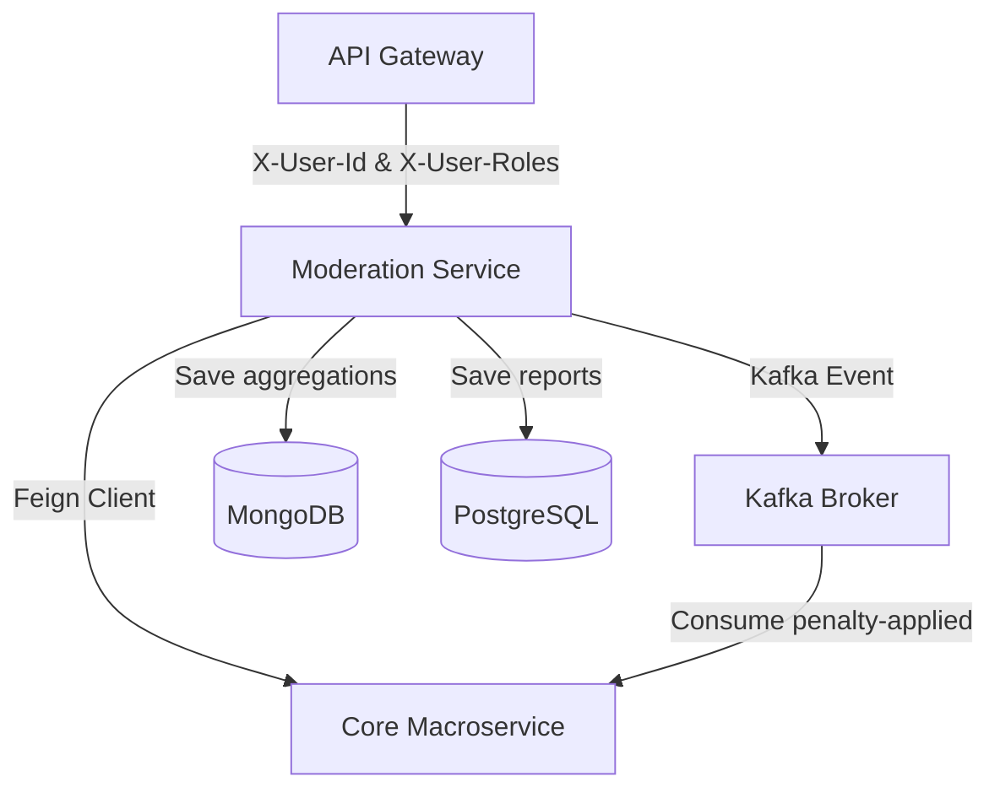

# Implementation Plan - Moderation Service Gap Remediation

This document details the step-by-step technical plan to remediate the architectural, integration, security, and contract gaps identified in the [moderation-service](file:///home/annguyen/master_projects/sem2_year3_projects/BatDongSan/BatDongScam-Backend-Microservice/moderation-service). The goal is to migrate it from an isolated standalone application into a secure, fully integrated microservice inside the BatDongSan platform.

---

## User Review Required

> [!IMPORTANT]
> **Stateless Downstream Role Propagation**
> The current system lacks Role-Based Access Control (RBAC) downstream because user roles are stripped at the gateway. To solve this, we must configure the gateway filter [JwtAuthenticationFilter.java](file:///home/annguyen/master_projects/sem2_year3_projects/BatDongSan/BatDongScam-Backend-Microservice/api-gateway/src/main/java/com/se100/bds/gateway/filter/JwtAuthenticationFilter.java) to propagate the role claims as a comma-separated header `X-User-Roles` (e.g., `ADMIN,CUSTOMER`). Downstream services will then extract this header to populate the Spring Security Context.

> [!WARNING]
> **Polyglot Persistence in Moderation Service**
> Migrating the daily/monthly statistics scheduler requires introducing MongoDB to the [moderation-service](file:///home/annguyen/master_projects/sem2_year3_projects/BatDongSan/BatDongScam-Backend-Microservice/moderation-service) alongside PostgreSQL. This introduces a dual-database environment (PostgreSQL for transactional reports, MongoDB for analytical snapshots). We must configure Spring Boot to support both starters smoothly without configuration collisions.

---

## Open Questions

> [!NOTE]
> **Validation Failure Policy (Fail-Secure vs. Permissive Fallback)**
> When validating reported properties or users via REST/Feign clients, if the target service is unavailable (e.g. network timeout or circuit breaker open), should the moderation service allow the report to be created under a warning (Permissive Mode), or block creation entirely (Fail-Secure)?
>
> **Proposed Approach:** We will implement a *Fail-Secure* policy where a report creation fails with a `503 Service Unavailable` if core validations cannot be completed, ensuring no orphaned or fake violation reports are saved.

---

## Proposed Changes



### Phase A: Contract & DTO Standardization
This phase registers the service in the build pipeline, replaces local response wrappers with the shared platform response types, and extracts enums to enable shared cross-service type safety.

---

#### [MODIFY] [pom.xml (root)](file:///home/annguyen/master_projects/sem2_year3_projects/BatDongSan/BatDongScam-Backend-Microservice/pom.xml)
- Add `<module>moderation-service</module>` under the `<modules>` section to include it in consolidated multi-module Maven builds.

#### [MODIFY] [pom.xml (moderation-service)](file:///home/annguyen/master_projects/sem2_year3_projects/BatDongSan/BatDongScam-Backend-Microservice/moderation-service/pom.xml)
- Change `<parent>` block to inherit from the parent POM `batdongsan-platform` (`com.se.bds`, version `0.0.1-SNAPSHOT`).
- Add the `bds-common` dependency to import shared DTOs, enums, and exceptions:
  ```xml
  <dependency>
      <groupId>com.se.bds</groupId>
      <artifactId>bds-common</artifactId>
      <version>0.0.1-SNAPSHOT</version>
  </dependency>
  ```
- Remove local dependencies redundant with parent dependency management (e.g., matching lombok, jackson, and validation versions).

#### [NEW] [com.se.bds.common.enums](file:///home/annguyen/master_projects/sem2_year3_projects/BatDongSan/BatDongScam-Backend-Microservice/bds-common/src/main/java/com/se/bds/common/enums)
- Create and export standard enums in `bds-common` to replace duplicates in the moderation-service:
  - [ViolationReportedTypeEnum.java](file:///home/annguyen/master_projects/sem2_year3_projects/BatDongSan/BatDongScam-Backend-Microservice/bds-common/src/main/java/com/se/bds/common/enums/ViolationReportedTypeEnum.java)
  - [ViolationTypeEnum.java](file:///home/annguyen/master_projects/sem2_year3_projects/BatDongSan/BatDongScam-Backend-Microservice/bds-common/src/main/java/com/se/bds/common/enums/ViolationTypeEnum.java)
  - [ViolationStatusEnum.java](file:///home/annguyen/master_projects/sem2_year3_projects/BatDongSan/BatDongScam-Backend-Microservice/bds-common/src/main/java/com/se/bds/common/enums/ViolationStatusEnum.java)
  - [PenaltyAppliedEnum.java](file:///home/annguyen/master_projects/sem2_year3_projects/BatDongSan/BatDongScam-Backend-Microservice/bds-common/src/main/java/com/se/bds/common/enums/PenaltyAppliedEnum.java)
  - [MediaTypeEnum.java](file:///home/annguyen/master_projects/sem2_year3_projects/BatDongSan/BatDongScam-Backend-Microservice/bds-common/src/main/java/com/se/bds/common/enums/MediaTypeEnum.java)

#### [DELETE] [Constants.java (Enums only)](file:///home/annguyen/master_projects/sem2_year3_projects/BatDongSan/BatDongScam-Backend-Microservice/moderation-service/src/main/java/microservices/moderationservice/common/Constants.java)
- Delete local enum definitions from `Constants.java` to prevent namespace collision.
- Replace imports across `ViolationReport.java`, `ViolationServiceImpl.java`, `ViolationController.java`, and DTOs with the `com.se.bds.common.enums.*` classes.

#### [DELETE] [Local API response wrappers](file:///home/annguyen/master_projects/sem2_year3_projects/BatDongSan/BatDongScam-Backend-Microservice/moderation-service/src/main/java/microservices/moderationservice/api/response)
- Delete the following custom wrappers:
  - [AbstractBaseResponse.java](file:///home/annguyen/master_projects/sem2_year3_projects/BatDongSan/BatDongScam-Backend-Microservice/moderation-service/src/main/java/microservices/moderationservice/api/response/AbstractBaseResponse.java)
  - [SingleResponse.java](file:///home/annguyen/master_projects/sem2_year3_projects/BatDongSan/BatDongScam-Backend-Microservice/moderation-service/src/main/java/microservices/moderationservice/api/response/SingleResponse.java)
  - [PageResponse.java](file:///home/annguyen/master_projects/sem2_year3_projects/BatDongSan/BatDongScam-Backend-Microservice/moderation-service/src/main/java/microservices/moderationservice/api/response/PageResponse.java)
- Delete local [AbstractBaseDataResponse.java](file:///home/annguyen/master_projects/sem2_year3_projects/BatDongSan/BatDongScam-Backend-Microservice/moderation-service/src/main/java/microservices/moderationservice/common/model/AbstractBaseDataResponse.java) and replace it with `com.se.bds.common.dto.AbstractBaseDataResponse`.
- Delete local [NotFoundException.java](file:///home/annguyen/master_projects/sem2_year3_projects/BatDongSan/BatDongScam-Backend-Microservice/moderation-service/src/main/java/microservices/moderationservice/common/exception/NotFoundException.java) and replace usages with standard `com.se.bds.common.exception.BusinessException`.

#### [MODIFY] [ViolationController.java](file:///home/annguyen/master_projects/sem2_year3_projects/BatDongSan/BatDongScam-Backend-Microservice/moderation-service/src/main/java/microservices/moderationservice/moderation/controller/ViolationController.java)
- Update all endpoint method signatures to wrap payloads in `com.se.bds.common.dto.ApiResponse<T>` instead of `SingleResponse` and `PageResponse`.
- Refactor return statements to map results using `ApiResponse.success(data)` and `ApiResponse.error(message)`.

---

### Phase B: Business Logic Parity
This phase migrates the missing legacy schedulers, implements proper evidence media classification, and integrates real Cloudinary CDN storage.

---

#### [NEW] [ViolationEvidence.java](file:///home/annguyen/master_projects/sem2_year3_projects/BatDongSan/BatDongScam-Backend-Microservice/moderation-service/src/main/java/microservices/moderationservice/moderation/entity/ViolationEvidence.java)
- Create a new `@Embeddable` class to replace the raw String array `evidenceUrls`:
  ```java
  package microservices.moderationservice.moderation.entity;

  import jakarta.persistence.Embeddable;
  import jakarta.persistence.EnumType;
  import jakarta.persistence.Enumerated;
  import lombok.*;
  import com.se.bds.common.enums.MediaTypeEnum;

  @Embeddable
  @Getter @Setter @Builder
  @NoArgsConstructor @AllArgsConstructor
  public class ViolationEvidence {
      private String fileUrl;
      @Enumerated(EnumType.STRING)
      private MediaTypeEnum mediaType;
      private String fileName;
      private String mimeType;
  }
  ```

#### [MODIFY] [ViolationReport.java](file:///home/annguyen/master_projects/sem2_year3_projects/BatDongSan/BatDongScam-Backend-Microservice/moderation-service/src/main/java/microservices/moderationservice/moderation/entity/ViolationReport.java)
- Refactor `evidenceUrls` collection to use `ViolationEvidence` elements:
  ```java
  @ElementCollection
  @CollectionTable(name = "violation_evidence_files", joinColumns = @JoinColumn(name = "violation_id"))
  @Builder.Default
  private List<ViolationEvidence> evidenceList = new ArrayList<>();
  ```

#### [MODIFY] [ViolationServiceImpl.java](file:///home/annguyen/master_projects/sem2_year3_projects/BatDongSan/BatDongScam-Backend-Microservice/moderation-service/src/main/java/microservices/moderationservice/moderation/service/impl/ViolationServiceImpl.java)
- Update `createViolationReport` to extract content types from file uploads:
  - If MIME type is image-based (`image/*`), classify media type as `MediaTypeEnum.IMAGE`.
  - Otherwise, classify it as `MediaTypeEnum.DOCUMENT`.
- Populate and add `ViolationEvidence` objects to `evidenceList` instead of raw strings.

#### [NEW] [CloudinaryService.java](file:///home/annguyen/master_projects/sem2_year3_projects/BatDongSan/BatDongScam-Backend-Microservice/moderation-service/src/main/java/microservices/moderationservice/storage/CloudinaryService.java)
- Implement a real Cloudinary file upload service to replace [MockFileStorageService.java](file:///home/annguyen/master_projects/sem2_year3_projects/BatDongSan/BatDongScam-Backend-Microservice/moderation-service/src/main/java/microservices/moderationservice/storage/MockFileStorageService.java).
- Read credentials from properties (`cloudinary.cloud-name`, `cloudinary.api-key`, `cloudinary.api-secret`).

#### [NEW] [Violation Reporting Scheduler & Schemas](file:///home/annguyen/master_projects/sem2_year3_projects/BatDongSan/BatDongScam-Backend-Microservice/moderation-service/src/main/java/microservices/moderationservice/moderation/schema)
- Add the `spring-boot-starter-data-mongodb` dependency to `moderation-service/pom.xml`.
- Recreate legacy Mongo schemas under the `microservices.moderationservice.moderation.schema` package:
  - `AbstractBaseMongoSchema.java` (stores document ID, creation date, modification date)
  - `AbstractBaseMongoReport.java` (stores common reporting header)
  - `BaseReportData.java` (stores month, year, report title, description, and report type)
  - `ViolationReportDetails.java` (document mapping for MongoDB collections storing aggregates)
- Recreate [ViolationReportDetailsRepository.java](file:///home/annguyen/master_projects/sem2_year3_projects/BatDongSan/BatDongScam-Backend-Microservice/moderation-service/src/main/java/microservices/moderationservice/moderation/repository/mongo/ViolationReportDetailsRepository.java) extending `MongoRepository`.
- Recreate the scheduler `ViolationReportScheduler.java` running on `@Scheduled(cron = "0 0 0 1 * ?")` to aggregate stats for the month and persist to MongoDB.

#### [NEW] [ViolationReportController.java](file:///home/annguyen/master_projects/sem2_year3_projects/BatDongSan/BatDongScam-Backend-Microservice/moderation-service/src/main/java/microservices/moderationservice/moderation/controller/ViolationReportController.java)
- Expose GET `/violations/admin/reports/{year}` returning `ViolationReportStats` payload containing charts, trends, and averages for the requested year (migrated from legacy `ReportServiceImpl.java` and `StatisticReportController`).

---

### Phase C: Integration & Communication
This phase configures Eureka registration, implements OpenFeign clients to enrich and validate data, enforces downstream role verification from gateway headers, and integrates Kafka events for penalty propagation.

---

#### [MODIFY] [pom.xml (moderation-service)](file:///home/annguyen/master_projects/sem2_year3_projects/BatDongSan/BatDongScam-Backend-Microservice/moderation-service/pom.xml)
- Add Spring Cloud Netflix Eureka Client, OpenFeign, Resilience4j, and Kafka dependencies:
  ```xml
  <dependency>
      <groupId>org.springframework.cloud</groupId>
      <artifactId>spring-cloud-starter-netflix-eureka-client</artifactId>
  </dependency>
  <dependency>
      <groupId>org.springframework.cloud</groupId>
      <artifactId>spring-cloud-starter-openfeign</artifactId>
  </dependency>
  <dependency>
      <groupId>org.springframework.cloud</groupId>
      <artifactId>spring-cloud-starter-circuitbreaker-resilience4j</artifactId>
  </dependency>
  <dependency>
      <groupId>org.springframework.kafka</groupId>
      <artifactId>spring-kafka</artifactId>
  </dependency>
  ```

#### [MODIFY] [application.properties (moderation-service)](file:///home/annguyen/master_projects/sem2_year3_projects/BatDongSan/BatDongScam-Backend-Microservice/moderation-service/src/main/resources/application.properties)
- Add Eureka client settings:
  ```properties
  eureka.client.service-url.defaultZone=${EUREKA_URI:http://localhost:8761/eureka/}
  eureka.instance.prefer-ip-address=true
  ```
- Add MongoDB configurations:
  ```properties
  spring.data.mongodb.host=${MONGODB_HOST:localhost}
  spring.data.mongodb.port=${MONGODB_PORT:27017}
  spring.data.mongodb.database=${MONGODB_DB:batdongsan_db}
  spring.data.mongodb.username=${MONGODB_USER:mongo}
  spring.data.mongodb.password=${MONGODB_PASSWORD:mongo}
  spring.data.mongodb.authentication-database=${MONGODB_AUTH_DB:admin}
  ```
- Add Kafka broker configurations:
  ```properties
  spring.kafka.bootstrap-servers=${KAFKA_BOOTSTRAP_SERVERS:localhost:9092}
  ```

#### [NEW] [CoreServiceClient.java (Feign Client)](file:///home/annguyen/master_projects/sem2_year3_projects/BatDongSan/BatDongScam-Backend-Microservice/moderation-service/src/main/java/microservices/moderationservice/client/CoreServiceClient.java)
- Create Feign Client targeting the `core-service` app name:
  ```java
  package microservices.moderationservice.client;

  import org.springframework.cloud.openfeign.FeignClient;
  import org.springframework.web.bind.annotation.GetMapping;
  import org.springframework.web.bind.annotation.PathVariable;
  import org.springframework.web.bind.annotation.RequestParam;
  import java.util.UUID;
  import java.util.Map;

  @FeignClient(name = "core-service")
  public interface CoreServiceClient {
      @GetMapping("/public/properties/{propertyId}")
      Map<String, Object> getPropertyDetails(@PathVariable("propertyId") UUID propertyId);

      @GetMapping("/users/validate")
      Map<String, Object> validateUser(@RequestParam("userId") UUID userId, @RequestParam("role") String role);
      
      @GetMapping("/users/{userId}")
      Map<String, Object> getUserDetails(@PathVariable("userId") UUID userId);
  }
  ```

#### [MODIFY] [ViolationServiceImpl.java](file:///home/annguyen/master_projects/sem2_year3_projects/BatDongSan/BatDongScam-Backend-Microservice/moderation-service/src/main/java/microservices/moderationservice/moderation/service/impl/ViolationServiceImpl.java)
- Inject `CoreServiceClient` and configure Resilience4j annotations for circuit breaking.
- Implement ID validation in `validateReportedEntity`:
  - If property: call `getPropertyDetails(reportedId)`. Catch feign exceptions, map to `BusinessException` if entity does not exist.
  - If user: call `validateUser(reportedId, role)`.
- Implement **DTO Data Enrichment**:
  - Enrich response models (`ViolationAdminItem`, `ViolationAdminDetails`, `ViolationUserDetails`, `ViolationUserItem`) with names and avatars by making Feign queries to retrieve reporter/reported user details and property titles.
- Implement **Kafka Event Dispatch**:
  - Publish `ViolationPenaltyAppliedEvent` containing `targetId`, `targetType` (User or Property), `penaltyType`, and `resolvedAt` to the `violation-penalty-applied` topic when an admin sets status to `RESOLVED` with a penalty.

#### [NEW] [ViolationPenaltyAppliedEvent.java](file:///home/annguyen/master_projects/sem2_year3_projects/BatDongSan/BatDongScam-Backend-Microservice/bds-common/src/main/java/com/se/bds/common/event/ViolationPenaltyAppliedEvent.java)
- Define standard event record inside `bds-common` event package for cross-service payload serialization.

#### [NEW] [ViolationPenaltyAppliedConsumer.java](file:///home/annguyen/master_projects/sem2_year3_projects/BatDongSan/BatDongScam-Backend-Microservice/bds-core-macroservice/src/main/java/com/se/bds/core/property/internal/adapter/in/messaging/ViolationPenaltyAppliedConsumer.java)
- Create Kafka consumer in core macroservice listening to the `violation-penalty-applied` topic:
  - If target is `PROPERTY` and penalty is `REMOVED_POST`: update property status to `REMOVED` via `PropertyUseCase.updatePropertyStatus`.
  - If target is `USER` (Customer/Owner/Agent) and penalty is `SUSPENDED_ACCOUNT`: update user status profile to `SUSPENDED` in the database.

#### [MODIFY] [HeaderUserIdAuthenticationFilter.java](file:///home/annguyen/master_projects/sem2_year3_projects/BatDongSan/BatDongScam-Backend-Microservice/moderation-service/src/main/java/microservices/moderationservice/security/HeaderUserIdAuthenticationFilter.java)
- Update filtering logic to read the comma-separated `X-User-Roles` header forwarded by the gateway.
- Parse roles and map each to a `SimpleGrantedAuthority` (e.g. `ROLE_ADMIN` if the header has `ADMIN`).
- Pass the parsed authorities to the `UsernamePasswordAuthenticationToken` during authentication context registration.

#### [MODIFY] [SecurityConfig.java](file:///home/annguyen/master_projects/sem2_year3_projects/BatDongSan/BatDongScam-Backend-Microservice/moderation-service/src/main/java/microservices/moderationservice/security/SecurityConfig.java)
- Enable method security annotations: `@EnableMethodSecurity`.
- Update HTTP configuration rules:
  - Restrict `/violations/admin/**` paths to role `ADMIN` only (`.requestMatchers("/violations/admin/**").hasRole("ADMIN")`).
  - Restrict `/violations/my-violations/**` paths to authenticated users (`.authenticated()`).

---

## Risk Assessment & Edge Cases

1. **Dual-Database Transactions**:
   Updating SQL tables (Postgres) and writing summaries to MongoDB in the scheduler happens across separate database boundaries. If a Postgres transaction fails, the scheduler must catch the exception to avoid writing partial aggregations to Mongo. We will ensure stats generation runs inside a single scoped block with robust catch handlers.
2. **Circuit Breaker Permissive Fallbacks**:
   If Feign client requests to the core macroservice fail due to network timeouts, the fallback handler must fail-secure for validation tasks (rejecting reports with unvalidated IDs) but fail-safe for DTO enrichment (returning UUIDs with default placeholder names like `Unknown User` or `Unknown Property` to prevent interface blocks).
3. **Kafka Event Delivery Guarantees**:
   If penalty events are lost, administrative suspensions won't synchronize. We will configure the Kafka template to use acknowledgment configurations (`acks=all`) and implement transactional processing.

---

## Verification Plan

### Automated Tests

- **Unit Testing**:
  - **Security Filter Tests**:
    Create `HeaderUserIdAuthenticationFilterTest` in the moderation service to verify:
    - Requests with valid `X-User-Id` and `X-User-Roles: ADMIN` populate the security context with `ROLE_ADMIN`.
    - Requests without headers or invalid formats result in an empty/cleared security context.
  - **Service Method Tests**:
    Update `ViolationServiceImplTest` to verify:
    - Creation fails with `BusinessException` if the core Feign client returns user/property validation errors.
    - Media files are correctly classified into `IMAGE` or `DOCUMENT` based on mimetype inputs.
    - Status updates to `RESOLVED` with a penalty trigger Kafka message dispatch to the template.

- **Integration Testing**:
  - Implement skeletons inside `Req_2_6_1_Test.java` in the core macroservice to verify E2E integration:
    - **TC-2.6.1-01**: Admin updates violation status to `RESOLVED` with penalty `REMOVED_POST`. Verify via Kafka that the property status is updated to `REMOVED` in the core service.
    - **TC-2.6.1-02**: Admin updates status to `RESOLVED` with penalty `SUSPENDED_ACCOUNT`. Verify the user's status profile changes to `SUSPENDED`.
    - **TC-2.6.1-03**: Verify role restrictions (requests to `/violations/admin/**` without `X-User-Roles: ADMIN` return `403 Forbidden`).

---

### Manual Verification
- Deploy system components (`api-gateway`, `bds-core-macroservice`, `moderation-service`, and Eureka/Kafka instances).
- Trigger a mock report via POST `/violations` through the gateway with a dummy file upload. Check that URLs are written with Cloudinary prefixes rather than local stubs.
- Verify through REST clients that admin endpoints `/violations/admin/**` reject requests when bypassing the gateway without proper forwarded headers.
