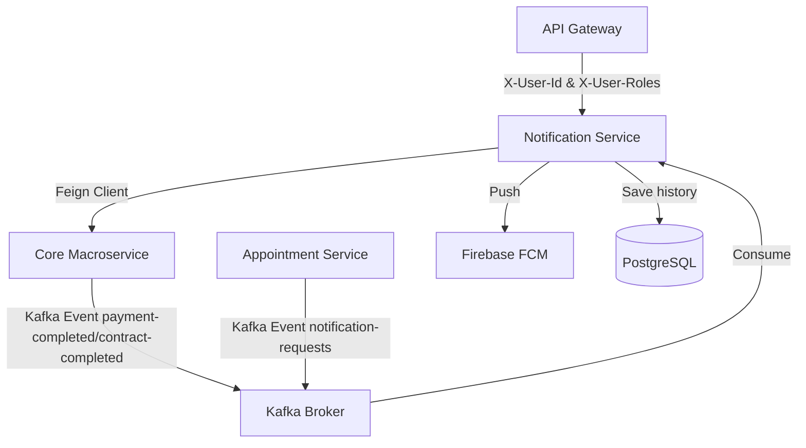

# Implementation Plan - Notification Service Gap Remediation

This document details the step-by-step technical plan to remediate the architectural, integration, security, and contract gaps identified in the [notification-service](file:///home/annguyen/master_projects/sem2_year3_projects/BatDongSan/BatDongScam-Backend-Microservice/notification-service). The goal is to migrate it from an isolated REST-based utility into a secure, fully integrated, event-driven notification provider inside the BatDongSan platform.

---

## User Review Required

> [!IMPORTANT]
> **FCM Token Management Ownership**
> Since the new microservices architecture decouples user profiles from FCM tokens, we need a single source of truth for user push tokens. We propose updating the user profile in `bds-core-macroservice` to store the user's registered FCM token and exposing a REST endpoint. When a push notification is requested without a token in the payload, the `notification-service` will fetch the token dynamically from the core service.

> [!WARNING]
> **Downstream Authentication Propagation**
> Downstream microservices must reject unauthenticated requests. We must configure the `api-gateway` filter `JwtAuthenticationFilter.java` to propagate role claims as `X-User-Roles` (e.g. `ADMIN,CUSTOMER`) to let downstream services validate roles. In `notification-service`, we will implement a stateless Spring Security configuration that validates these headers.

---

## Open Questions

> [!NOTE]
> **FCM Token Resolution Fallback Policy**
> If a notification must be sent but the core service REST endpoint is unavailable (e.g., connection timeout or circuit breaker open), how should `notification-service` proceed?
>
> **Proposed Approach:** Implement a *Fail-Safe* fallback. The service will write the notification to the local PostgreSQL database (enabling the user to read it later in their unified in-app mailbox) but skip dispatching the Firebase push notification, logging a warning rather than throwing a blocking exception.

---

## Proposed Changes



### Phase A: Contract & DTO Standardization
This phase registers the service in the parent build pipeline, replaces local response wrappers with the shared platform response types, and migrates enums to maintain strict type parity across the platform.

---

#### [MODIFY] [pom.xml (root)](file:///home/annguyen/master_projects/sem2_year3_projects/BatDongSan/BatDongScam-Backend-Microservice/pom.xml)
- Add `<module>notification-service</module>` under the `<modules>` section to include it in the multi-module Maven build.

#### [MODIFY] [pom.xml (notification-service)](file:///home/annguyen/master_projects/sem2_year3_projects/BatDongSan/BatDongScam-Backend-Microservice/notification-service/pom.xml)
- Change `<parent>` block to inherit from the parent POM `batdongsan-platform` (`com.se.bds`, version `0.0.1-SNAPSHOT`).
- Remove `<properties><java.version>17</java.version></properties>` to inherit Java 21 compile configuration.
- Change the `groupId` from `com.se100.bds` to `com.se.bds`.
- Add the `bds-common` dependency to import shared DTOs and exceptions:
  ```xml
  <dependency>
      <groupId>com.se.bds</groupId>
      <artifactId>bds-common</artifactId>
      <version>0.0.1-SNAPSHOT</version>
  </dependency>
  ```
- Remove redundant dependency versions (Lombok, modelmapper, validation) managed by the parent.

#### [NEW] [com.se.bds.common.enums](file:///home/annguyen/master_projects/sem2_year3_projects/BatDongSan/BatDongScam-Backend-Microservice/bds-common/src/main/java/com/se/bds/common/enums)
- Create shared enums in `bds-common` to maintain strict contract parity:
  - [NotificationTypeEnum.java](file:///home/annguyen/master_projects/sem2_year3_projects/BatDongSan/BatDongScam-Backend-Microservice/bds-common/src/main/java/com/se/bds/common/enums/NotificationTypeEnum.java)
  - [RelatedEntityTypeEnum.java](file:///home/annguyen/master_projects/sem2_year3_projects/BatDongSan/BatDongScam-Backend-Microservice/bds-common/src/main/java/com/se/bds/common/enums/RelatedEntityTypeEnum.java)
  - [NotificationStatusEnum.java](file:///home/annguyen/master_projects/sem2_year3_projects/BatDongSan/BatDongScam-Backend-Microservice/bds-common/src/main/java/com/se/bds/common/enums/NotificationStatusEnum.java)

#### [DELETE] [Constants.java (Enums only)](file:///home/annguyen/master_projects/sem2_year3_projects/BatDongSan/BatDongScam-Backend-Microservice/notification-service/src/main/java/com/se100/bds/notificationservice/utils/Constants.java)
- Delete local duplicate enum definitions from `Constants.java`.
- Replace local enum imports across entity, mapper, controller, and service files with the shared `com.se.bds.common.enums.*` classes.

#### [DELETE] [Local API response wrappers](file:///home/annguyen/master_projects/sem2_year3_projects/BatDongSan/BatDongScam-Backend-Microservice/notification-service/src/main/java/com/se100/bds/notificationservice/dtos/responses)
- Delete the following custom response wrappers:
  - [AbstractBaseResponse.java](file:///home/annguyen/master_projects/sem2_year3_projects/BatDongSan/BatDongScam-Backend-Microservice/notification-service/src/main/java/com/se100/bds/notificationservice/dtos/responses/AbstractBaseResponse.java)
  - [SingleResponse.java](file:///home/annguyen/master_projects/sem2_year3_projects/BatDongSan/BatDongScam-Backend-Microservice/notification-service/src/main/java/com/se100/bds/notificationservice/dtos/responses/SingleResponse.java)
  - [PageResponse.java](file:///home/annguyen/master_projects/sem2_year3_projects/BatDongSan/BatDongScam-Backend-Microservice/notification-service/src/main/java/com/se100/bds/notificationservice/dtos/responses/PageResponse.java)
  - [AbstractBaseDataResponse.java](file:///home/annguyen/master_projects/sem2_year3_projects/BatDongSan/BatDongScam-Backend-Microservice/notification-service/src/main/java/com/se100/bds/notificationservice/dtos/responses/AbstractBaseDataResponse.java)
- Delete unused error DTO classes inside `com/se100/bds/notificationservice/dtos/responses/error/`.

#### [MODIFY] [NotificationController.java](file:///home/annguyen/master_projects/sem2_year3_projects/BatDongSan/BatDongScam-Backend-Microservice/notification-service/src/main/java/com/se100/bds/notificationservice/controllers/NotificationController.java)
- Update all endpoint method signatures to return standard `com.se.bds.common.dto.ApiResponse<T>` instead of `SingleResponse` and `PageResponse`.
- Refactor return statements to map results using `ApiResponse.success(data)` and `ApiResponse.error(message)`.

#### [MODIFY] [AppExceptionHandler.java](file:///home/annguyen/master_projects/sem2_year3_projects/BatDongSan/BatDongScam-Backend-Microservice/notification-service/src/main/java/com/se100/bds/notificationservice/exceptions/AppExceptionHandler.java)
- Update handlers to return standardized error structures using `ApiResponse.error(...)` wrapped in `ResponseEntity`.

---

### Phase B: Business Logic Parity
This phase adds support for User FCM token registration and resolution in the core macroservice, integrates dynamic FCM token resolution via Feign client in `notification-service`, and configures role-based access security.

---

#### [NEW] [com.se.bds.core.user.internal](file:///home/annguyen/master_projects/sem2_year3_projects/BatDongSan/BatDongScam-Backend-Microservice/bds-core-macroservice/src/main/java/com/se/bds/core/user/internal)
- Implement user profile tracking in `bds-core-macroservice`:
  - **User Entity:** Map the existing `users` database table to track user properties, adding `@Column(name = "fcm_token") private String fcmToken`.
  - **UserRepository:** Create JPA repository to fetch/save user profiles.
  - **UserController:** Expose internal API endpoints:
    - `GET /api/users/{userId}/fcm-token` (retrieves the user's FCM token).
    - `PUT /api/users/{userId}/fcm-token?token={token}` (saves/registers the user's FCM token upon login).
    - `GET /users/validate?userId={userId}&role={role}` (resolves standard user validation).

#### [NEW] [CoreServiceClient.java](file:///home/annguyen/master_projects/sem2_year3_projects/BatDongSan/BatDongScam-Backend-Microservice/notification-service/src/main/java/com/se100/bds/notificationservice/client/CoreServiceClient.java)
- Create Feign Client targeting the `core-service` app name:
  ```java
  package com.se100.bds.notificationservice.client;

  import org.springframework.cloud.openfeign.FeignClient;
  import org.springframework.web.bind.annotation.GetMapping;
  import org.springframework.web.bind.annotation.PathVariable;
  import java.util.UUID;

  @FeignClient(name = "core-service")
  public interface CoreServiceClient {
      @GetMapping("/api/users/{userId}/fcm-token")
      String getUserFcmToken(@PathVariable("userId") UUID userId);
  }
  ```

#### [MODIFY] [NotificationServiceImpl.java](file:///home/annguyen/master_projects/sem2_year3_projects/BatDongSan/BatDongScam-Backend-Microservice/notification-service/src/main/java/com/se100/bds/notificationservice/services/impl/NotificationServiceImpl.java)
- Inject `CoreServiceClient`.
- Refactor `createNotification` to dynamically fetch the recipient's FCM token via `coreServiceClient.getUserFcmToken` if the token is not supplied in the payload. Implement a try-catch fail-safe wrapper around the Feign call to continue creating DB notifications even if token retrieval fails.

#### [NEW] [Security Configurations](file:///home/annguyen/master_projects/sem2_year3_projects/BatDongSan/BatDongScam-Backend-Microservice/notification-service/src/main/java/com/se100/bds/notificationservice/security)
- Create [HeaderUserIdAuthenticationFilter.java](file:///home/annguyen/master_projects/sem2_year3_projects/BatDongSan/BatDongScam-Backend-Microservice/notification-service/src/main/java/com/se100/bds/notificationservice/security/HeaderUserIdAuthenticationFilter.java) to intercept the `X-User-Id` and `X-User-Roles` headers forwarded by the API Gateway and populate the Spring Security authentication context.
- Create [SecurityConfig.java](file:///home/annguyen/master_projects/sem2_year3_projects/BatDongSan/BatDongScam-Backend-Microservice/notification-service/src/main/java/com/se100/bds/notificationservice/security/SecurityConfig.java):
  - Enable method security annotations (`@EnableMethodSecurity`).
  - Restrict `/api/notifications/**` to authenticated users only.
  - Allow permit-all access to public documentation paths (`/swagger-ui/**`, `/api-docs/**`, `/actuator/**`).

---

### Phase C: Integration & Communication
This phase registers the service with Eureka service discovery, configures Resilience4j resilience controls for Firebase integration, and establishes Kafka event listeners to automate asynchronous notification delivery.

---

#### [MODIFY] [pom.xml (notification-service)](file:///home/annguyen/master_projects/sem2_year3_projects/BatDongSan/BatDongScam-Backend-Microservice/notification-service/pom.xml)
- Add Eureka client, OpenFeign, Resilience4j, and Kafka dependencies:
  ```xml
  <dependency>
      <groupId>org.springframework.cloud</groupId>
      <artifactId>spring-cloud-starter-netflix-eureka-client</artifactId>
  </dependency>
  <dependency>
      <groupId>org.springframework.cloud</groupId>
      <artifactId>spring-cloud-starter-openfeign</artifactId>
  </dependency>
  <dependency>
      <groupId>org.springframework.cloud</groupId>
      <artifactId>spring-cloud-starter-circuitbreaker-resilience4j</artifactId>
  </dependency>
  <dependency>
      <groupId>org.springframework.kafka</groupId>
      <artifactId>spring-kafka</artifactId>
  </dependency>
  ```

#### [MODIFY] [application.yaml (notification-service)](file:///home/annguyen/master_projects/sem2_year3_projects/BatDongSan/BatDongScam-Backend-Microservice/notification-service/src/main/resources/application.yaml)
- Configure port bindings: `server.port=${SERVER_PORT:8083}`.
- Configure Eureka service discovery:
  ```yaml
  eureka:
    client:
      service-url:
        defaultZone: ${EUREKA_URI:http://localhost:8761/eureka/}
      prefer-ip-address: true
  ```
- Configure Kafka consumer group and bootstrap servers:
  ```yaml
  spring:
    kafka:
      bootstrap-servers: ${KAFKA_BOOTSTRAP_SERVERS:localhost:9092}
      consumer:
        group-id: notification-service-group
        key-deserializer: org.apache.kafka.common.serialization.StringDeserializer
        value-deserializer: org.apache.kafka.common.serialization.StringDeserializer
  ```

#### [MODIFY] [FirebasePushService.java](file:///home/annguyen/master_projects/sem2_year3_projects/BatDongSan/BatDongScam-Backend-Microservice/notification-service/src/main/java/com/se100/bds/notificationservice/services/impl/FirebasePushService.java)
- Configure Resilience4j connect/read timeouts for Firebase calls and add `@CircuitBreaker(name = "firebaseCircuitBreaker")` around push operations to prevent thread exhaustion during network outages.

#### [NEW] [KafkaNotificationListener.java](file:///home/annguyen/master_projects/sem2_year3_projects/BatDongSan/BatDongScam-Backend-Microservice/notification-service/src/main/java/com/se100/bds/notificationservice/listeners/KafkaNotificationListener.java)
- Build Kafka event consumers to listen to topics:
  - `contract-status-changed` (published on contract signing or completion).
  - `payment-completed` (published on payment completion).
  - `payment-due` (asynchronously triggered by contract scheduler).
  - `payment-overdue` (triggered by overdue checks).
  - `notification-requests` (asynchronously requested by other services like appointments).
- The listener will deserialize events, resolve user FCM tokens dynamically from the core service, and invoke `notificationService.createNotification(...)`.

#### [NEW] [Shared Kafka Event DTOs](file:///home/annguyen/master_projects/sem2_year3_projects/BatDongSan/BatDongScam-Backend-Microservice/bds-common/src/main/java/com/se/bds/common/event)
- Define standard event contracts in `bds-common` for event deserialization:
  - [PaymentDueEvent.java](file:///home/annguyen/master_projects/sem2_year3_projects/BatDongSan/BatDongScam-Backend-Microservice/bds-common/src/main/java/com/se/bds/common/event/PaymentDueEvent.java)
  - [PaymentOverdueEvent.java](file:///home/annguyen/master_projects/sem2_year3_projects/BatDongSan/BatDongScam-Backend-Microservice/bds-common/src/main/java/com/se/bds/common/event/PaymentOverdueEvent.java)
  - [NotificationRequestEvent.java](file:///home/annguyen/master_projects/sem2_year3_projects/BatDongSan/BatDongScam-Backend-Microservice/bds-common/src/main/java/com/se/bds/common/event/NotificationRequestEvent.java)

#### [MODIFY] [RentalContractScheduler.java](file:///home/annguyen/master_projects/sem2_year3_projects/BatDongSan/BatDongScam-Backend-Microservice/bds-core-macroservice/src/main/java/com/se/bds/core/transaction/internal/application/service/RentalContractScheduler.java)
- Inject Spring's `ApplicationEventPublisher`.
- Refactor log-only fallbacks to publish concrete events (`PaymentDueEvent`, `PaymentOverdueEvent`) which will automatically be bridged to Kafka topics (`payment-due`, `payment-overdue`) by the `KafkaEventBridge`.

#### [MODIFY] [KafkaEventBridge.java](file:///home/annguyen/master_projects/sem2_year3_projects/BatDongSan/BatDongScam-Backend-Microservice/bds-core-macroservice/src/main/java/com/se/bds/core/shared/messaging/KafkaEventBridge.java)
- Map the new scheduler event classes to trigger Kafka template publishes on topics `payment-due` and `payment-overdue`.

#### [DECOUPLE] [Appointment Service Notifications](file:///home/annguyen/master_projects/sem2_year3_projects/BatDongSan/BatDongScam-Backend-Microservice/appointment-service)
- **pom.xml:** Add `spring-kafka` dependency.
- **Cleanup:** Run database scripts to drop the local duplicated `notifications` table, and delete files `Notification.java` (JPA Entity) and `NotificationRepository.java`.
- **Refactor:** Modify `NotificationServiceImpl.java` to serialize payload details and publish a `NotificationRequestEvent` to the `notification-requests` Kafka topic instead of writing directly to the database.

---

## Risk Assessment & Edge Cases

1. **Circular Downstream Security Header Validation**:
   If the API Gateway strips `X-User-Id` headers on requests from client apps but maps it from validated JWTs, any internal inter-service calls bypassing the Gateway must still have a secure authorization mechanism. Feign clients will configure standard request interceptors to pass token context securely.
2. **Missing Firebase Tokens Fallback (First-time Login)**:
   If a user logs in for the first time and their FCM token has not been registered yet, the Feign call to fetch their token will return a null/empty string. The fallback handler must verify that the in-app notification database entity is still created (enabling mailbox view) and only skip the push step, logging a warn message rather than breaking execution.
3. **Kafka Event Sequence & Duplicate Deliveries**:
   If Kafka delivers a `PaymentDueEvent` twice, the user might get duplicate pushes. We will design the consumer in `notification-service` to be idempotent by checking the local database for existing notifications matching the combination of `relatedEntityType=PAYMENT` and `relatedEntityId` before executing database write and push actions.

---

## Verification Plan

### Automated Tests

- **Unit Testing**:
  - Create `HeaderUserIdAuthenticationFilterTest` in `notification-service` to assert:
    - Headers `X-User-Id` and `X-User-Roles: CUSTOMER` correctly register the user context in the Security Context.
    - Missing headers or malformed UUIDs result in blocked requests.
  - Create `NotificationServiceImplTest` to verify:
    - FCM token resolution successfully calls the Feign client.
    - Idempotency filters catch and reject duplicate event payloads.
- **Integration Testing**:
  - Add integration tests inside `Req_4_1_3_Test.java` (in `bds-core-macroservice`):
    - Assert that attempting to fetch notifications of another recipient returns `403 Forbidden`.
    - Assert that valid users can query their own mailbox with status `200 OK`.
  - Create E2E integration test skeletons to verify:
    - Publishing a mock `payment-due` Kafka event correctly results in an in-app database record inside `notification-service`.

### Manual Verification
- Deploy `eureka-server`, `kafka`, `api-gateway`, `bds-core-macroservice`, and `notification-service`.
- Trigger `/users/{userId}/fcm-token` REST requests and verify DB writes to user profiles.
- Trigger asynchronous events over Kafka and watch the `notification-service` log execution outputs.
