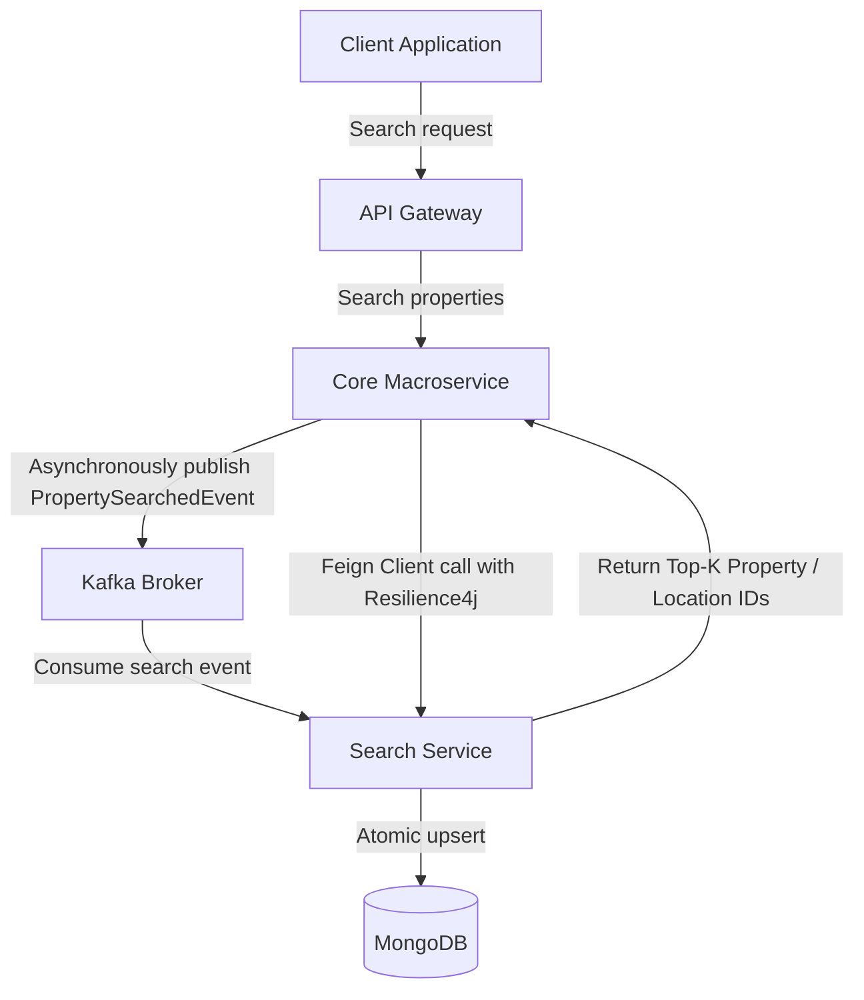

# Implementation Plan - Search Service Gap Remediation

This document details the step-by-step technical plan to remediate the architectural, integration, and contract gaps identified in the [search-service](file:///home/annguyen/master_projects/sem2_year3_projects/BatDongSan/BatDongScam-Backend-Microservice/search-service). The goal is to align `search-service` with the global platform architecture, establish robust event-driven search logging, and restore popular query aggregation using Kafka and Resilience4j-wrapped Feign clients.

---

## User Review Required

> [!IMPORTANT]
> **Concurrence-Safe Statistics Aggregation**
> To prevent race conditions and database locks when multiple search logs or Kafka events update the `PropertyStatisticsReport` concurrently, we propose using MongoDB's atomic update operations (`$inc`) rather than standard read-modify-save cycles. In `SearchServiceImpl`, we will implement `MongoTemplate` updates targeting the map fields directly (e.g. `searched_cities.<cityId>`).

> [!WARNING]
> **Internal API Security in Core Macroservice**
> Exposing valid location and property type IDs for the statistics scheduler requires creating endpoints on `bds-core-macroservice`. We propose creating a separate `/api/internal/**` path structure. These endpoints will bypass public JWT filters but must be restricted to internal service-to-service communication.

---

## Open Questions

> [!NOTE]
> **Property Statistics Historical Catch-up Policy**
> When a new month starts, the statistics scheduler initializes a new report. If a search is logged with a timestamp belonging to a previous month (e.g. due to network lags or message delivery delays), should the system update the historical report or ignore it?
> 
> **Proposed Approach:** The update logic will dynamically resolve the target report using the year and month extracted from the search log's timestamp (rather than the current system time) to maintain historical accuracy.

---

## Proposed Changes



---

### Phase A: Contract & DTO Standardization
This phase integrates `search-service` into the main Maven build, establishes the shared library dependency, resolves naming violations, and standardizes REST controllers with platform-compliant envelopes.

---

#### [MODIFY] [pom.xml (root)](file:///home/annguyen/master_projects/sem2_year3_projects/BatDongSan/BatDongScam-Backend-Microservice/pom.xml)
- **Action Required:** Add `<module>search-service</module>` under the `<modules>` block on line 21 to register the service.
- **Dependencies:** None.

#### [MODIFY] [pom.xml (search-service)](file:///home/annguyen/master_projects/sem2_year3_projects/BatDongSan/BatDongScam-Backend-Microservice/search-service/pom.xml)
- **Action Required:**
  - Update the parent POM coordinates to match `batdongsan-platform` (`com.se.bds`, version `0.0.1-SNAPSHOT`).
  - Upgrade Java version to `21`.
  - Align package group ID to `com.se.bds`.
  - Add the `bds-common` library:
    ```xml
    <dependency>
        <groupId>com.se.bds</groupId>
        <artifactId>bds-common</artifactId>
        <version>0.0.1-SNAPSHOT</version>
    </dependency>
    ```
- **Dependencies:** `com.se.bds:bds-common:0.0.1-SNAPSHOT`.

#### [MODIFY] Align Package Directory Structure
- **Target Files:**
  - Move files from `com.se100.bds.searchservice` package structure to `com.se.bds.search`.
- **Action Required:** Restructure the package folders to comply with the standard `com.se.bds` domain hierarchy. Update package and import declarations in all Java files.

#### [DELETE] Local API Response Wrappers
- **Target Files:**
  - [AbstractBaseResponse.java](file:///home/annguyen/master_projects/sem2_year3_projects/BatDongSan/BatDongScam-Backend-Microservice/search-service/src/main/java/com/se100/bds/searchservice/dtos/responses/AbstractBaseResponse.java)
  - [SingleResponse.java](file:///home/annguyen/master_projects/sem2_year3_projects/BatDongSan/BatDongScam-Backend-Microservice/search-service/src/main/java/com/se100/bds/searchservice/dtos/responses/SingleResponse.java)
  - [ErrorResponse.java](file:///home/annguyen/master_projects/sem2_year3_projects/BatDongSan/BatDongScam-Backend-Microservice/search-service/src/main/java/com/se100/bds/searchservice/dtos/responses/error/ErrorResponse.java)
  - [DetailedErrorResponse.java](file:///home/annguyen/master_projects/sem2_year3_projects/BatDongSan/BatDongScam-Backend-Microservice/search-service/src/main/java/com/se100/bds/searchservice/dtos/responses/error/DetailedErrorResponse.java)
- **Action Required:** Delete these classes to enforce the use of `com.se.bds.common.dto.ApiResponse` from `bds-common`.

#### [MODIFY] [SearchController.java](file:///home/annguyen/master_projects/sem2_year3_projects/BatDongSan/BatDongScam-Backend-Microservice/search-service/src/main/java/com/se100/bds/searchservice/controllers/SearchController.java)
- **Action Required:** Update return types of all endpoints to use `com.se.bds.common.dto.ApiResponse<T>`. Update mappings to return `ApiResponse.success(data)`.

#### [MODIFY] [AppExceptionHandler.java](file:///home/annguyen/master_projects/sem2_year3_projects/BatDongSan/BatDongScam-Backend-Microservice/search-service/src/main/java/com/se100/bds/searchservice/exceptions/AppExceptionHandler.java)
- **Action Required:** Refactor exceptions to return standard `ApiResponse.error(message)` response envelopes.

#### [NEW] [PropertySearchedEvent.java](file:///home/annguyen/master_projects/sem2_year3_projects/BatDongSan/BatDongScam-Backend-Microservice/bds-common/src/main/java/com/se/bds/common/event/PropertySearchedEvent.java)
- **Action Required:** Create the shared Kafka event representation:
  ```java
  package com.se.bds.common.event;

  import java.util.List;
  import java.util.UUID;

  public record PropertySearchedEvent(
          UUID userId,
          List<UUID> cityIds,
          List<UUID> districtIds,
          List<UUID> wardIds,
          List<UUID> propertyTypeIds,
          UUID propertyId
  ) {}
  ```
- **Dependencies:** None.

---

### Phase B: Business Logic Parity
This phase ports the statistics report scheduler from legacy and implements real-time runtime log aggregation.

---

#### [NEW] [PropertyStatisticsReportScheduler.java](file:///home/annguyen/master_projects/sem2_year3_projects/BatDongSan/BatDongScam-Backend-Microservice/search-service/src/main/java/com/se100/bds/searchservice/scheduler/PropertyStatisticsReportScheduler.java)
- **Action Required:** Port the scheduler from [PropertyStatisticsReportScheduler.java](file:///home/annguyen/master_projects/sem2_year3_projects/BatDongSan/BatDongScam-Backend-Microservice/legacy/src/main/java/com/se100/bds/services/domains/report/scheduler/PropertyStatisticsReportScheduler.java). Update it to run monthly (`@Scheduled(cron = "0 0 0 1 * ?")`) to initialize reports, and call `bds-core-macroservice` REST clients to retrieve valid ID lists.
- **Dependencies:**
  - `org.springframework.scheduling.annotation.Scheduled`
  - `com.se.bds.search.client.CoreServiceClient`

#### [NEW] [CoreServiceClient.java](file:///home/annguyen/master_projects/sem2_year3_projects/BatDongSan/BatDongScam-Backend-Microservice/search-service/src/main/java/com/se100/bds/searchservice/client/CoreServiceClient.java)
- **Action Required:** Create a Feign Client to call internal endpoints in `bds-core-macroservice`:
  ```java
  package com.se.bds.search.client;

  import org.springframework.cloud.openfeign.FeignClient;
  import org.springframework.web.bind.annotation.GetMapping;
  import java.util.List;
  import java.util.UUID;

  @FeignClient(name = "core-service")
  public interface CoreServiceClient {
      @GetMapping("/api/internal/locations/cities/ids")
      List<UUID> getAllCityIds();

      @GetMapping("/api/internal/locations/districts/ids")
      List<UUID> getAllDistrictIds();

      @GetMapping("/api/internal/locations/wards/ids")
      List<UUID> getAllWardIds();

      @GetMapping("/api/internal/property-types/ids")
      List<UUID> getAllPropertyTypeIds();
  }
  ```
- **Dependencies:** Spring Cloud OpenFeign.

#### [NEW] Internal Endpoints in `bds-core-macroservice`
- **Target Files:**
  - [LocationController.java](file:///home/annguyen/master_projects/sem2_year3_projects/BatDongSan/BatDongScam-Backend-Microservice/bds-core-macroservice/src/main/java/com/se/bds/core/property/internal/adapter/in/web/LocationController.java)
  - [PropertyController.java](file:///home/annguyen/master_projects/sem2_year3_projects/BatDongSan/BatDongScam-Backend-Microservice/bds-core-macroservice/src/main/java/com/se/bds/core/property/internal/adapter/in/web/PropertyController.java)
- **Action Required:**
  - In `LocationController`, add:
    - `GET /api/internal/locations/cities/ids`
    - `GET /api/internal/locations/districts/ids`
    - `GET /api/internal/locations/wards/ids`
  - In `PropertyController`, add:
    - `GET /api/internal/property-types/ids`
  - Implement corresponding fetching methods in `LocationUseCase` / `LocationServiceImpl` and `PropertyUseCase` / `PropertyServiceImpl`.
- **Dependencies:** None.

#### [MODIFY] [SearchServiceImpl.java](file:///home/annguyen/master_projects/sem2_year3_projects/BatDongSan/BatDongScam-Backend-Microservice/search-service/src/main/java/com/se100/bds/searchservice/services/impl/SearchServiceImpl.java)
- **Action Required:**
  - Implement concurrent-safe updates to increment search counters inside `PropertyStatisticsReport`.
  - Use `MongoTemplate` with `$inc` modifiers targeting maps in `PropertyStatisticsReport` (e.g. `searchedCities`, `searchedDistricts`, `searchedWards`, `searchedPropertyTypes`, `searchedProperties`).
- **Dependencies:** `org.springframework.data.mongodb.core.MongoTemplate`.

---

### Phase C: Integration & Communication
This phase wires up Kafka messaging to perform asynchronous logging and updates, configures the Feign client in `bds-core-macroservice`, and implements resilience configurations.

---

#### [MODIFY] [pom.xml (search-service)](file:///home/annguyen/master_projects/sem2_year3_projects/BatDongSan/BatDongScam-Backend-Microservice/search-service/pom.xml)
- **Action Required:** Add Spring Kafka and Spring Cloud Netflix Eureka Client dependencies.
- **Dependencies:**
  - `org.springframework.kafka:spring-kafka`
  - `org.springframework.cloud:spring-cloud-starter-netflix-eureka-client`
  - `org.springframework.cloud:spring-cloud-starter-openfeign`

#### [MODIFY] [application.yaml (search-service)](file:///home/annguyen/master_projects/sem2_year3_projects/BatDongSan/BatDongScam-Backend-Microservice/search-service/src/main/resources/application.yaml)
- **Action Required:**
  - Bind Eureka configuration:
    ```yaml
    eureka:
      client:
        service-url:
          defaultZone: ${EUREKA_URI:http://localhost:8761/eureka/}
        prefer-ip-address: true
    ```
  - Bind Kafka bootstrap and consumer details:
    ```yaml
    spring:
      kafka:
        bootstrap-servers: ${KAFKA_BOOTSTRAP_SERVERS:localhost:9092}
        consumer:
          group-id: search-service-group
          key-deserializer: org.apache.kafka.common.serialization.StringDeserializer
          value-deserializer: org.apache.kafka.common.serialization.StringDeserializer
    ```

#### [NEW] [KafkaSearchEventListener.java](file:///home/annguyen/master_projects/sem2_year3_projects/BatDongSan/BatDongScam-Backend-Microservice/search-service/src/main/java/com/se100/bds/searchservice/listeners/KafkaSearchEventListener.java)
- **Action Required:** Create a listener to consume events:
  - `property-searched`: Triggers search log creation and updates statistics maps.
  - `property-status-changed`: Triggers adjustments to `totalActiveProperties`, `totalSoldProperties`, and `totalRentedProperties` inside the current month's report.
- **Dependencies:** `org.springframework.kafka.annotation.KafkaListener`.

#### [MODIFY] [PropertyServiceImpl.java (bds-core-macroservice)](file:///home/annguyen/master_projects/sem2_year3_projects/BatDongSan/BatDongScam-Backend-Microservice/bds-core-macroservice/src/main/java/com/se/bds/core/property/internal/application/service/PropertyServiceImpl.java)
- **Action Required:**
  - Refactor `searchProperties` method to publish a `PropertySearchedEvent` through `eventPublisher`.
  - In `searchProperties`, check if `topK` is true (needs to be added to `SearchPropertyCommand`). If true, call `SearchServiceClient` to fetch popular property IDs and pass them to `propertyRepository.searchWithFilters`.
- **Dependencies:** `ApplicationEventPublisher`.

#### [MODIFY] [KafkaEventBridge.java](file:///home/annguyen/master_projects/sem2_year3_projects/BatDongSan/BatDongScam-Backend-Microservice/bds-core-macroservice/src/main/java/com/se/bds/core/shared/messaging/KafkaEventBridge.java)
- **Action Required:** Listen to `PropertySearchedEvent` and bridge it to the `property-searched` Kafka topic.
- **Dependencies:** None.

#### [MODIFY] [pom.xml (bds-core-macroservice)](file:///home/annguyen/master_projects/sem2_year3_projects/BatDongSan/BatDongScam-Backend-Microservice/bds-core-macroservice/pom.xml)
- **Action Required:** Add Spring Cloud OpenFeign and Resilience4j.
- **Dependencies:**
  - `org.springframework.cloud:spring-cloud-starter-openfeign`
  - `org.springframework.cloud:spring-cloud-starter-circuitbreaker-resilience4j`

#### [NEW] [SearchServiceClient.java](file:///home/annguyen/master_projects/sem2_year3_projects/BatDongSan/BatDongScam-Backend-Microservice/bds-core-macroservice/src/main/java/com/se/bds/core/property/internal/adapter/out/client/SearchServiceClient.java)
- **Action Required:** Define OpenFeign client interface targeting the `search-service`:
  ```java
  package com.se.bds.core.property.internal.adapter.out.client;

  import com.se.bds.common.dto.ApiResponse;
  import org.springframework.cloud.openfeign.FeignClient;
  import org.springframework.web.bind.annotation.GetMapping;
  import org.springframework.web.bind.annotation.RequestParam;
  import java.util.List;
  import java.util.UUID;

  @FeignClient(name = "search-service")
  public interface SearchServiceClient {
      @GetMapping("/api/search/most-searched-properties")
      ApiResponse<List<UUID>> getMostSearchedPropertyIds(
              @RequestParam("limit") int limit,
              @RequestParam("year") int year,
              @RequestParam("month") int month
      );

      @GetMapping("/api/search/top")
      ApiResponse<List<UUID>> topMostSearchByUser(
              @RequestParam("userId") UUID userId,
              @RequestParam("offset") int offset,
              @RequestParam("limit") int limit,
              @RequestParam("searchType") String searchType,
              @RequestParam("year") int year,
              @RequestParam("month") int month
      );
  }
  ```
- **Dependencies:** Spring Cloud OpenFeign.

#### [MODIFY] [application.yaml (bds-core-macroservice)](file:///home/annguyen/master_projects/sem2_year3_projects/BatDongSan/BatDongScam-Backend-Microservice/bds-core-macroservice/src/main/resources/application.yml)
- **Action Required:** Configure Resilience4j settings for the `SearchServiceClient`:
  ```yaml
  resilience4j:
    circuitbreaker:
      instances:
        searchServiceCircuitBreaker:
          slidingWindowSize: 10
          failureRateThreshold: 50
          waitDurationInOpenState: 10000
    retry:
      instances:
        searchServiceRetry:
          maxAttempts: 3
          waitDuration: 2000
  ```

#### [MODIFY] [SearchPropertyCommand.java](file:///home/annguyen/master_projects/sem2_year3_projects/BatDongSan/BatDongScam-Backend-Microservice/bds-core-macroservice/src/main/java/com/se/bds/core/property/internal/application/command/SearchPropertyCommand.java)
- **Action Required:** Add `Boolean topK` to the record structure to support popularity filters.

#### [MODIFY] [JpaPropertyRepository.java](file:///home/annguyen/master_projects/sem2_year3_projects/BatDongSan/BatDongScam-Backend-Microservice/bds-core-macroservice/src/main/java/com/se/bds/core/property/internal/adapter/out/persistence/JpaPropertyRepository.java)
- **Action Required:**
  - Add `@Param("propertyIds") List<UUID> propertyIds` to `searchWithFilters`.
  - Add mapping clause `and (coalesce(:propertyIds, NULL) IS NULL or p.id in :propertyIds)` to support Popularity-based search filtering.

#### [MODIFY] [LocationController.java (bds-core-macroservice)](file:///home/annguyen/master_projects/sem2_year3_projects/BatDongSan/BatDongScam-Backend-Microservice/bds-core-macroservice/src/main/java/com/se/bds/core/property/internal/adapter/in/web/LocationController.java)
- **Action Required:** Add `GET /public/locations/cities/top` endpoint. Implement it by calling `SearchServiceClient.topMostSearchByUser` (resolving popular city IDs) and fetch city entities from `locationUseCase`.

---

## Risk Assessment & Edge Cases

1. **Stale Location IDs in Statistics Maps**:
   If a city, district, or ward is deleted or added in `bds-core-macroservice`, the statistics map must align.
   - *Mitigation:* The scheduler updates the maps by matching against the fresh lists of valid IDs obtained from the REST calls. Any deleted IDs are safely removed, while new IDs are initialized with a count of `0`.
2. **MongoDB Counters Out-of-sync**:
   In cases where multiple events are processed, the statistical total could potentially drift.
   - *Mitigation:* The monthly scheduler will run a baseline audit, fetching actual totals (e.g. counting total active properties in core) and correcting any deviations.
3. **Internal REST Endpoint Access Control**:
   Exposing database internal IDs to the network presents a risk if not restricted.
   - *Mitigation:* The Gateway routing configuration will explicitly block external requests starting with `/api/internal/**` (allowing only downstream gateway routes), and the internal clients will use service-to-service host authorization.

---

## Comprehensive Verification Plan

### Unit Testing Strategy
- **Search Service (`search-service`):**
  - Create `SearchServiceImplTest` verifying:
    - Invoking `addSearch` correctly triggers atomic updates on `MongoTemplate`.
    - `topMostSearchByUser` maps different `SearchTypeEnum` fields correctly.
- **Core Service (`bds-core-macroservice`):**
  - Create `PropertyServiceImplSearchTest` asserting:
    - Performing a search publishes the `PropertySearchedEvent`.
    - If `topK` is true, the Feign Client retrieves popular property IDs, which are passed to the repository.

### Integration Testing
- **Event-Driven Verification:**
  - Publish a mock `PropertySearchedEvent` directly to the `property-searched` Kafka topic.
  - Assert that `search-service` consumes the message, saves a log, and increments the appropriate fields in the database.
- **Feign & Resilience4j verification:**
  - Mock the `search-service` endpoint to timeout or fail with `500 Server Error`.
  - Trigger a `topK` search in `bds-core-macroservice`. Assert that the Resilience4j fallback is triggered (safely returning an empty list without throwing a blocking exception).

### Contract Validation
- Assert that REST payloads returned from `/api/search/**` match:
  ```json
  {
    "success": true,
    "message": "Success",
    "data": [...]
  }
  ```
- Verify that validation handlers return standard `ApiResponse` objects in case of malformed requests.
