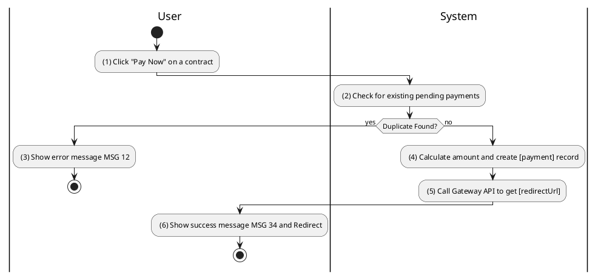
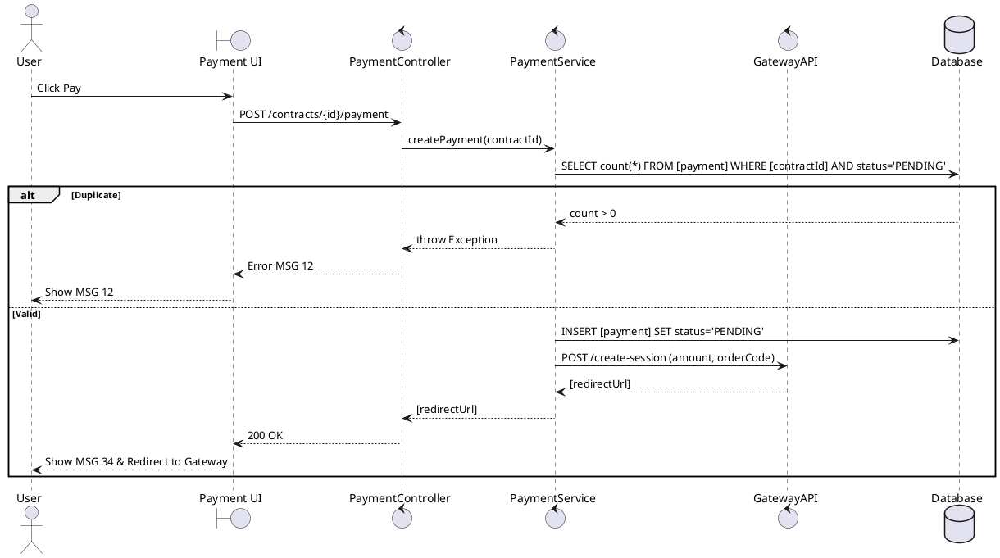

### UC10: Initialize Payment
**Name**: Initialize Payment
**Description**: This use case describes the process by which a user initiates a payment for a contract or service via an external payment gateway.
**Actor**: User
**Trigger**: ❖ When the user clicks on the “Pay Now” button.
**Pre-condition**: 
❖ The user is logged in to the system.
❖ The target contract is in a state that allows payment (e.g., 'WAITING_OFFICIAL').
**Post-condition**: 
❖ A payment record is created in 'PENDING' status.
❖ The user is redirected to the external payment gateway.

**Activities Flow (PlantUML)**:

**Business Rules**:

| Activity | BR Code | Description |
| :--- | :--- | :--- |
| (2) | BR37 | **Validate Rules:** ❖ If [paymentRepository.countByContractAndStatus([contractId], 'PENDING')] > 0 then the system shows error message MSG 12 ("Payment already in progress"). |
| (4) | BR38 | **Creating Rules:** ❖ [payment.amount] = [contract.depositAmount]. ❖ [payment.status] = 'PENDING'. ❖ [payment.dueDate] = <<current date time>> + 3 days. ❖ Payment Repository save [payment] (call save() function). |
| (5) | BR39 | **Gateway Rules:** ❖ [redirectUrl] = Gateway API generate session with [orderCode] = [payment.id]. |
| (6) | BR34 | **Redirect Rules:** ❖ The system shows success message MSG 34 and redirects to [redirectUrl]. |
