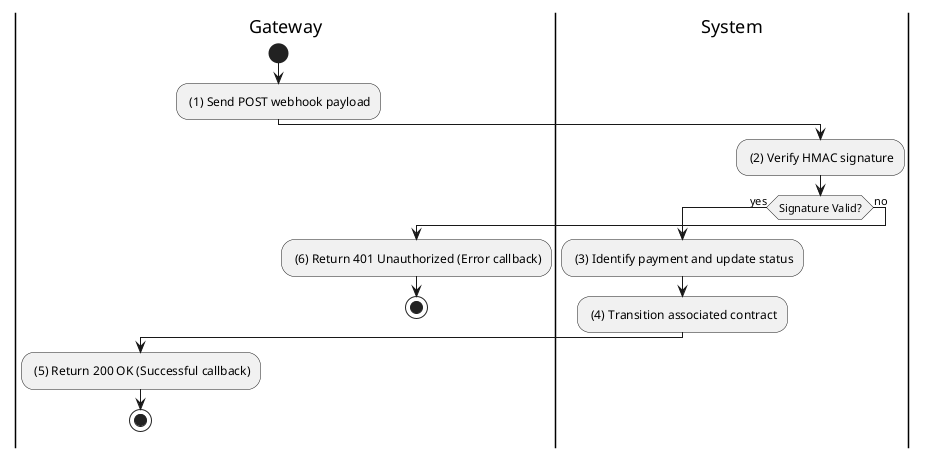
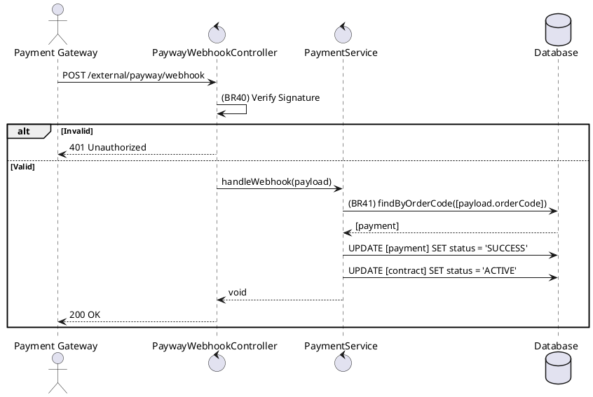

### UC11: Handle Payment Webhook
**Name**: Handle Payment Webhook
**Description**: This use case describes how the system processes asynchronous payment confirmation notifications from external gateways.
**Actor**: System
**Trigger**: ❖ When the external gateway sends a POST request to the webhook endpoint.
**Pre-condition**: 
❖ The system endpoint is public and the gateway has a valid signed payload.
**Post-condition**: 
❖ The payment status is updated to 'SUCCESS'.
❖ The associated contract status is updated to 'ACTIVE'.

**Activities Flow (PlantUML)**:

**Business Rules**:

| Activity | BR Code | Description |
| :--- | :--- | :--- |
| (2) | BR40 | **Validate Rules:** ❖ If hash_hmac('sha256', [payload], [secret]) != [header.signature] then return 401-UNAUTHORIZED. |
| (3) | BR41 | **Updating Rules:** ❖ [payment] = Payment Repository find by [payload.orderCode]. ❖ If [payment.status] == 'SUCCESS' then return 200 OK (idempotent skip). ❖ [payment.status] = 'SUCCESS'. ❖ [payment.gatewayTransactionId] = [payload.transactionId]. ❖ Payment Repository save [payment]. |
| (4) | BR42 | **Updating Rules:** ❖ [contract] = [payment.contract]. ❖ [contract.status] = 'ACTIVE'. ❖ Contract Repository save [contract]. |
