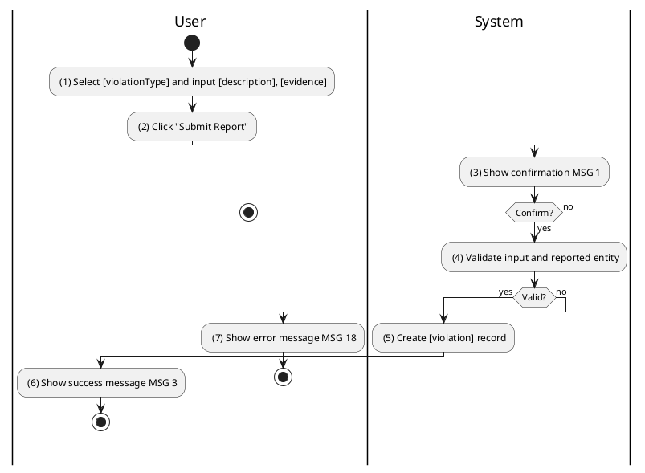
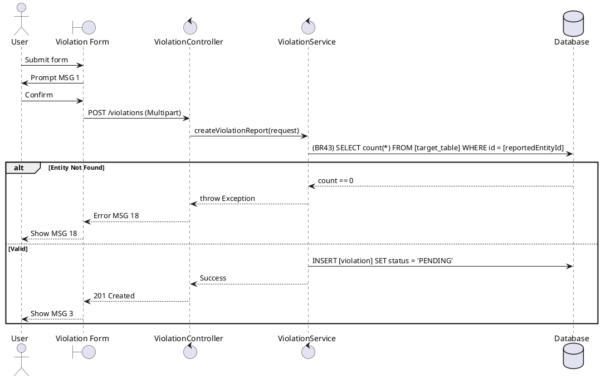

### UC12: Report Violation
**Name**: Report Violation
**Description**: This use case allows a user to report suspicious property listings or user behavior to the administration.
**Actor**: User
**Trigger**: ❖ When the user clicks on the “Submit Report” button.
**Pre-condition**: 
❖ The user is logged in to the system.
**Post-condition**: 
❖ A violation report is created in 'PENDING' status for admin review.

**Activities Flow (PlantUML)**:

**Business Rules**:

| Activity | BR Code | Description |
| :--- | :--- | :--- |
| (4) | BR43 | **Validate Rules:** When the user clicks on “Submit Report”, the system will prompt a confirmation message (Refer to MSG 1). If user chooses Cancel, the system does nothing; else: ❖ The system checks [reportedEntityId], [reportedType]. ❖ If [reportedType] == 'PROPERTY' and Property Repository find by [reportedEntityId] is null then show error message MSG 18. ❖ If [reportedType] == 'USER' and User Repository find by [reportedEntityId] is null then show error message MSG 18. |
| (5) | BR44 | **Creating Rules:** ❖ [violation] = Violation Repository save new report. ❖ [violation.status] = 'PENDING'. ❖ [violation.reporterId] = <<current user id retrieved from jwt>>. ❖ [violation.evidencePaths] = Cloudinary Service upload [evidence] files. |
| (6) | BR3 | **Message Rules:** ❖ The system shows success message MSG 3. |
