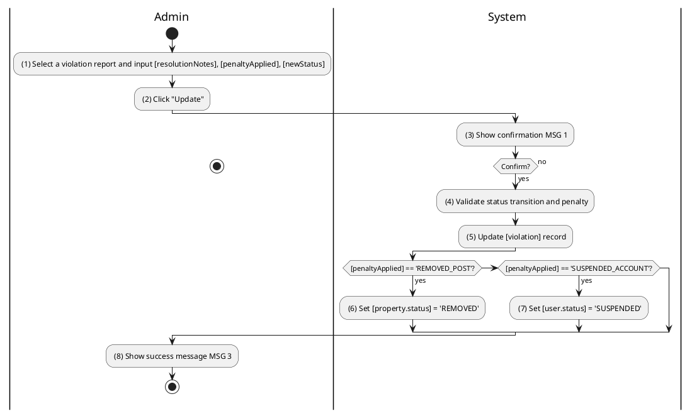
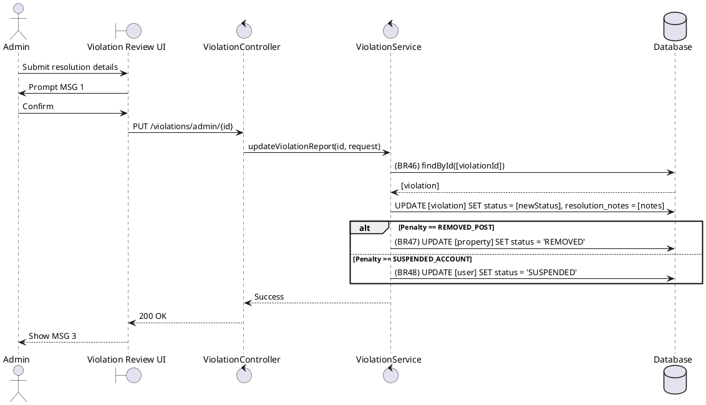

### UC13: Review Violations
**Name**: Review Violations
**Description**: This use case describes how an Administrator reviews a reported violation and applies disciplinary actions if necessary.
**Actor**: Admin
**Trigger**: ❖ When the Admin clicks on the “Resolve/Update” button on a violation report.
**Pre-condition**: 
❖ The Admin is logged in. 
❖ The violation report exists and is in 'PENDING' or 'UNDER_REVIEW' status.
**Post-condition**: 
❖ The violation report status is updated to 'RESOLVED' or 'DISMISSED'. 
❖ Disciplinary actions are applied to the target entity (user or property).

**Activities Flow (PlantUML)**:

**Business Rules**:

| Activity | BR Code | Description |
| :--- | :--- | :--- |
| (4) | BR46 | **Validate Rules:** When the Admin clicks on “Update”, the system will prompt a confirmation message (Refer to MSG 1). If Admin chooses Cancel, the system does nothing; else: ❖ If [violation.status] is 'RESOLVED' or 'DISMISSED' then the system shows error message MSG 12. ❖ [violation] = Violation Repository find by [violationId] (call findById() function). |
| (5) | BR46_B | **Updating Rules:** ❖ [violation.status] = [newStatus]. ❖ [violation.resolutionNotes] = [resolutionNotes]. ❖ Violation Repository save [violation]. |
| (6) | BR47 | **Penalty Rules:** ❖ If [penaltyApplied] == 'REMOVED_POST' then [property] = Property Repository find by [violation.reportedEntityId]. ❖ [property.status] = 'REMOVED'. ❖ Property Repository save [property]. |
| (7) | BR48 | **Penalty Rules:** ❖ If [penaltyApplied] == 'SUSPENDED_ACCOUNT' then [user] = User Repository find by [violation.reportedEntityId]. ❖ [user.status] = 'SUSPENDED'. ❖ User Repository save [user]. |
| (8) | BR3 | **Message Rules:** ❖ The system shows success message MSG 3. |
