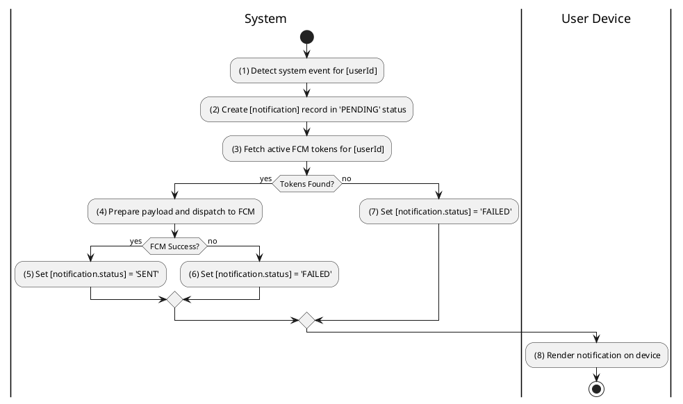
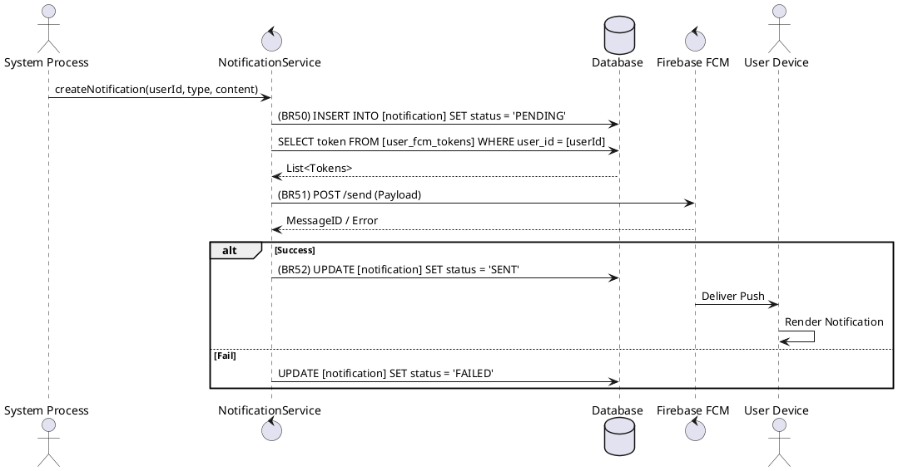

### UC14: Send Push Notification
**Name**: Send Push Notification
**Description**: This use case describes the process by which the system sends real-time alerts to users based on system events.
**Actor**: System
**Trigger**: ❖ When a specific system event (e.g., appointment booked, payment received) occurs.
**Pre-condition**: 
❖ The target user has at least one valid FCM token registered in the system.
**Post-condition**: 
❖ The notification record is saved and the message is dispatched to the user's device via FCM.

**Activities Flow (PlantUML)**:

**Business Rules**:

| Activity | BR Code | Description |
| :--- | :--- | :--- |
| (2) | BR50 | **Saving Rules:** ❖ [notification] = Notification Repository save new notification. ❖ [notification.status] = 'PENDING'. ❖ [notification.type] = [eventType]. ❖ [notification.createdAt] = <<current date time>>. |
| (4) | BR51 | **Gateway Rules:** ❖ Payload = { "title": [notification.title], "body": [notification.content], "data": { "id": [notification.relatedEntityId] } }. ❖ Call FCM API for each token found. |
| (5) | BR52 | **Updating Rules:** ❖ If FCM returns success then [notification.status] = 'SENT' else [notification.status] = 'FAILED'. ❖ Notification Repository save [notification]. |
