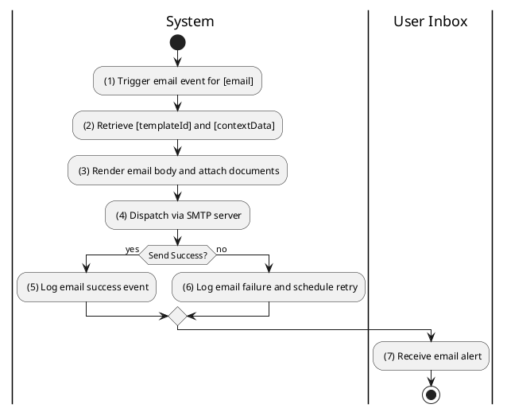
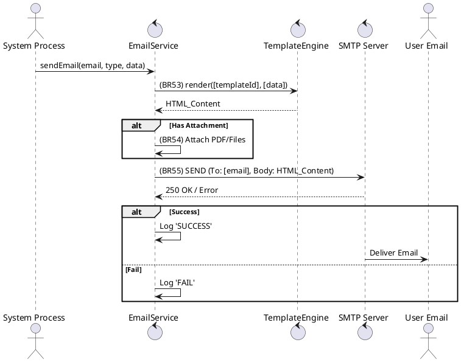

### UC15: Send Email Alert
**Name**: Send Email Alert
**Description**: This use case describes the process by which the system sends automated email notifications and documents to users.
**Actor**: System
**Trigger**: ❖ When a specific system event requiring email notification occurs (e.g., payment success).
**Pre-condition**: 
❖ The target user has a valid [email] address.
**Post-condition**: 
❖ The email is sent using the appropriate template and any necessary attachments.

**Activities Flow (PlantUML)**:

**Business Rules**:

| Activity | BR Code | Description |
| :--- | :--- | :--- |
| (3) | BR53 | **Template Rules:** ❖ [emailBody] = Template Engine render by [templateId] using [contextData] map. ❖ [templateId] is retrieved from System Configuration where [keyword] = [eventType]. |
| (3) | BR54 | **Attachment Rules:** ❖ If [attachments] is not null then for each [file] in [attachments] do add to email multipart body. |
| (4) | BR55 | **Dispatch Rules:** ❖ If [email] is null or blank then return 400-BAD_REQUEST error message MSG 2. ❖ Call SMTP library send function with system credentials. |
