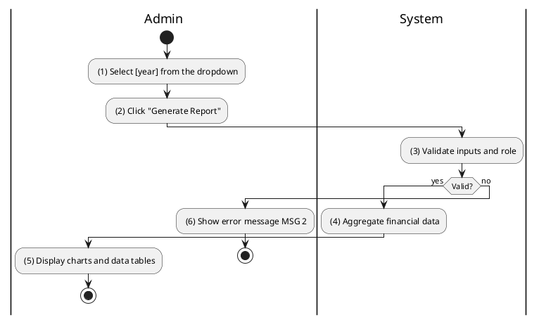
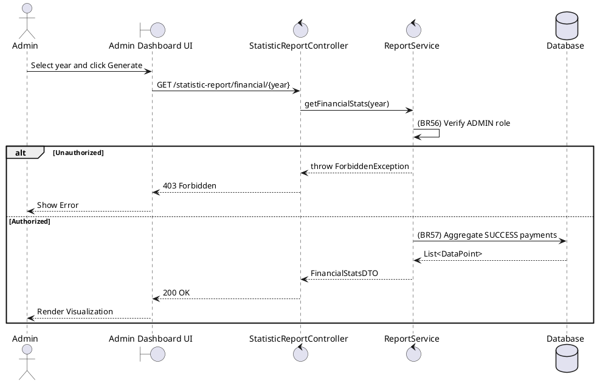

### UC16: Generate Sales Report
**Name**: Generate Sales Report
**Description**: This use case describes how an Administrator can generate financial and transaction reports for a specific year.
**Actor**: Admin
**Trigger**: ❖ When the user clicks the "Generate Report" button.
**Pre-condition**: 
❖ The user is logged in as Admin.
**Post-condition**: 
❖ The system displays the financial and transaction statistics for the requested year.

**Activities Flow (PlantUML)**:

**Business Rules**:

| Activity | BR Code | Description |
| :--- | :--- | :--- |
| (3) | BR56 | **Validate Rules:** ❖ If [year] is null then the system shows error message MSG 2. ❖ If <<current user role>> != 'ADMIN' then return 403-FORBIDDEN error message. |
| (4) | BR57 | **Loading Rules:** ❖ [revenueData] = Payment Repository calculate sum by month WHERE [year] matches AND [status] in ['SUCCESS', 'SYSTEM_SUCCESS']. ❖ [transactionCount] = Contract Repository count total WHERE year([createdAt]) = [year]. |
