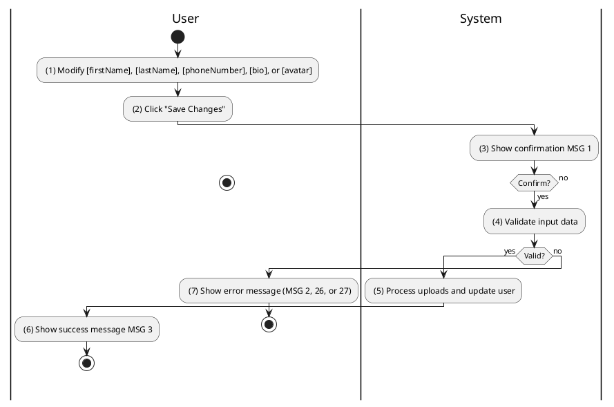
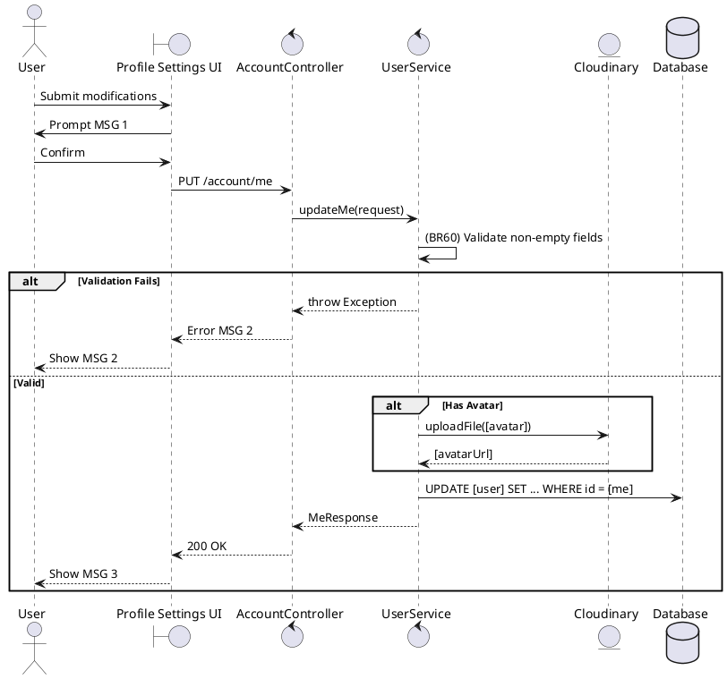

### UC17: Update Profile
**Name**: Update Profile
**Description**: This use case describes the process by which a user updates their personal information and avatar.
**Actor**: User
**Trigger**: ❖ When the user clicks the "Save Changes" button.
**Pre-condition**: 
❖ The user is logged in to the system.
**Post-condition**: 
❖ The user's profile information has been updated in the database.

**Activities Flow (PlantUML)**:

**Business Rules**:

| Activity | BR Code | Description |
| :--- | :--- | :--- |
| (4) | BR60 | **Validate Rules:** When the user clicks on “Save Changes”, the system will prompt a confirmation message (Refer to MSG 1). If user chooses Cancel, the system does nothing; else: ❖ The system checks the items [firstName], [lastName], [phoneNumber]. ❖ If any mandatory entries are empty, the system shows an error message MSG 2. ❖ If [phoneNumber] exists for another user then show error message MSG 26. |
| (5) | BR59 | **Updating Rules:** ❖ If [avatar] is provided then [user.avatarPath] = Cloudinary Service save [avatar]. ❖ [user] = User Repository save updated fields. ❖ User Repository save [user] (call save() function). |
| (6) | BR3 | **Message Rules:** ❖ The system shows success message MSG 3. |
