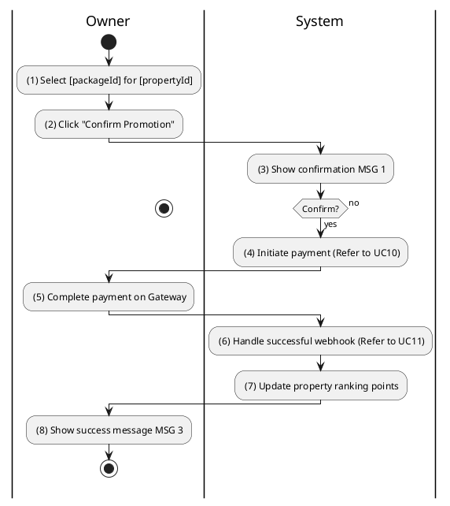
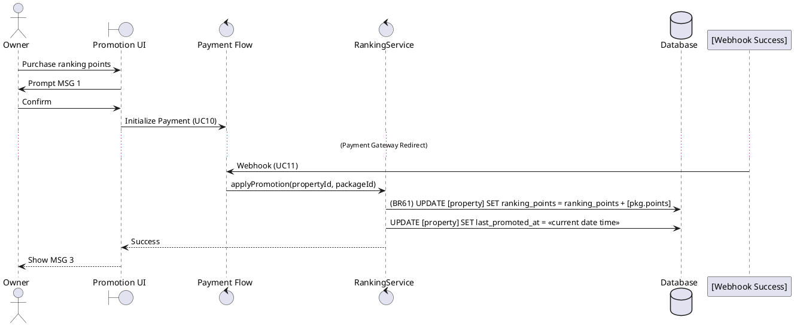

### UC18: Promote Property
**Name**: Promote Property
**Description**: This use case describes how a Property Owner pays to increase the ranking and visibility of their listing.
**Actor**: Owner
**Trigger**: ❖ When the user selects a promotion package and confirms the transaction.
**Pre-condition**: 
❖ The user is logged in as Owner.
❖ The target property is in 'AVAILABLE' status.
**Post-condition**: 
❖ The property ranking points have been increased.

**Activities Flow (PlantUML)**:

**Business Rules**:

| Activity | BR Code | Description |
| :--- | :--- | :--- |
| (7) | BR61 | **Updating Rules:** ❖ [package] = Ranking Package Repository find by [packageId]. ❖ [property] = Property Repository find by [propertyId]. ❖ [property.rankingPoints] = [property.rankingPoints] + [package.points]. ❖ [property.lastPromotedAt] = <<current date time>>. ❖ Property Repository save [property]. |
| (8) | BR3 | **Message Rules:** ❖ The system shows success message MSG 3. |
