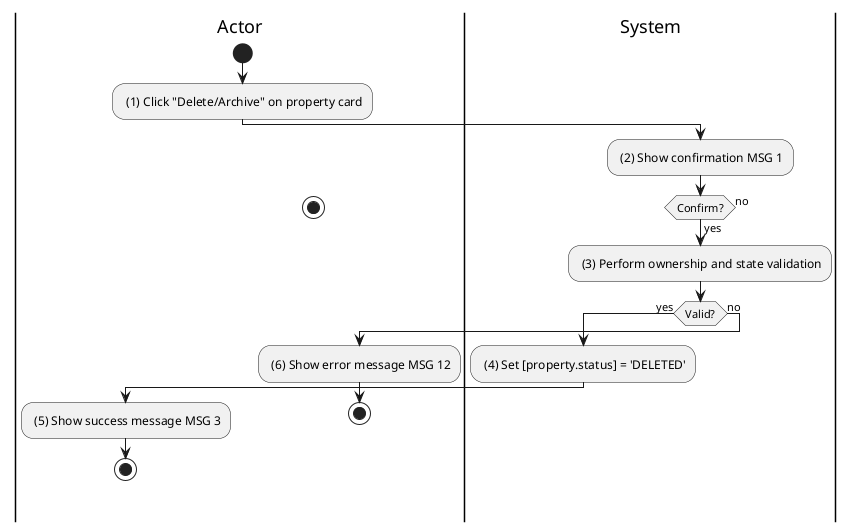
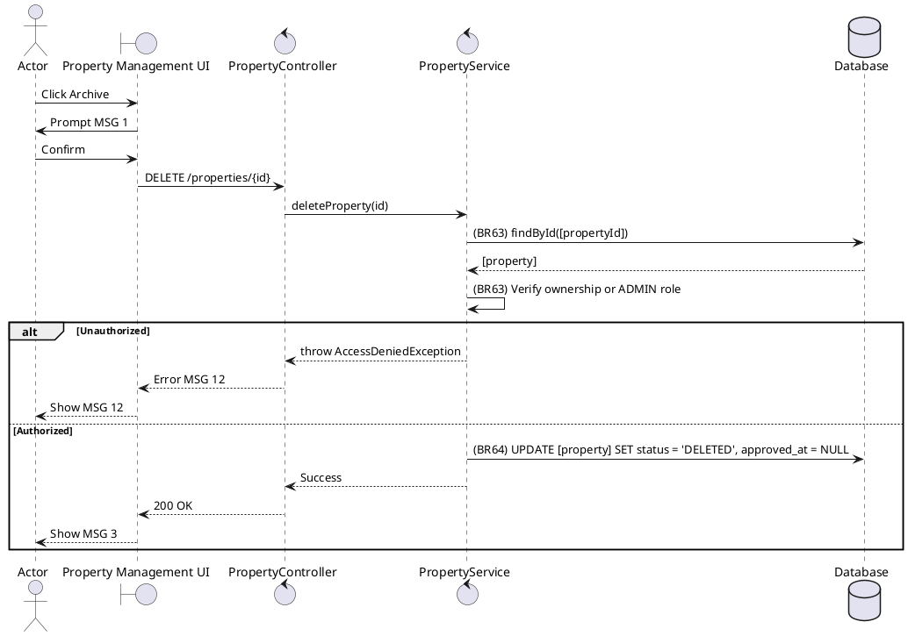

### UC19: Archive Property
**Name**: Archive Property
**Description**: This use case describes the process by which a Property Owner or Administrator soft-deletes a property listing from the platform.
**Actor**: Owner / Admin
**Trigger**: ❖ When the user clicks on the “Delete/Archive” button on a property listing.
**Pre-condition**: 
❖ The user is logged in.
❖ The user has ownership of the property or has administrative privileges.
**Post-condition**: 
❖ The property listing status is updated to 'DELETED'.
❖ The property is no longer visible in public searches.

**Activities Flow (PlantUML)**:

**Business Rules**:

| Activity | BR Code | Description |
| :--- | :--- | :--- |
| (3) | BR63 | **Validate Rules:** When the user clicks on “Delete/Archive”, the system will prompt a confirmation message (Refer to MSG 1). If user chooses Cancel, the system does nothing; else: ❖ If [property.status] == 'DELETED' then the system shows error message MSG 12. ❖ If <<current user role>> != 'ADMIN' AND [property.owner.userId] != <<current user id>> then the system shows error message MSG 12. |
| (4) | BR64 | **Delete Rules:** ❖ [property.status] = 'DELETED'. ❖ [property.approvedAt] = null. ❖ [property.assignedAgent] = null. ❖ Property Repository save [property] (call save() function). |
| (5) | BR3 | **Message Rules:** ❖ The system shows success message MSG 3. |
