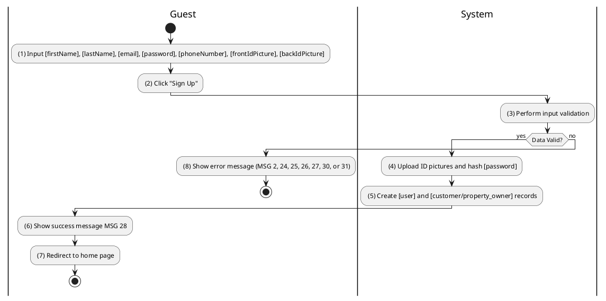
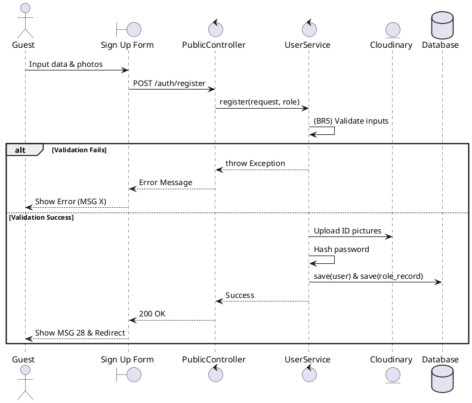

### UC1: Sign Up
**Name**: Sign Up
**Description**: This use case describes the process by which a user creates a new account in the system.
**Actor**: Guest
**Trigger**: ❖ When the user clicks on the “Sign Up” button.
**Pre-condition**: 
❖ The user is on the sign up page (refer to “Sign Up Form” in “List description” file).
**Post-condition**: 
❖ A new account has been created in the ‘PENDING_APPROVAL’ or 'ACTIVE' state.
❖ The user will be redirected to the home page.

**Activities Flow (PlantUML)**:

**Business Rules**:

| Activity | BR Code | Description |
| :--- | :--- | :--- |
| (3) | BR5 | **Validate Rules:** ❖ The system checks the items [firstName], [lastName], [email], [password], [phoneNumber], [roleEnum]. ❖ If any entries are empty, the system shows an error message MSG 2. ❖ If [password.length] < 8 then the system shows an error message MSG 24. ❖ If pattern.compile("^[a-zA-Z0-9._%+-]+@[a-zA-Z0-9.-]+\.[a-zA-Z]{2,}$").notMatch([email]) then returns error message MSG 31. ❖ If [userRepository.existsByEmail([email])] is true then the system shows an error message MSG 27. ❖ If [roleEnum] not in ['CUSTOMER', 'PROPERTY_OWNER'] return error "Hell nah". |
| (5) | BR6 | **Creating Rules:** ❖ [user.password] = hash([password]) ❖ If [roleEnum] == 'CUSTOMER' then [user.status] = 'ACTIVE' and create record in [customer] table. ❖ If [roleEnum] == 'PROPERTY_OWNER' then [user.status] = 'PENDING_APPROVAL' and create record in [property_owner] table. |
| (6) | BR7 | **Message Rules:** ❖ The system shows success message MSG 28. |
| (7) | BR8 | **Redirect Rules:** ❖ The system redirects to the home page. |
