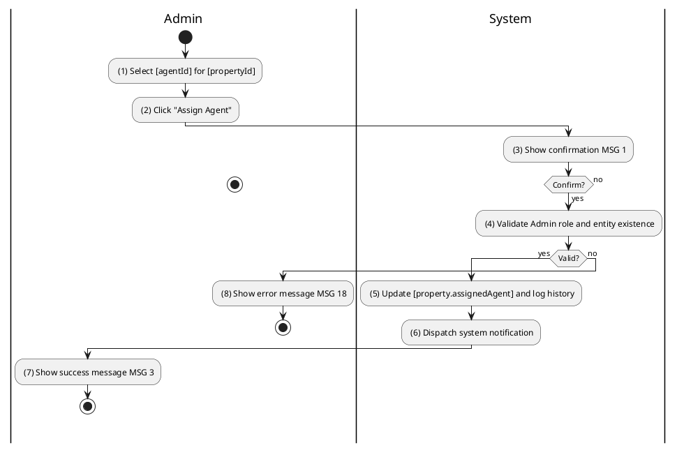
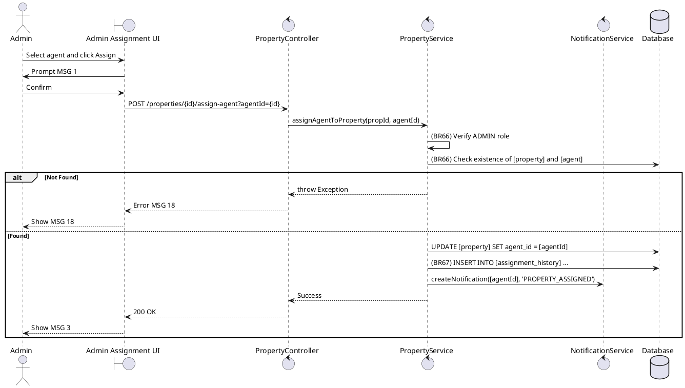

### UC20: Assign Agent to Property
**Name**: Assign Agent to Property
**Description**: This use case describes how an Administrator assigns a Sales Agent to manage a specific property listing.
**Actor**: Admin
**Trigger**: ❖ When the Admin selects an agent and confirms the assignment.
**Pre-condition**: 
❖ The user is logged in as Admin.
**Post-condition**: 
❖ The property record is updated with the assigned Sales Agent ID.
❖ The Sales Agent is notified of the assignment.

**Activities Flow (PlantUML)**:

**Business Rules**:

| Activity | BR Code | Description |
| :--- | :--- | :--- |
| (4) | BR66 | **Validate Rules:** When the Admin clicks on “Assign Agent”, the system will prompt a confirmation message (Refer to MSG 1). If Admin chooses Cancel, the system does nothing; else: ❖ The system checks the items [propertyId], [agentId]. ❖ If [propertyRepository.findById([propertyId])] is null or [userRepository.findById([agentId])] is null then show error message MSG 18. |
| (5) | BR66_B | **Updating Rules:** ❖ [property.assignedAgent] = [agent]. ❖ Property Repository save [property]. |
| (5) | BR67 | **Saving Rules:** ❖ [history] = new PropertyAssignmentHistory(). ❖ [history.propertyId] = [propertyId], [history.agentId] = [agentId], [history.assignedBy] = <<me>>. ❖ Assignment History Repository save [history]. |
| (7) | BR3 | **Message Rules:** ❖ The system shows success message MSG 3. |
