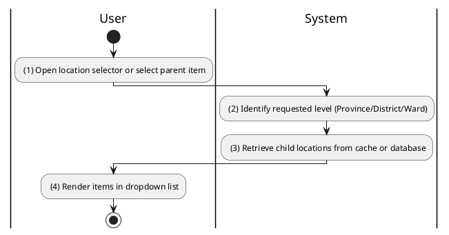
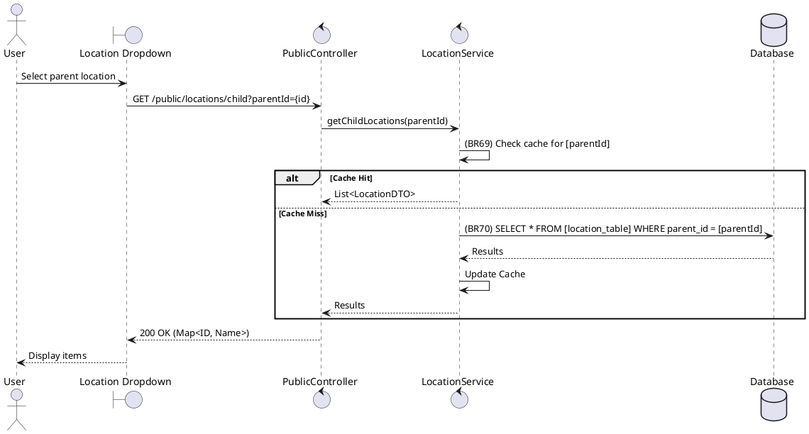

### UC21: Fetch Location Data
**Name**: Fetch Location Data
**Description**: This use case describes the retrieval of hierarchical location data (Provinces, Districts, Wards) for use in forms and filters.
**Actor**: User
**Trigger**: ❖ When the user interacts with a location selection component (e.g., dropdown).
**Pre-condition**: 
❖ None.
**Post-condition**: 
❖ The system returns a list of location items matching the requested level and parent ID.

**Activities Flow (PlantUML)**:

**Business Rules**:

| Activity | BR Code | Description |
| :--- | :--- | :--- |
| (3) | BR69 | **Loading Rules:** ❖ The system checks the internal cache for [parentId]. If found, return results immediately without querying the database. |
| (3) | BR70 | **Retrieval Rules:** ❖ If cache miss then [results] = Location Repository find all by [parentId]. ❖ Sort [results] alphabetically by name. |
