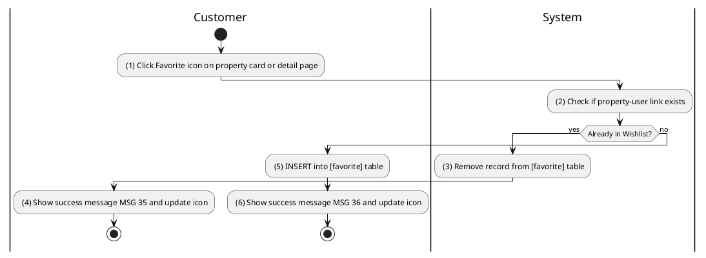
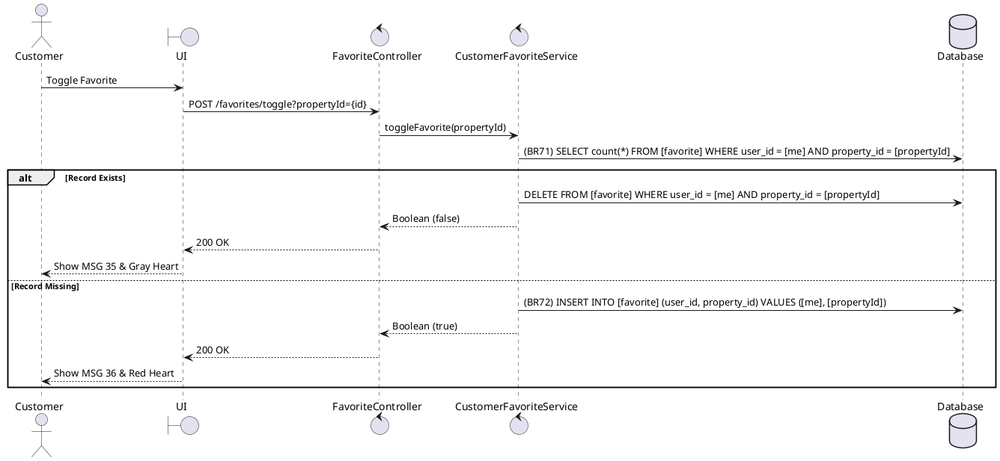

### UC22: Wishlist Property
**Name**: Wishlist Property
**Description**: This use case describes how a customer can add or remove a property from their personal favorites list for later review.
**Actor**: Customer
**Trigger**: ❖ When the user clicks on the “Favorite/Heart” icon.
**Pre-condition**: 
❖ The user is logged in to the system.
**Post-condition**: 
❖ The property association with the user's wishlist is updated.

**Activities Flow (PlantUML)**:

**Business Rules**:

| Activity | BR Code | Description |
| :--- | :--- | :--- |
| (2) | BR71 | **Checking Rules:** ❖ [count] = Favorite Repository count WHERE [user_id] = <<me>> AND [property_id] = [propertyId]. |
| (5) | BR72 | **Saving Rules:** ❖ If [propertyRepository.findById([propertyId])] is null then show error message MSG 18. ❖ Favorite Repository save new favorite record. |
| (4) | BR35 | **Message Rules:** ❖ The system shows success message MSG 35 ("Removed from favorites"). |
| (6) | BR36 | **Message Rules:** ❖ The system shows success message MSG 36 ("Added to favorites"). |
