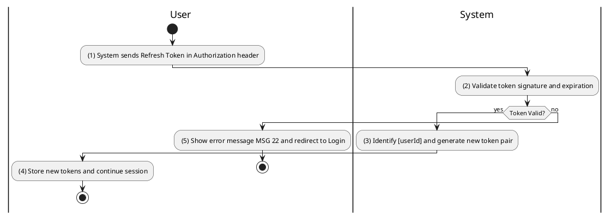
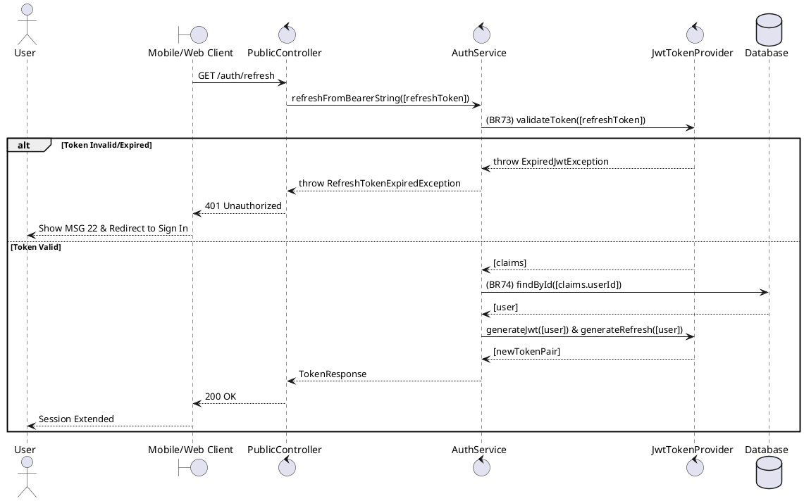

### UC23: Token Refresh
**Name**: Token Refresh
**Description**: This use case describes the process by which the system issues a new set of authentication tokens using a valid refresh token.
**Actor**: User
**Trigger**: ❖ When the client application detects an expired access token or upon initial launch.
**Pre-condition**: 
❖ The user has a valid, non-expired refresh token stored locally.
**Post-condition**: 
❖ The system issues a new JWT access token and a rotated refresh token.

**Activities Flow (PlantUML)**:

**Business Rules**:

| Activity | BR Code | Description |
| :--- | :--- | :--- |
| (2) | BR73 | **Validate Rules:** ❖ If [jwtTokenProvider.validateToken([refreshToken])] is false OR [refreshToken.expiry] < <<now>> then return 401-UNAUTHORIZED with error message MSG 22. |
| (3) | BR74 | **Creating Rules:** ❖ [accessToken] = jwtTokenProvider.generateToken([user.id], [user.role], <<expiry: 1h>>). ❖ [refreshToken] = jwtTokenProvider.generateToken([user.id], [user.role], <<expiry: 7d>>). ❖ Return [TokenResponse] containing both tokens. |
