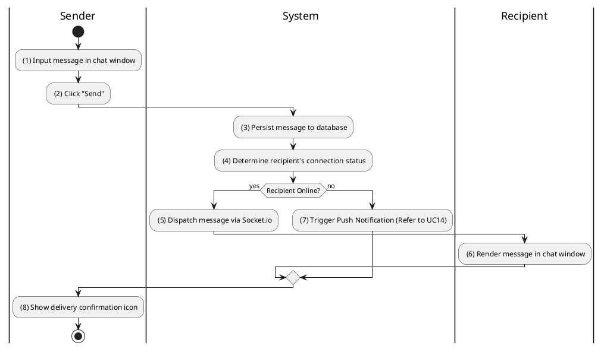
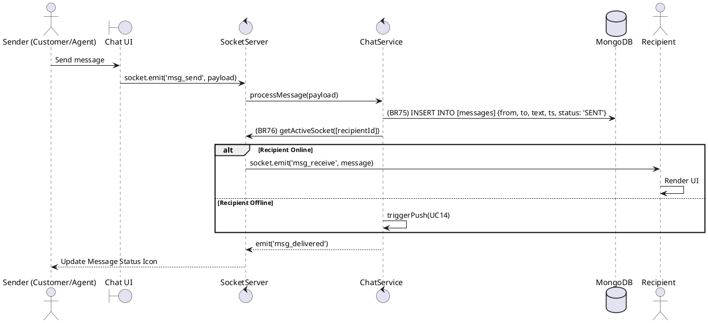

### UC24: Real-time Agent Chat
**Name**: Real-time Agent Chat
**Description**: This use case describes the real-time exchange of messages between a Customer and a Sales Agent regarding a property listing.
**Actor**: Customer / Agent
**Trigger**: ❖ When the user sends a message in the chat interface.
**Pre-condition**: 
❖ Both parties are logged in.
❖ A WebSocket/Socket.io connection is established.
**Post-condition**: 
❖ The message is delivered to the recipient and saved in the message history.

**Activities Flow (PlantUML)**:

**Business Rules**:

| Activity | BR Code | Description |
| :--- | :--- | :--- |
| (3) | BR75 | **Saving Rules:** ❖ [message] = new ChatMessage(). ❖ [message.senderId] = <<me>>, [message.receiverId] = [recipientId], [message.content] = [text]. ❖ Message Repository save [message] (call save() function). |
| (4), (5) | BR76 | **Dispatch Rules:** ❖ The system checks the internal Socket Map for [recipientId]. ❖ If [socketId] exists then call socket.to([socketId]).emit('new_message', [message]) else call Notification Service createNotification([recipientId], 'CHAT_MESSAGE', [text]). |
