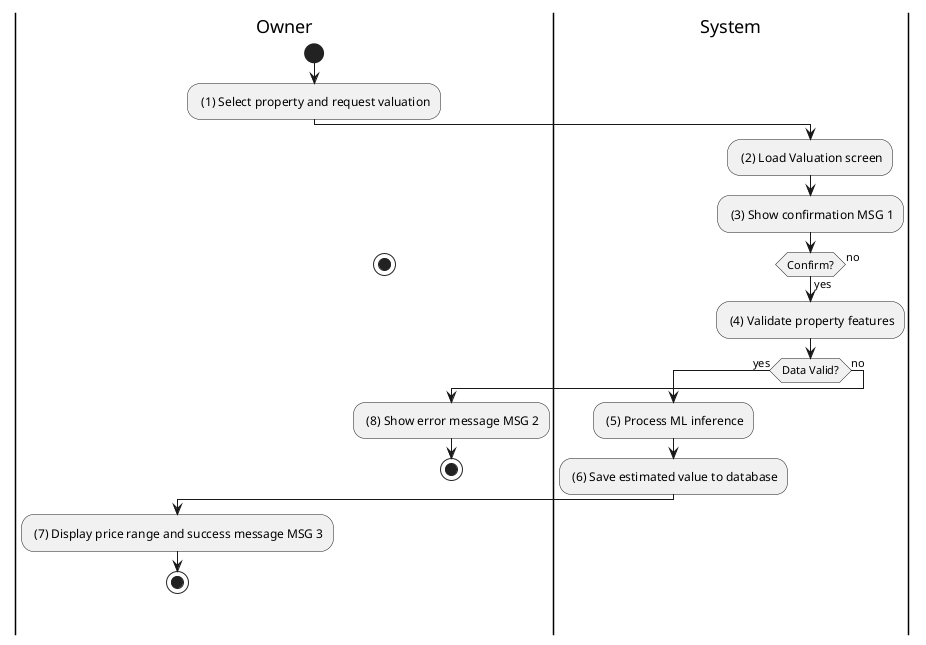
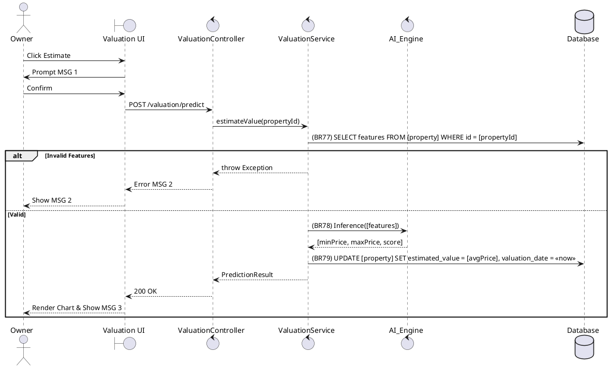

### UC25: AI Property Valuation
**Name**: AI Property Valuation
**Description**: This use case describes how the system uses artificial intelligence to estimate the market value of a property based on its features and historical data.
**Actor**: Owner
**Trigger**: ❖ When the user clicks on the “Estimate Value” button.
**Pre-condition**: 
❖ The user is logged in as Owner.
❖ The property has basic data provided (area, location, type).
**Post-condition**: 
❖ An AI-estimated value is displayed and saved to the property record.

**Activities Flow (PlantUML)**:

**Business Rules**:

| Activity | BR Code | Description |
| :--- | :--- | :--- |
| (2) | BR76 | **Loading Screen Rules:** ❖ The system loads the “AI Valuation” interface. |
| (4) | BR77 | **Validate Rules:** When the user clicks on “Estimate Value”, the system will prompt a confirmation message (Refer to MSG 1). If user chooses Cancel, the system does nothing; else: ❖ The system checks the items [area], [wardId], [propertyTypeId]. ❖ If [area] <= 0 then the system shows error message MSG 13. ❖ If mandatory items are null then the system shows error message MSG 2. |
| (5) | BR78 | **AI Rules:** ❖ [prediction] = AI Gateway POST /predict with [featureVector] constructed from property attributes. |
| (6) | BR79 | **Saving Rules:** ❖ [property.estimatedValue] = ([prediction.min] + [prediction.max]) / 2. ❖ [property.valuationDate] = <<current date time>>. ❖ Property Repository save [property] (call save() function). |
| (7) | BR3 | **Message Rules:** ❖ The system shows success message MSG 3. |
