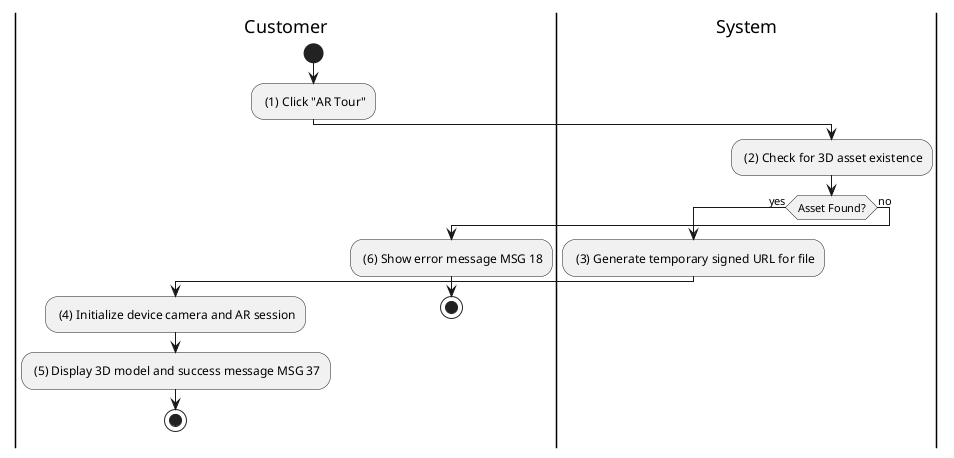
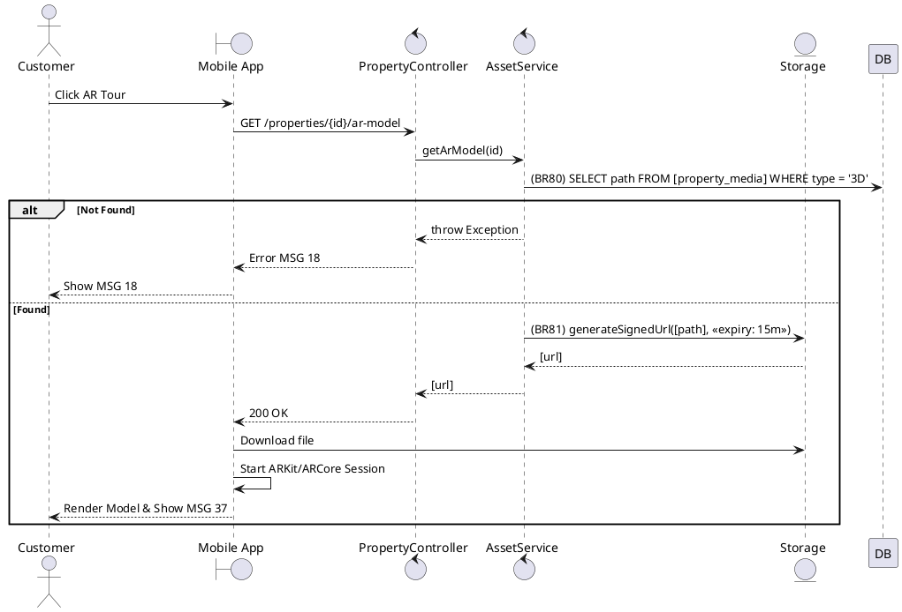

### UC26: Augmented Reality Virtual Tour
**Name**: Augmented Reality Virtual Tour
**Description**: This use case describes the process of initializing an Augmented Reality (AR) session for a 3D visualization of a property.
**Actor**: Customer
**Trigger**: ❖ When the user clicks on the “AR Tour” button.
**Pre-condition**: 
❖ The user is viewing property details on a mobile device.
❖ The property has a processed 3D model asset.
**Post-condition**: 
❖ An AR session is started on the device.

**Activities Flow (PlantUML)**:

**Business Rules**:

| Activity | BR Code | Description |
| :--- | :--- | :--- |
| (2) | BR80 | **Checking Rules:** ❖ If Property Media Repository find 3D asset by [propertyId] is null then show error message MSG 18. |
| (3) | BR81 | **Creating Rules:** ❖ [url] = Storage Service generateSignedUrl([asset.path], [expiration: 900 seconds]). |
| (5) | BR37 | **Message Rules:** ❖ The system shows success message MSG 37 ("AR session initialized"). |
