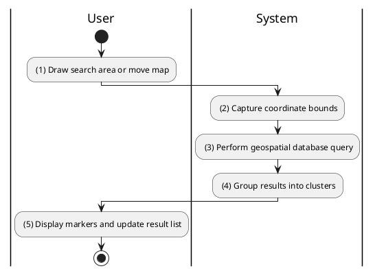
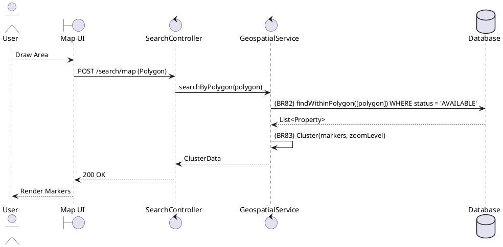

### UC27: Map-based Search
**Name**: Map-based Search
**Description**: This use case describes how a user can find properties by drawing an area on a map or navigating the map view.
**Actor**: User
**Trigger**: ❖ When the user interacts with the map (draws area or pans view).
**Pre-condition**: 
❖ The user is on the property search page.
**Post-condition**: 
❖ Property markers within the selected area are displayed on the map.

**Activities Flow (PlantUML)**:

**Business Rules**:

| Activity | BR Code | Description |
| :--- | :--- | :--- |
| (3) | BR82 | **Validate Rules:** ❖ [results] = Property Repository find within [polygon] WHERE [status] = 'AVAILABLE'. |
| (4) | BR83 | **Creating Rules:** ❖ If [zoomLevel] < 12 then the system groups nearby [markers] into [clusters] to optimize rendering. |
