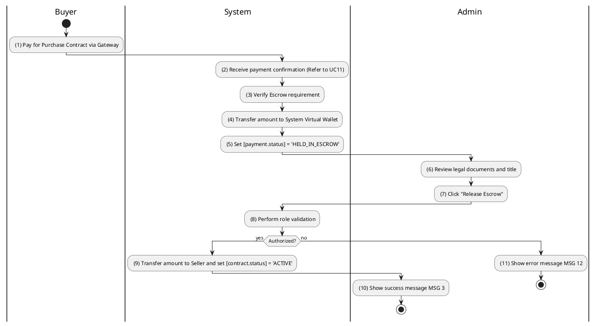
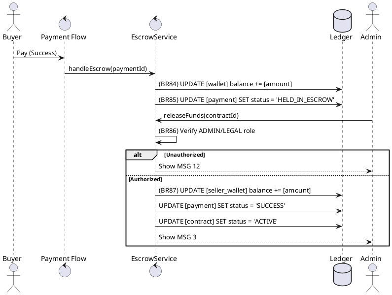

### UC28: Escrow Payment Protection
**Name**: Escrow Payment Protection
**Description**: This use case describes the process by which high-value transaction funds are held in a system-controlled virtual wallet until specific legal conditions are met.
**Actor**: Buyer / Admin
**Trigger**: ❖ When the Buyer completes a payment for a purchase contract.
**Pre-condition**: 
❖ The user is logged in as Buyer.
❖ [contract.status] is 'WAITING_OFFICIAL'.
**Post-condition**: 
❖ Funds are held in 'HELD_IN_ESCROW' status.
❖ Funds are released to the Seller upon Admin approval.

**Activities Flow (PlantUML)**:

**Business Rules**:

| Activity | BR Code | Description |
| :--- | :--- | :--- |
| (3) | BR84 | **Validate Rules:** ❖ If [contract.type] == 'PURCHASE' then [payment.mode] = 'ESCROW' else [payment.mode] = 'DIRECT'. |
| (4) | BR84_B | **Ledger Rules:** ❖ [wallet] = Wallet Repository findByUserId([system.id]). ❖ [wallet.balance] = [wallet.balance] + [payment.amount]. ❖ Wallet Repository save [wallet]. |
| (5) | BR85 | **Updating Rules:** ❖ [payment.status] = 'HELD_IN_ESCROW'. ❖ Payment Repository save [payment]. |
| (8) | BR86 | **Validate Rules:** ❖ If <<current user role>> not in ['ADMIN', 'LEGAL'] then show error message MSG 12. |
| (9) | BR87 | **Release Rules:** ❖ [sellerWallet] = Wallet Repository findByUserId([property.ownerId]). ❖ [sellerWallet.balance] = [sellerWallet.balance] + [payment.amount]. ❖ [payment.status] = 'SUCCESS'. ❖ [contract.status] = 'ACTIVE'. ❖ Repository save all entities. |
| (10) | BR3 | **Message Rules:** ❖ The system shows success message MSG 3. |
