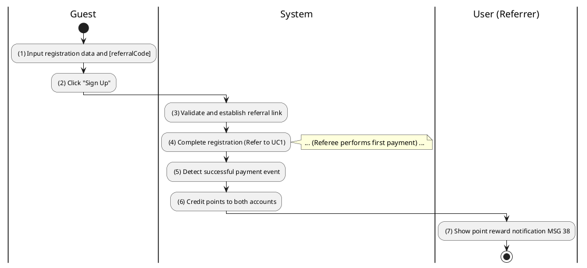
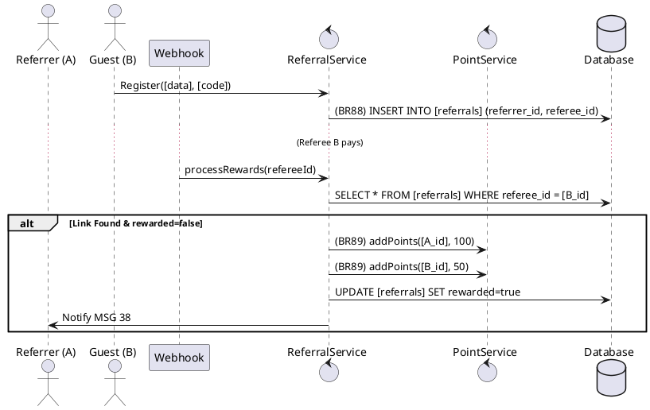

### UC29: Referral Program
**Name**: Referral Program
**Description**: This use case describes how the system tracks user invitations and awards reward points upon successful transactions by referred users.
**Actor**: User
**Trigger**: ❖ When a Guest registers using a unique referral code.
**Pre-condition**: 
❖ The Referrer has an active account.
**Post-condition**: 
❖ A referral link is established.
❖ Points are awarded to both parties after the referee's first successful payment.

**Activities Flow (PlantUML)**:

**Business Rules**:

| Activity | BR Code | Description |
| :--- | :--- | :--- |
| (3) | BR88 | **Validate Rules:** ❖ If [referralCode] exists in the system then [link] = new ReferralLink([referrer.id], [me]). ❖ Referral Repository save [link] (call save() function). |
| (6) | BR89 | **Point Rules:** ❖ If [referee.transactionCount] == 1 then [referrer.points] = [referrer.points] + 100. ❖ [referee.points] = [referee.points] + 50. ❖ Point Repository save both user balances. |
| (7) | BR38 | **Message Rules:** ❖ The system shows notification message MSG 38 ("Referral reward points credited"). |
