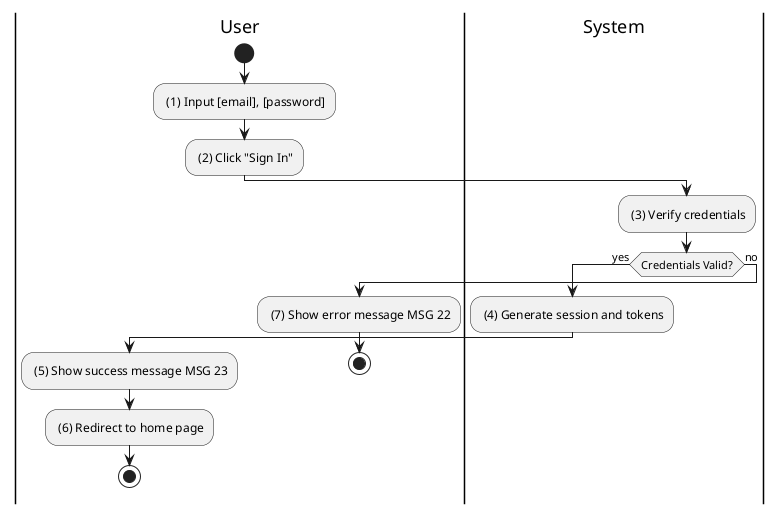
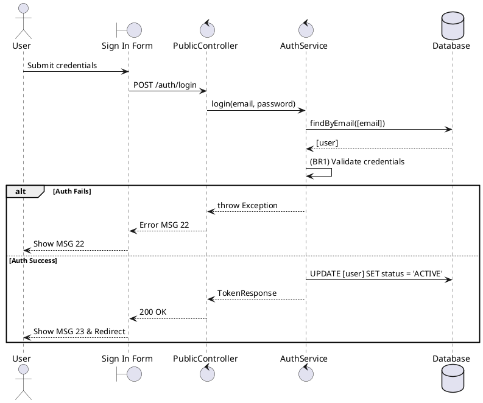

### UC2: Sign In
**Name**: Sign In
**Description**: This use case describes the process by which a user logs into the system.
**Actor**: User
**Trigger**: ❖ When the user clicks on the “Sign In” button.
**Pre-condition**: 
❖ The user is not logged in to the system.
❖ The user is in the sign in page (refer to “Sign In Form” in “List description” file).
**Post-condition**: 
❖ The user is logged in to the system.
❖ The user is redirected to the home page.

**Activities Flow (PlantUML)**:

**Business Rules**:

| Activity | BR Code | Description |
| :--- | :--- | :--- |
| (3) | BR1 | **Validate Rules:** ❖ The system checks the items [email], [password]. ❖ If any of them is null or blank the system will show an error message MSG 2. ❖ If [email] does not exist the system will show an error message MSG 22 else [user] = User Repository find by [email]. ❖ If hash([password]) != [user.password] then the system will show an error message MSG 22 else generate jwt from [user.id]. |
| (5) | BR3 | **Message Rules:** ❖ The system shows the success message MSG 23. |
| (6) | BR4 | **Redirect Rules:** ❖ The system redirects to the home page. |
| (7) | BR2 | **Message Rules:** ❖ The system shows the error message MSG 22. |
