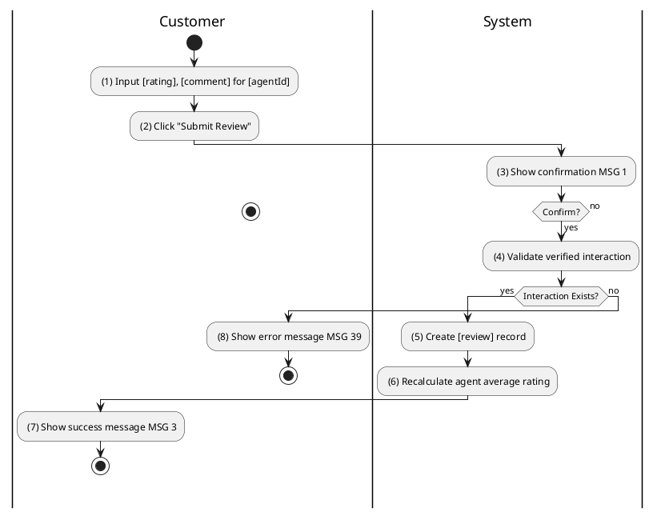
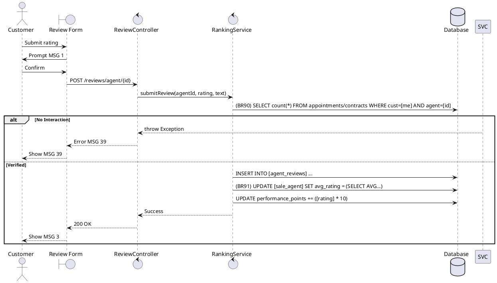

### UC30: Agent Review
**Name**: Agent Review
**Description**: This use case describes the process by which a customer rates and provides feedback on a Sales Agent following a completed interaction.
**Actor**: Customer
**Trigger**: ❖ When the user clicks on the “Rate Agent” button.
**Pre-condition**: 
❖ The user is logged in as Customer.
❖ The user has a 'COMPLETED' appointment or 'ACTIVE' contract with the agent.
**Post-condition**: 
❖ The review is saved and the agent's aggregate rating is updated.

**Activities Flow (PlantUML)**:

**Business Rules**:

| Activity | BR Code | Description |
| :--- | :--- | :--- |
| (4) | BR90 | **Validate Rules:** When the user clicks on “Submit Review”, the system will prompt a confirmation message (Refer to MSG 1). If user chooses Cancel, the system does nothing; else: ❖ If Appointment Repository countByCustomerAndAgentAndStatus([me], [agentId], 'COMPLETED') == 0 AND Contract Repository countByCustomerAndAgent([me], [agentId]) == 0 then show error message MSG 39 ("No verified interaction found"). |
| (6) | BR91 | **Calculation Rules:** ❖ [agent.avgRating] = Review Repository calculate average([agentId]). ❖ [agent.performancePoints] = [agent.performancePoints] + ([rating] * 10). ❖ Sale Agent Repository save [agent]. |
| (7) | BR3 | **Message Rules:** ❖ The system shows success message MSG 3. |
