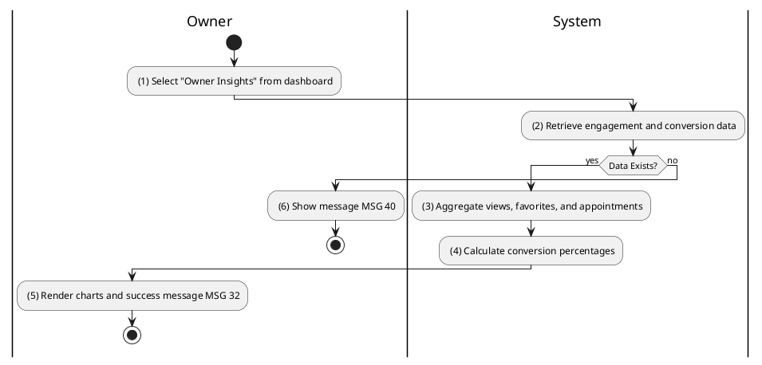
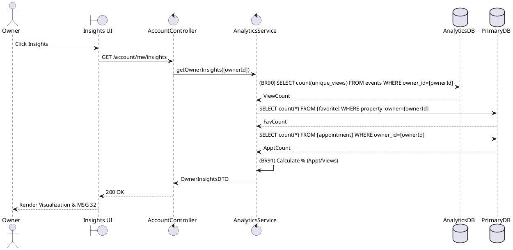

### UC31: View Owner Insights
**Name**: View Owner Insights
**Description**: This use case describes how a Property Owner can view engagement metrics and conversion statistics for their listings.
**Actor**: Owner
**Trigger**: ❖ When the user clicks on the “Insights” tab in the dashboard.
**Pre-condition**: 
❖ The user is logged in as Owner.
**Post-condition**: 
❖ Engagement charts and conversion metrics are displayed.

**Activities Flow (PlantUML)**:

**Business Rules**:

| Activity | BR Code | Description |
| :--- | :--- | :--- |
| (3) | BR90 | **Aggregation Rules:** ❖ [viewCount] = Analytics Repository findUniqueViewsByOwner([ownerId]). ❖ [favoriteCount] = Favorite Repository findCountByOwner([ownerId]). ❖ [appointmentCount] = Appointment Repository findCountByOwner([ownerId]). |
| (4) | BR91 | **Calculation Rules:** ❖ [conversionRate] = ([appointmentCount] / [viewCount]) * 100. If [viewCount] == 0 then [conversionRate] = 0. |
| (5) | BR32 | **Message Rules:** ❖ The system shows success message MSG 32. |
| (6) | BR40 | **Message Rules:** ❖ The system shows informational message MSG 40 ("No data available for the selected period"). |
