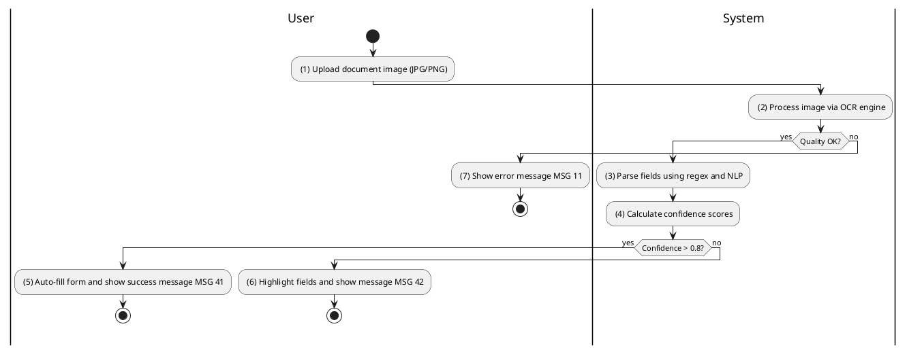
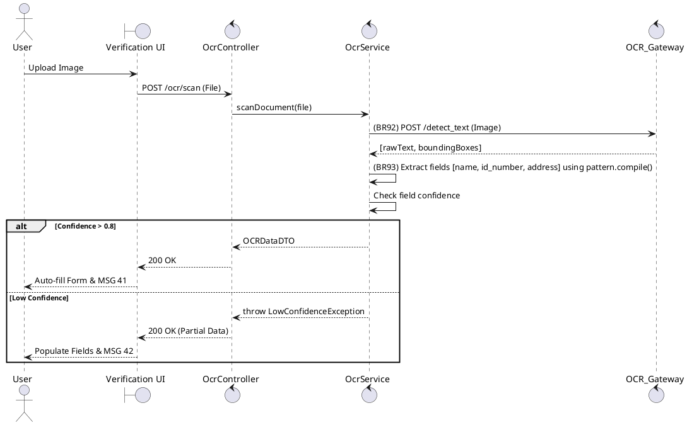

### UC32: Scan Document with OCR
**Name**: Scan Document with OCR
**Description**: This use case describes the automated extraction of text from identity or land documents to facilitate form completion.
**Actor**: User
**Trigger**: ❖ When the user uploads a document image to an OCR-enabled field.
**Pre-condition**: 
❖ The user is on a registration or verification page.
**Post-condition**: 
❖ Extracted text fields are populated in the UI form.

**Activities Flow (PlantUML)**:

**Business Rules**:

| Activity | BR Code | Description |
| :--- | :--- | :--- |
| (2) | BR92 | **OCR Rules:** ❖ [ocrResult] = OCR Gateway scan([image]). ❖ If [image.size] > 10.MB then return error message MSG 11. |
| (3) | BR93 | **Parsing Rules:** ❖ [idNumber] = pattern.compile("^[0-9]{12}$").find([ocrResult.rawText]). ❖ [name] = pattern.compile("[A-Z ]+").find([ocrResult.rawText]). ❖ [fields] = Map of extracted items with confidence scores. |
| (5) | BR41 | **Message Rules:** ❖ The system shows success message MSG 41 ("Document scanned successfully"). |
| (6) | BR42 | **Message Rules:** ❖ The system shows informational message MSG 42 ("Low confidence detected, please verify fields manually"). |
