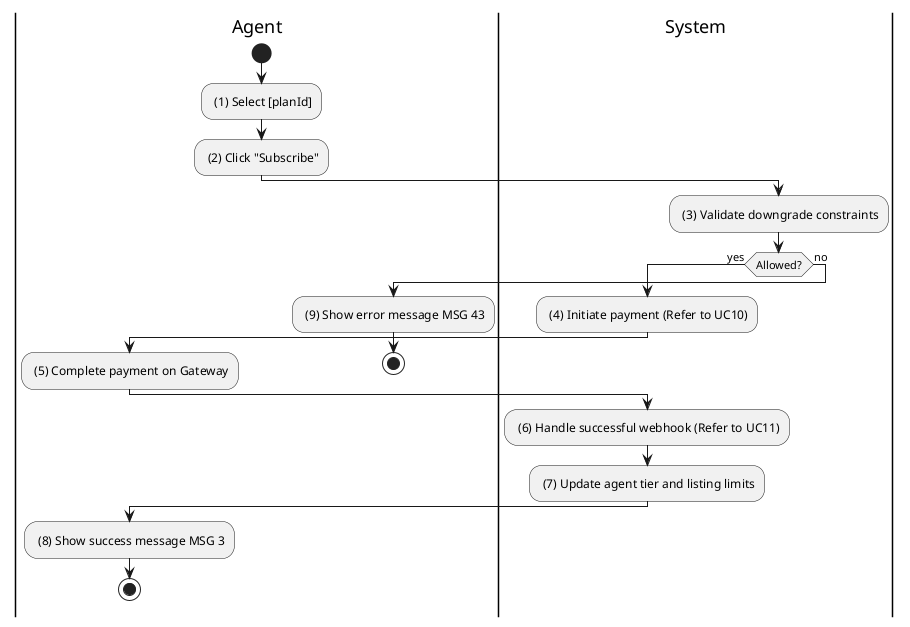
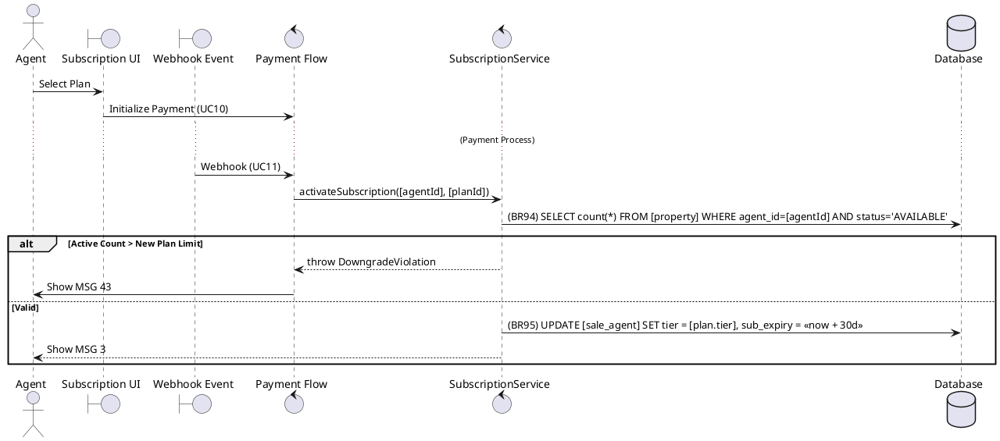

### UC33: Subscribe to Plan
**Name**: Subscribe to Plan
**Description**: This use case describes how a Sales Agent can purchase a premium subscription plan to increase their property listing capacity.
**Actor**: Sales Agent
**Trigger**: ❖ When the user selects a subscription plan and clicks "Subscribe".
**Pre-condition**: 
❖ The user is logged in as Sales Agent.
**Post-condition**: 
❖ The agent's tier is updated and a subscription record is created.

**Activities Flow (PlantUML)**:

**Business Rules**:

| Activity | BR Code | Description |
| :--- | :--- | :--- |
| (3) | BR94 | **Validate Rules:** ❖ [activeListings] = Property Repository countByAgentAndStatus([me], 'AVAILABLE'). ❖ If [activeListings] > [plan.propertyLimit] then show error message MSG 43 ("Active listings exceed new plan limit"). |
| (7) | BR95 | **Updating Rules:** ❖ [saleAgent.tier] = [plan.tier]. ❖ [saleAgent.subscriptionExpiry] = <<current date time>> + 30 days. ❖ Sale Agent Repository save [saleAgent]. |
| (8) | BR3 | **Message Rules:** ❖ The system shows success message MSG 3. |
