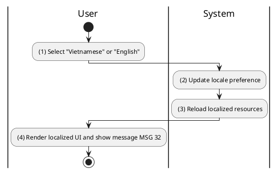
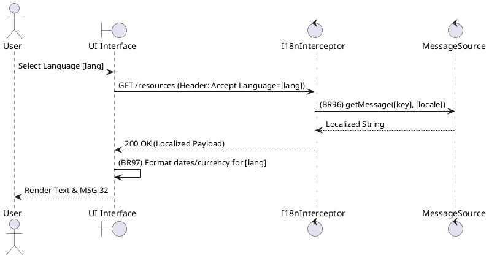

### UC34: Change Language
**Name**: Change Language
**Description**: This use case describes the process by which a user switches the application interface and content language.
**Actor**: User
**Trigger**: ❖ When the user selects a language from the interface.
**Pre-condition**: 
❖ None.
**Post-condition**: 
❖ The UI is localized to the selected language.

**Activities Flow (PlantUML)**:

**Business Rules**:

| Activity | BR Code | Description |
| :--- | :--- | :--- |
| (3) | BR96 | **Loading Rules:** ❖ [message] = MessageSource getMessage([key], [locale]). If not found, use [defaultLocale]. |
| (4) | BR97 | **Formatting Rules:** ❖ If [locale] == 'vi' then [date] = format([ts], "dd/MM/yyyy") else [date] = format([ts], "MM/dd/yyyy"). ❖ If [locale] == 'vi' then [currency] = format([amount], "VND") else [currency] = format([amount], "USD"). |
