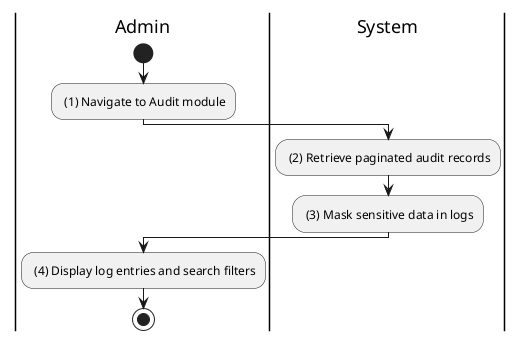
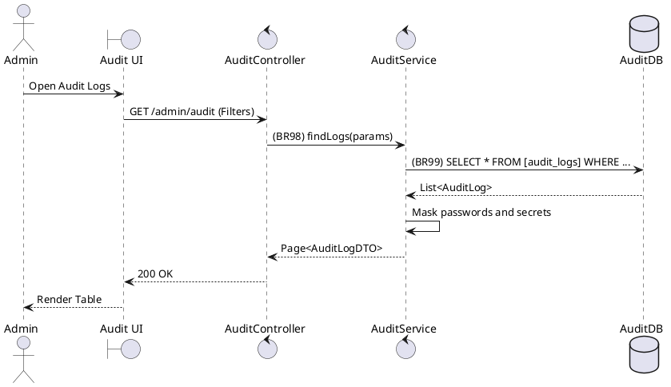

### UC35: View Audit Logs
**Name**: View Audit Logs
**Description**: This use case describes how an Administrator can view the history of sensitive system actions and state changes.
**Actor**: Admin
**Trigger**: ❖ When the Admin clicks on the “Audit Logs” menu item.
**Pre-condition**: 
❖ The user is logged in as Admin.
**Post-condition**: 
❖ The system displays a paginated list of audit records.

**Activities Flow (PlantUML)**:

**Business Rules**:

| Activity | BR Code | Description |
| :--- | :--- | :--- |
| (2) | BR98 | **Retrieval Rules:** ❖ [results] = Audit Repository find paginated by [filters] sorted by [timestamp] DESC. |
| (3) | BR99 | **Security Rules:** ❖ The system must automatically mask values in the [delta] JSON where [key] is in ['password', 'secret', 'token']. |
