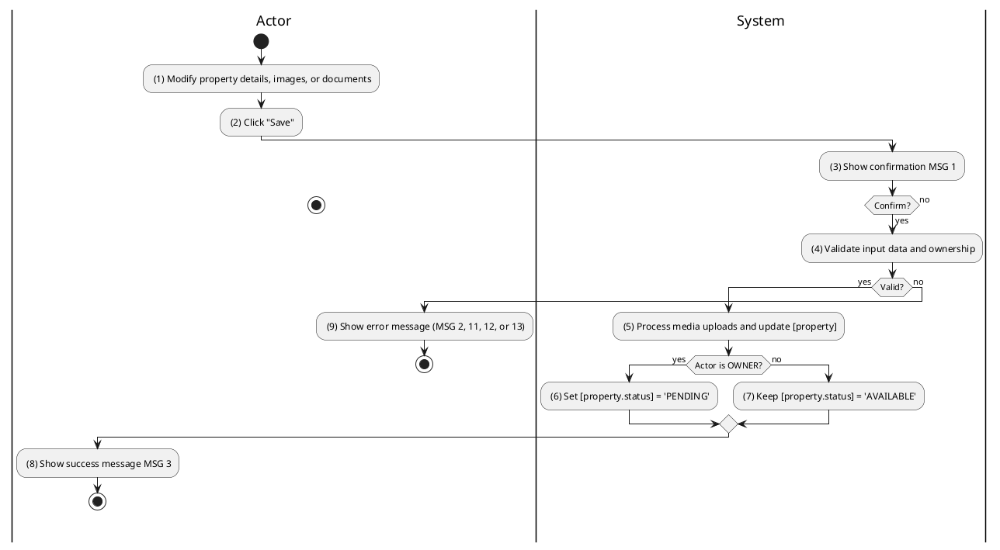
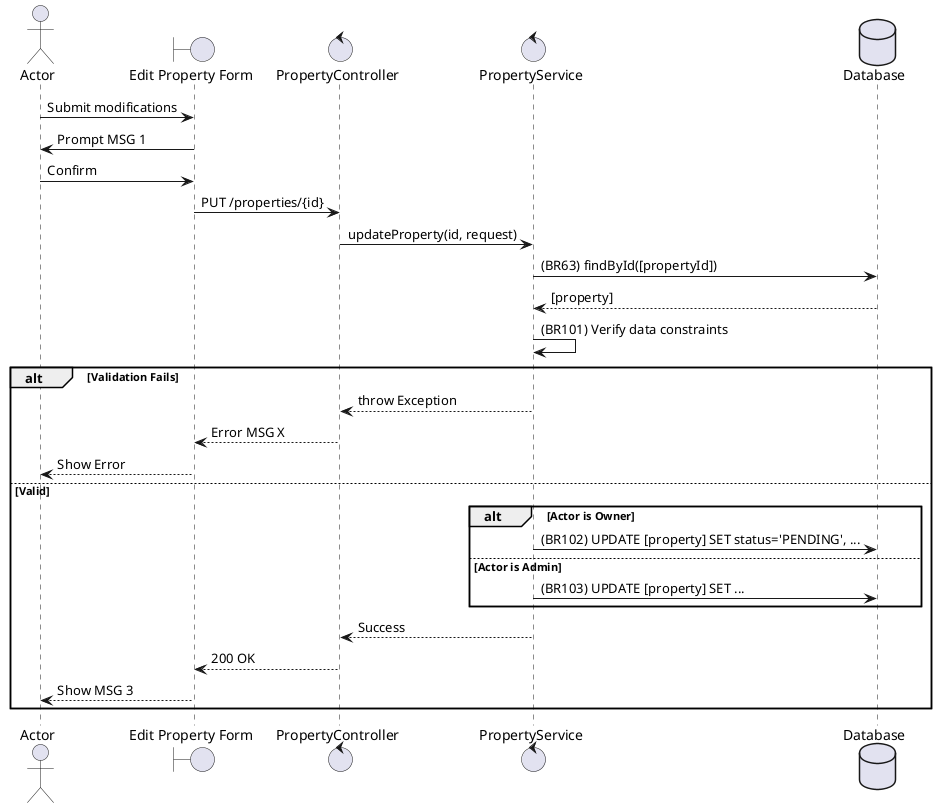

### UC36: Update Property
**Name**: Update Property
**Description**: This use case describes the process by which a Property Owner or Administrator updates the information and media of an existing property listing.
**Actor**: Owner / Admin
**Trigger**: ❖ When the user clicks the “Save” button in the property edit form.
**Pre-condition**: 
❖ The user is logged in.
❖ The user owns the property or has administrative privileges.
**Post-condition**: 
❖ The property record is updated in the database.
❖ If updated by an Owner, the property status may be reset to 'PENDING'.

**Activities Flow (PlantUML)**:

**Business Rules**:

| Activity | BR Code | Description |
| :--- | :--- | :--- |
| (4) | BR101 | **Validate Rules:** When the user clicks on “Save”, the system will prompt a confirmation message (Refer to MSG 1). If user chooses Cancel, the system does nothing; else: ❖ The system checks the items [title], [priceAmount], [area]. ❖ If any mandatory entries are empty, the system shows an error message MSG 2. ❖ If [priceAmount] < 0 then the system shows error message MSG 13. |
| (6) | BR102 | **Status Rules:** ❖ If <<current user role>> == 'PROPERTY_OWNER' then [property.status] = 'PENDING'. ❖ Property Repository save [property]. |
| (7) | BR103 | **Status Rules:** ❖ If <<current user role>> == 'ADMIN' then [property.status] remains unchanged. ❖ Property Repository save [property]. |
| (8) | BR3 | **Message Rules:** ❖ The system shows success message MSG 3. |
