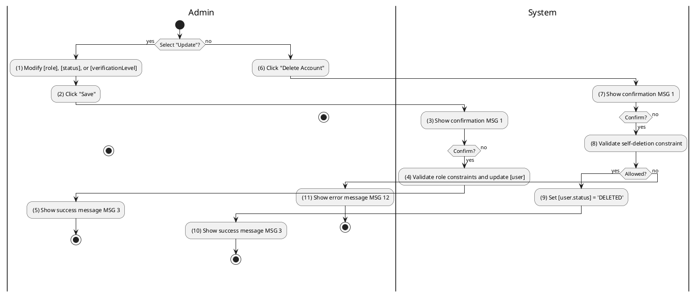
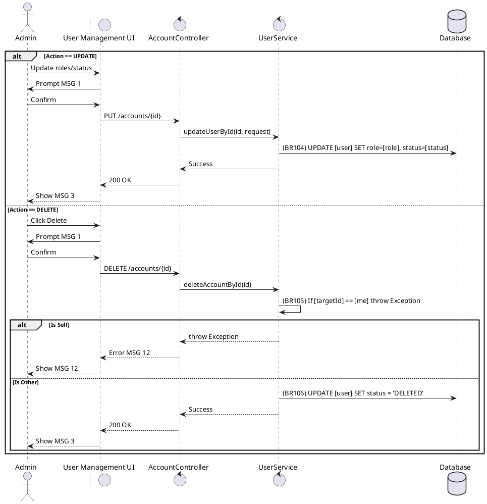

### UC37: Manage User Account
**Name**: Manage User Account
**Description**: This use case allows an Administrator to perform administrative actions on user accounts, including updating roles, statuses, or deleting the account.
**Actor**: Admin
**Trigger**: ❖ When the Admin clicks the “Update” or “Delete” button in the user management UI.
**Pre-condition**: 
❖ The user is logged in as Admin.
❖ The target user account exists in the system.
**Post-condition**: 
❖ The user account is updated or soft-deleted.

**Activities Flow (PlantUML)**:

**Business Rules**:

| Activity | BR Code | Description |
| :--- | :--- | :--- |
| (4) | BR104 | **Updating Rules:** ❖ [user] = User Repository find by [targetUserId]. ❖ [user.role] = [newRole]. ❖ [user.status] = [newStatus]. ❖ User Repository save [user] (call save() function). |
| (8) | BR105 | **Validate Rules:** ❖ If [targetUserId] == <<current user id>> then the system shows error message MSG 12 ("Cannot delete your own account"). |
| (9) | BR106 | **Delete Rules:** ❖ [user.status] = 'DELETED'. ❖ User Repository save [user]. |
| (5), (10) | BR3 | **Message Rules:** ❖ The system shows success message MSG 3. |
