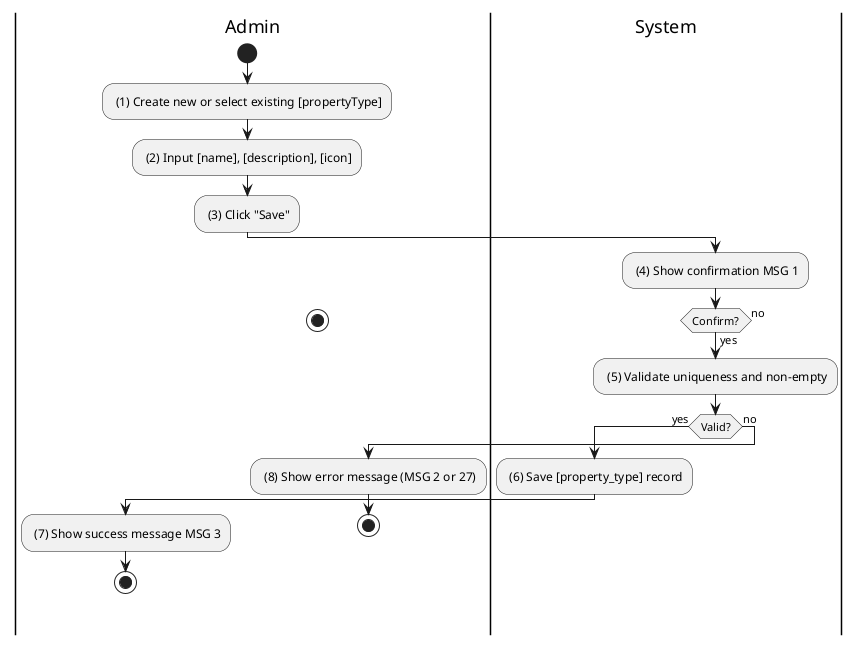
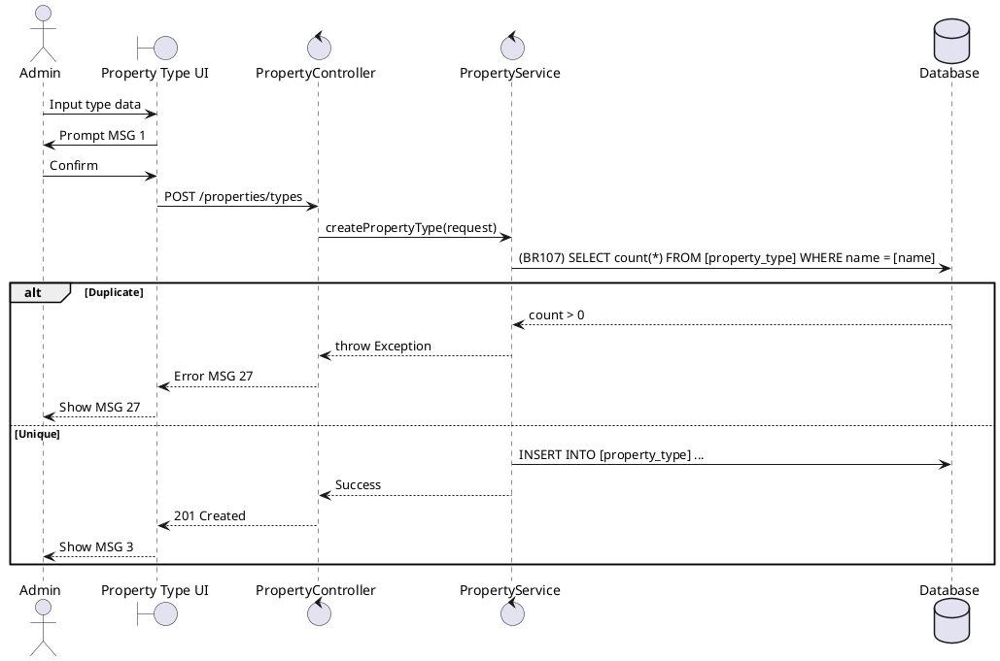

### UC38: Manage Property Types
**Name**: Manage Property Types
**Description**: This use case describes how an Administrator manages the global list of property categories (e.g., Apartment, Villa, Office).
**Actor**: Admin
**Trigger**: ❖ When the Admin clicks the “Save” or “Delete” button in the property type settings.
**Pre-condition**: 
❖ The user is logged in as Admin.
**Post-condition**: 
❖ The property type definitions are created, updated, or removed.

**Activities Flow (PlantUML)**:

**Business Rules**:

| Activity | BR Code | Description |
| :--- | :--- | :--- |
| (5) | BR107 | **Validate Rules:** When the Admin clicks on “Save”, the system will prompt a confirmation message (Refer to MSG 1). If Admin chooses Cancel, the system does nothing; else: ❖ If [name] is null or blank then show error message MSG 2. ❖ If [propertyTypeRepository.existsByName([name])] is true then show error message MSG 27. |
| (6) | BR108 | **Saving Rules:** ❖ [propertyType] = Property Type Repository save with all data. ❖ Property Type Repository save [propertyType] (call save() function). |
