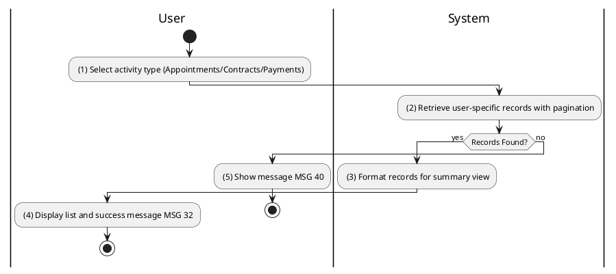
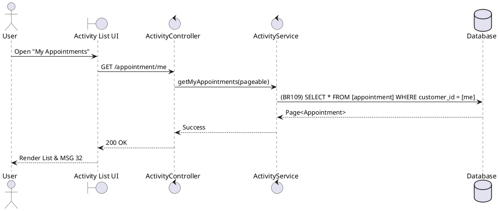

### UC39: View User Activity History
**Name**: View User Activity History
**Description**: This use case describes how users can view a paginated list of their personal appointments, contracts, and payments.
**Actor**: User
**Trigger**: ❖ When the user navigates to a historical activity page (e.g., “My Appointments”).
**Pre-condition**: 
❖ The user is logged in to the system.
**Post-condition**: 
❖ A list of records associated with the user is displayed.

**Activities Flow (PlantUML)**:

**Business Rules**:

| Activity | BR Code | Description |
| :--- | :--- | :--- |
| (2) | BR109 | **Loading Rules:** ❖ [results] = Repository find all by [currentUserId] sorted by [createdAt] DESC. ❖ Filter results based on selected status enums if provided. |
| (4) | BR32 | **Message Rules:** ❖ The system shows success message MSG 32. |
| (5) | BR40 | **Message Rules:** ❖ The system shows informational message MSG 40. |
