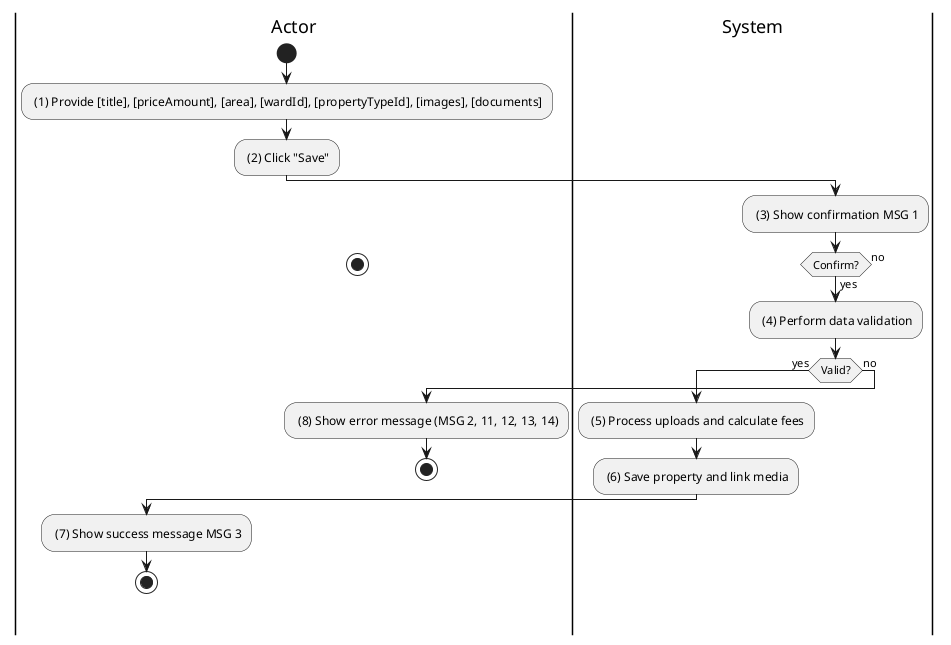
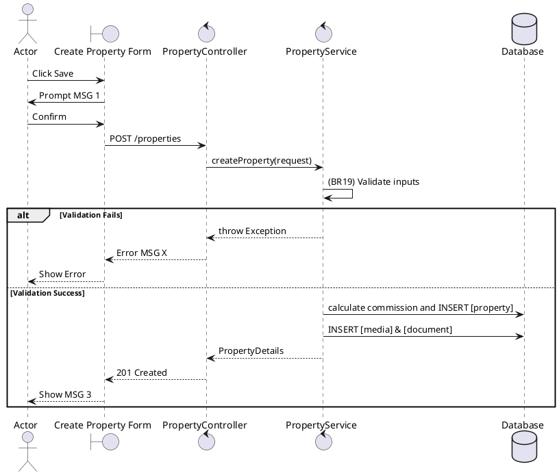

### UC3: Create Property Listing
**Name**: Create Property Listing
**Description**: This use case allows Owners or Admins to create a property listing with images and documents.
**Actor**: Owner / Admin
**Trigger**: ❖ When the user clicks on the “Submit Listing” button.
**Pre-condition**: 
❖ The user is logged in to the system.
❖ The user is in the create property page.
**Post-condition**: 
❖ The property listing has been created.

**Activities Flow (PlantUML)**:

**Business Rules**:

| Activity | BR Code | Description |
| :--- | :--- | :--- |
| (1) | BR18 | **Loading Screen Rules:** ❖ The system loads the “Create Property” screen. |
| (3) | BR19 | **Creating Rules:** When the user clicks on “Save”, the system will prompt a confirmation message (Refer to MSG 1). If user chooses Cancel, the system does nothing; else: ❖ The system checks the items [images], [title], [priceAmount], [area], [wardId], [propertyTypeId]. ❖ If any entries are empty, the system shows an error message MSG 2. ❖ If size of any in [images] > 5.MB then system shows error message MSG 11. ❖ If [priceAmount] < 0 then the system shows error message MSG 13. ❖ [property.serviceFeeAmount] = [priceAmount] * Constants.DEFAULT_PROPERTY_COMMISSION_RATE. ❖ If Actor is ADMIN then [status] = 'AVAILABLE' and [approvedAt] = <<now>> else [status] = 'PENDING'. ❖ [ownerId] = <<current user id retrieved from jwt>>. |
| (7) | BR20 | **Message Rules:** ❖ The system shows success message MSG 3. |
