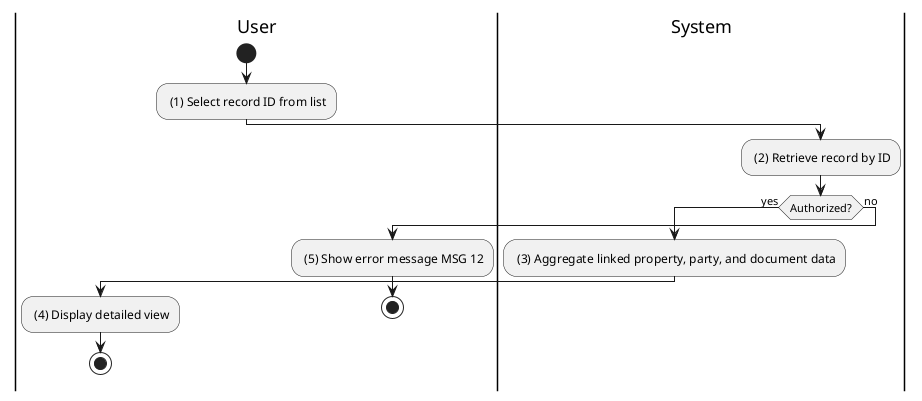
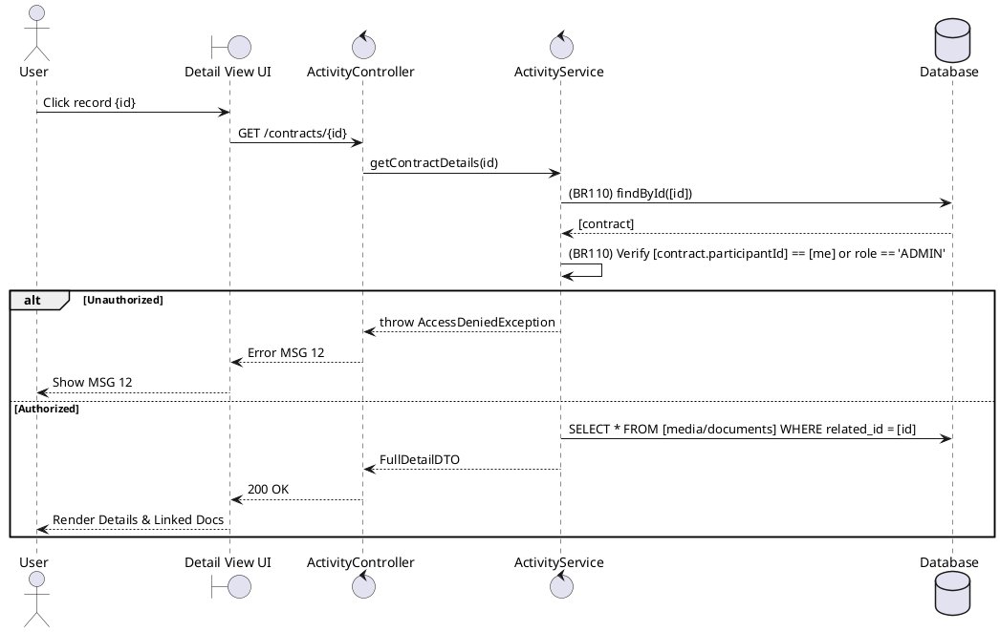

### UC40: View Activity Details
**Name**: View Activity Details
**Description**: This use case describes the retrieval of full technical and legal details for a specific appointment or contract.
**Actor**: User
**Trigger**: ❖ When the user clicks on an item in an activity history list.
**Pre-condition**: 
❖ The user is logged in.
❖ The user is authorized to view the specific record.
**Post-condition**: 
❖ Detailed data, including linked property and documents, is displayed.

**Activities Flow (PlantUML)**:

**Business Rules**:

| Activity | BR Code | Description |
| :--- | :--- | :--- |
| (2) | BR110 | **Validate Rules:** ❖ If [record] does not exist then show error message MSG 18. ❖ If <<current user role>> != 'ADMIN' AND [record.userId] != <<current user id>> then show error message MSG 12. |
| (3) | BR111 | **Loading Rules:** ❖ The system performs a join or separate fetch for all [documents] linked to the primary entity ID. |
