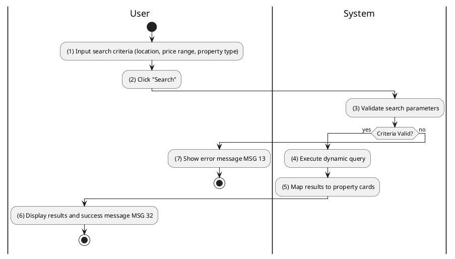
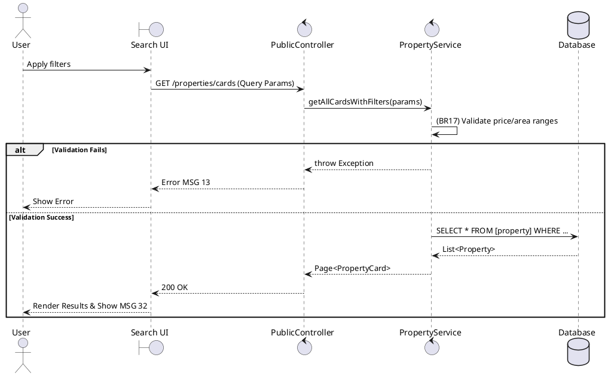

### UC4: Search Properties
**Name**: Search Properties
**Description**: This use case describes the process by which a user searches for properties using various filters such as location, price, and property type.
**Actor**: User
**Trigger**: ❖ When the user clicks on the “Search” button or applies a filter.
**Pre-condition**: 
❖ The user is on the property discovery page.
**Post-condition**: 
❖ The system displays a list of properties matching the search criteria.

**Activities Flow (PlantUML)**:

**Business Rules**:

| Activity | BR Code | Description |
| :--- | :--- | :--- |
| (1) | BR15 | **Loading Screen Rules:** ❖ The system loads the “Property Search” interface. |
| (3) | BR17 | **Validate Rules:** ❖ If [minPrice] > [maxPrice] then the system shows an error message MSG 13. ❖ If [minArea] > [maxArea] then the system shows an error message MSG 13. ❖ If all filters are null or blank the system will show an error message MSG 2. ❖ [results] = Property Repository find by criteria where [status] = 'AVAILABLE'. |
| (6) | BR32 | **Message Rules:** ❖ The system shows success message MSG 32 ("Search completed successfully"). |
