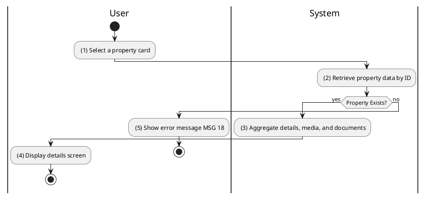
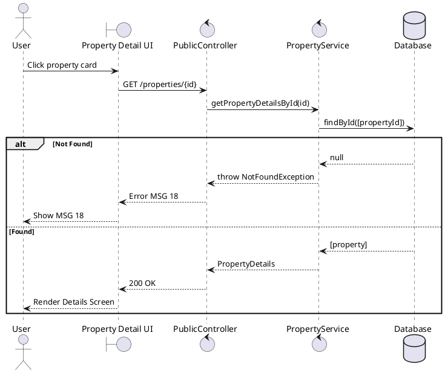

### UC5: View Property Details
**Name**: View Property Details
**Description**: This use case describes the process by which a user views the comprehensive information of a specific property.
**Actor**: User
**Trigger**: ❖ When the user clicks on a property card.
**Pre-condition**: 
❖ The user is viewing a list of properties.
**Post-condition**: 
❖ The system displays the full details, media, and contact information for the selected property.

**Activities Flow (PlantUML)**:

**Business Rules**:

| Activity | BR Code | Description |
| :--- | :--- | :--- |
| (2) | BR26 | **Checking Rules:** ❖ If [propertyId] does not exist, the system shows an error message MSG 18 else [property] = Property Repository find by [propertyId] (call findById() function). |
| (3) | BR19 | **Retrieval Rules:** ❖ The system fetches [images] from [media] table where [propertyId] matches. ❖ The system fetches [documents] from [document] table where [propertyId] matches. ❖ The system fetches [ownerTier] and [agentTier] from Ranking Service. |
