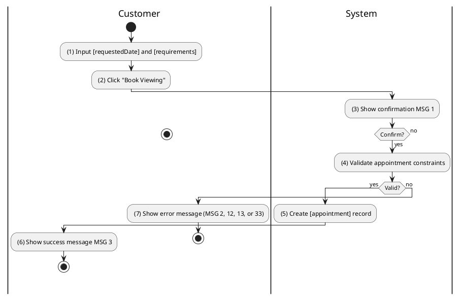
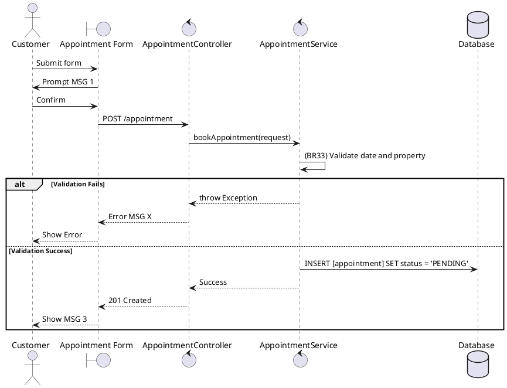

### UC6: Book Appointment
**Name**: Book Appointment
**Description**: This use case allows a user to request a viewing appointment for a specific property.
**Actor**: Customer
**Trigger**: ❖ When the user clicks on the “Book Viewing” button.
**Pre-condition**: 
❖ The user is logged in to the system.
❖ The user is on the property details page.
**Post-condition**: 
❖ A viewing appointment has been created in 'PENDING' or 'CONFIRMED' status.

**Activities Flow (PlantUML)**:

**Business Rules**:

| Activity | BR Code | Description |
| :--- | :--- | :--- |
| (4) | BR33 | **Validate Rules:** When the user clicks on “Book Viewing”, the system will prompt a confirmation message (Refer to MSG 1). If user chooses Cancel, the system does nothing; else: ❖ The system checks the items [requestedDate], [propertyId]. ❖ If any entries are empty, the system shows an error message MSG 2. ❖ If [requestedDate] <= <<now>> then the system shows an error message MSG 13. ❖ If [property.status] is not 'AVAILABLE' then the system shows an error message MSG 12. ❖ If [appointmentRepository.existsByCustomerAndProperty([me], [propertyId])] with status 'PENDING' or 'CONFIRMED' then the system shows error message MSG 33 ("Duplicate appointment"). |
| (5) | BR34 | **Creating Rules:** ❖ [appointment] = Appointment Repository save new appointment. ❖ [appointment.status] = 'PENDING'. ❖ If [agentId] is provided, [appointment.agentId] = [agentId] and [appointment.status] = 'CONFIRMED'. |
| (6) | BR20 | **Message Rules:** ❖ The system shows success message MSG 3. |
