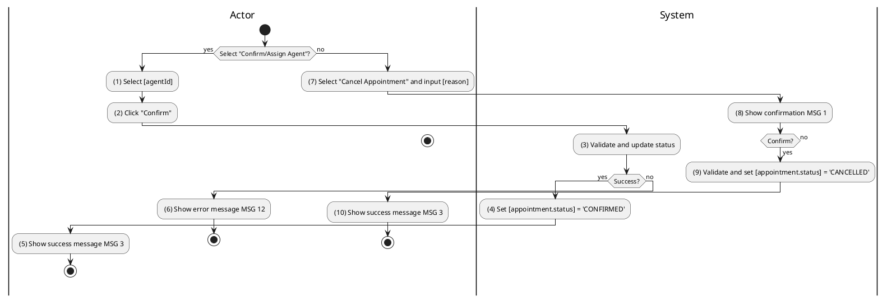
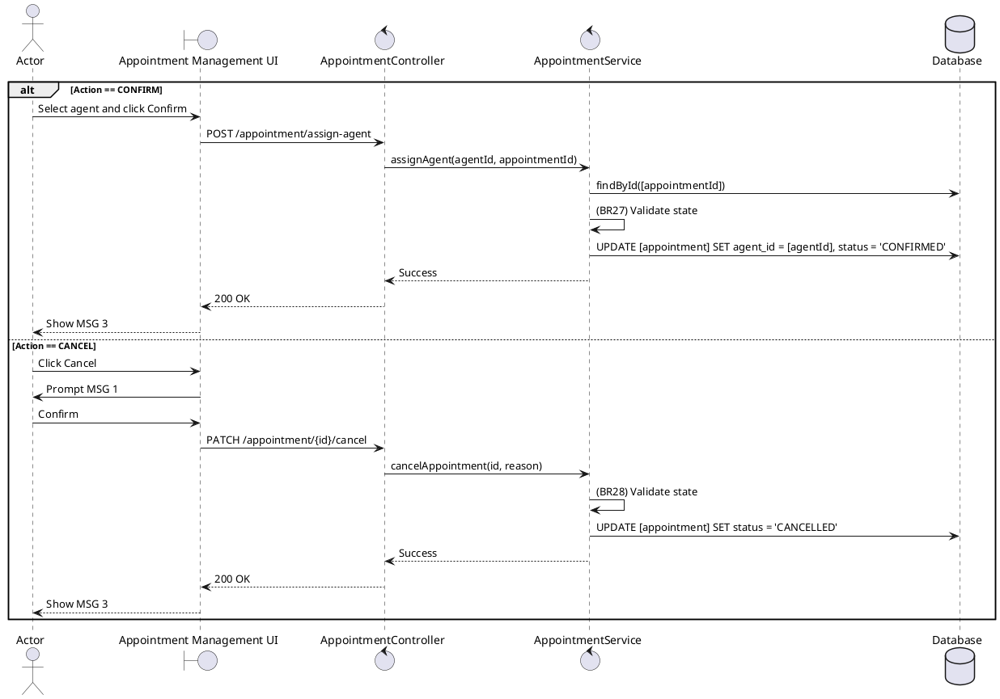

### UC7: Manage Appointment
**Name**: Manage Appointment
**Description**: This use case describes how an authorized user can confirm an appointment (by assigning a Sales Agent) or cancel a viewing request.
**Actor**: Admin / Agent / Owner
**Trigger**: ❖ When the user clicks the “Confirm/Assign Agent” or “Cancel Appointment” button.
**Pre-condition**: 
❖ The user is logged in and has appropriate permissions for the appointment.
❖ [appointment.status] is 'PENDING' or 'CONFIRMED'.
**Post-condition**: 
❖ The appointment status is updated.
❖ Involved parties are notified of the change.

**Activities Flow (PlantUML)**:

**Business Rules**:

| Activity | BR Code | Description |
| :--- | :--- | :--- |
| (3) | BR27 | **Saving Rules:** ❖ If [appointment.status] != 'PENDING' then the system shows error message MSG 12. ❖ [appointment.agent] = Agent Repository find by [agentId]. ❖ [appointment.status] = 'CONFIRMED'. ❖ [appointment.confirmedDate] = <<current date time>>. ❖ Appointment Repository save [appointment] (call save() function). |
| (9) | BR28 | **Validate Rules:** When the user clicks on “Cancel Appointment”, the system will prompt a confirmation message (Refer to MSG 1). If user chooses Cancel, the system does nothing; else: ❖ If [appointment.status] is 'CANCELLED' or 'COMPLETED' then the system shows error message MSG 12. ❖ [appointment.status] = 'CANCELLED'. ❖ [appointment.cancelledAt] = <<current date time>>. ❖ Appointment Repository save [appointment] (call save() function). ❖ If Actor is SALESAGENT then Ranking Service apply penalty 'APPOINTMENT_CANCELLED' for [agent.id]. |
| (5), (10) | BR3 | **Message Rules:** ❖ The system shows success message MSG 3. |
