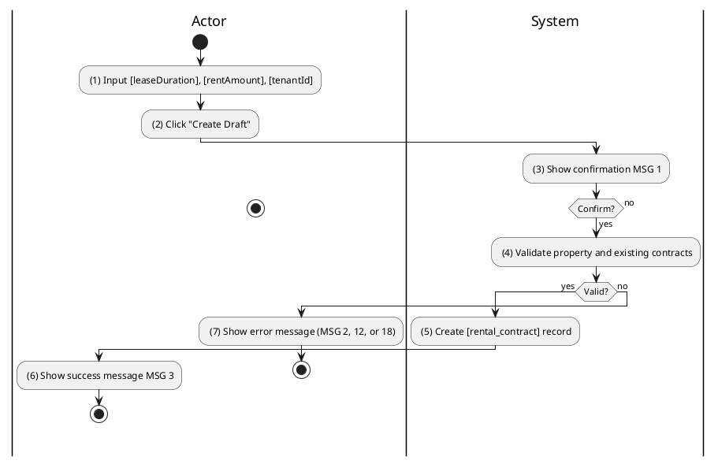
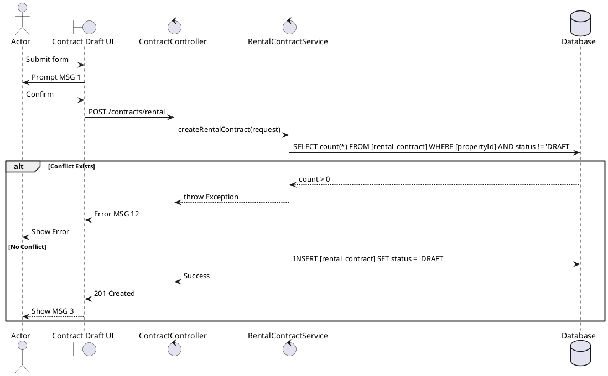

### UC8: Create Rental Contract Draft
**Name**: Create Rental Contract Draft
**Description**: This use case allows an Admin or Agent to generate a draft for a rental contract using property and party information.
**Actor**: Admin / Agent
**Trigger**: ❖ When the user clicks on the “Create Draft” button.
**Pre-condition**: 
❖ The user is logged in as Admin or Agent.
❖ No active rental contract exists for the target property.
**Post-condition**: 
❖ A new rental contract record is created in 'DRAFT' status.

**Activities Flow (PlantUML)**:

**Business Rules**:

| Activity | BR Code | Description |
| :--- | :--- | :--- |
| (4) | BR31 | **Validate Rules:** When the user clicks on “Create Draft”, the system will prompt a confirmation message (Refer to MSG 1). If user chooses Cancel, the system does nothing; else: ❖ The system checks the items [leaseDuration], [rentAmount], [tenantId], [propertyId]. ❖ If any entries are empty, the system shows an error message MSG 2. ❖ If [rentAmount] < 0 then the system shows error message MSG 13. ❖ If [rentalContractRepository.existsActiveContract([propertyId])] is true then the system shows error message MSG 12. ❖ If [depositContractId] is provided and [depositContract.status] != 'ACTIVE' then show error message MSG 12. |
| (5) | BR33 | **Saving Rules:** ❖ [rental_contract] = Rental Contract Repository save new contract with data (call save() function). ❖ [rental_contract.status] = 'DRAFT'. ❖ Populate [propertyInfo], [ownerInfo], [agentInfo] from respective repositories. |
| (6) | BR3 | **Message Rules:** ❖ The system shows success message MSG 3. |
