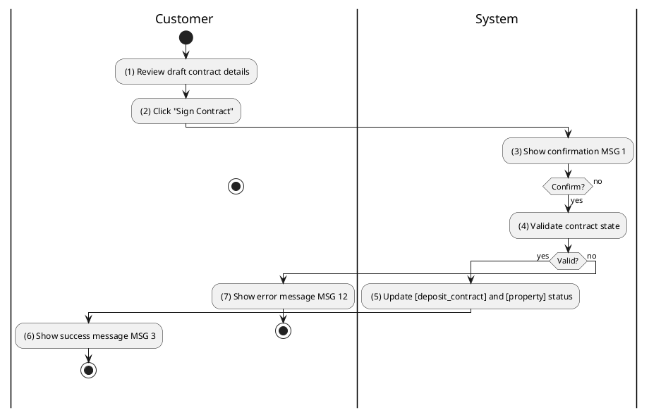
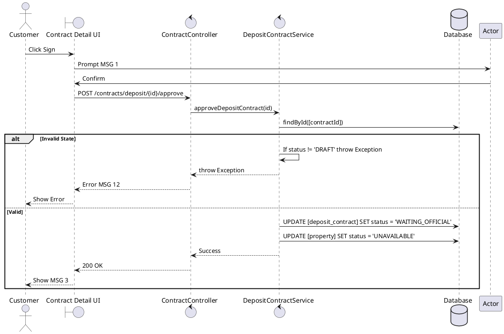

### UC9: Sign Deposit Contract
**Name**: Sign Deposit Contract
**Description**: This use case describes the process by which a customer signs a draft deposit contract to reserve a property.
**Actor**: Customer
**Trigger**: ❖ When the user clicks on the “Sign Contract” button.
**Pre-condition**: 
❖ The user is logged in as the assigned customer of a 'DRAFT' deposit contract.
**Post-condition**: 
❖ The contract status is updated to 'WAITING_OFFICIAL'.
❖ The property status is updated to 'UNAVAILABLE'.

**Activities Flow (PlantUML)**:

**Business Rules**:

| Activity | BR Code | Description |
| :--- | :--- | :--- |
| (4) | BR34 | **Validate Rules:** When the user clicks on “Sign Contract”, the system will prompt a confirmation message (Refer to MSG 1). If user chooses Cancel, the system does nothing; else: ❖ If [deposit_contract.status] != 'DRAFT' then the system shows error message MSG 12. |
| (5) | BR35 | **Saving Rules:** ❖ [deposit_contract.status] = 'WAITING_OFFICIAL'. ❖ [property.status] = 'UNAVAILABLE'. ❖ Deposit Contract Repository save [deposit_contract] (call save() function). ❖ Property Repository save [property] (call save() function). |
| (6) | BR3 | **Message Rules:** ❖ The system shows success message MSG 3. |
