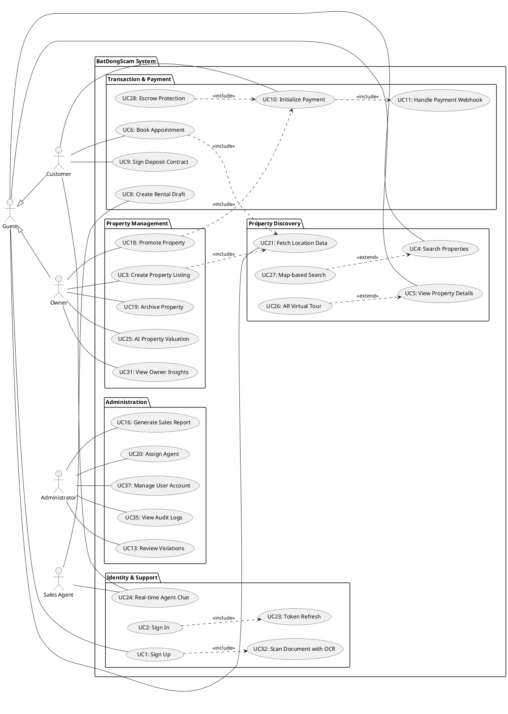

# System Use Case Diagram

This diagram provides a comprehensive overview of the interactions between different actors and the BatDongScam system, organized by functional modules.

```plantuml
@startuml
left to right direction

' 1. Actors Definition
actor "Guest" as Guest
actor "Customer" as Customer
actor "Owner" as Owner

Guest <|-- Customer
Guest <|-- Owner

actor "Sales Agent" as Agent
actor "Administrator" as Admin

' 2. System Boundaries
package "BatDongScam System" {

    package "Property Discovery" {
        usecase "UC4: Search Properties" as UC4
        usecase "UC5: View Property Details" as UC5
        usecase "UC21: Fetch Location Data" as UC21
        usecase "UC27: Map-based Search" as UC27
        usecase "UC26: AR Virtual Tour" as UC26
    }

    package "Transaction & Payment" {
        usecase "UC6: Book Appointment" as UC6
        usecase "UC10: Initialize Payment" as UC10
        usecase "UC11: Handle Payment Webhook" as UC11
        usecase "UC9: Sign Deposit Contract" as UC9
        usecase "UC8: Create Rental Draft" as UC8
        usecase "UC28: Escrow Protection" as UC28
    }

    package "Property Management" {
        usecase "UC3: Create Property Listing" as UC3
        usecase "UC18: Promote Property" as UC18
        usecase "UC19: Archive Property" as UC19
        usecase "UC25: AI Property Valuation" as UC25
        usecase "UC31: View Owner Insights" as UC31
    }

    package "Identity & Support" {
        usecase "UC1: Sign Up" as UC1
        usecase "UC2: Sign In" as UC2
        usecase "UC23: Token Refresh" as UC23
        usecase "UC32: Scan Document with OCR" as UC32
        usecase "UC24: Real-time Agent Chat" as UC24
    }

    package "Administration" {
        usecase "UC13: Review Violations" as UC13
        usecase "UC16: Generate Sales Report" as UC16
        usecase "UC20: Assign Agent" as UC20
        usecase "UC37: Manage User Account" as UC37
        usecase "UC35: View Audit Logs" as UC35
    }
}

' 3. Actor Associations (Solid Lines)
Guest -- UC1
Guest -- UC4
Guest -- UC5
Guest -- UC21

Customer -- UC6
Customer -- UC9
Customer -- UC10
Customer -- UC24

Owner -- UC3
Owner -- UC18
Owner -- UC19
Owner -- UC25
Owner -- UC31

Agent -- UC8
Agent -- UC24

Admin -- UC13
Admin -- UC16
Admin -- UC20
Admin -- UC37
Admin -- UC35

' 4. Relationships (Includes & Extends)

' Authentication & Identity Flow
UC1 ..> UC32 : <<include>>
UC2 ..> UC23 : <<include>>

' Payment Flow
UC10 ..> UC11 : <<include>>
UC18 ..> UC10 : <<include>>
UC28 ..> UC10 : <<include>>

' Discovery Enhancements
UC27 ..> UC4 : <<extend>>
UC26 ..> UC5 : <<extend>>

' Operational Flows
UC6 ..> UC21 : <<include>>
UC3 ..> UC21 : <<include>>

@enduml
```
